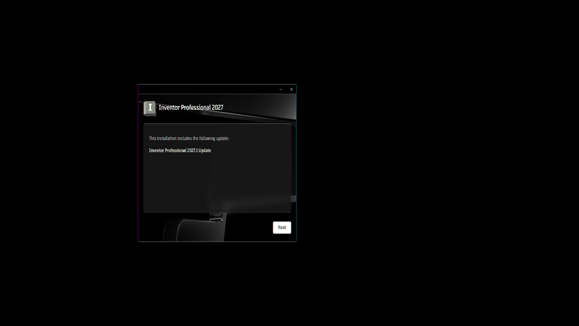
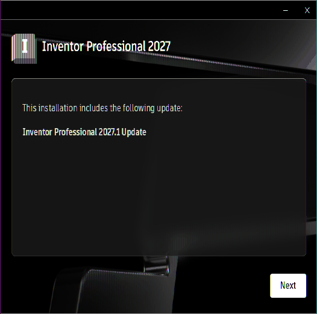
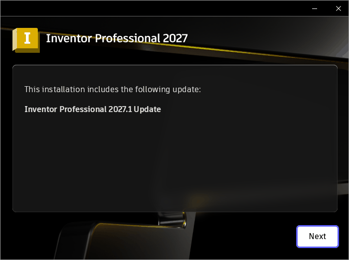

# 003 ODIS Installer.exe spins at 100% CPU; UI "Next" does nothing
Status: wontfix (not a Wine bug) · Owner: worker · Branch: - · Found in: Inventor web installer (prefix `inv`)

## Symptom
After Setup.exe (with the 001 workaround) starts the ODIS flow, the UI
(AdskAccessUIHost.exe, Electron, in Setup\ui-launcher) shows "This installation
includes the following update: Inventor Professional 2027.1 Update" with a Next
button. Clicking Next seemed to only change the button's focus look.
`Installer.exe` burns one thread at ~100% CPU from startup.

## Outcome: both parts are not Wine bugs
- **"Next does nothing" = broken screenshots.** `x/shot.sh` misread the root
  XGetImage on the headless NVIDIA Xorg: data is packed 24-bit BGR (3 B/px)
  though the header says 32 bpp. Screenshots were squashed to 0.75 width, so
  xdotool clicks at screenshot coords landed at x*0.75 (the mousedown just
  blurred the button). Verified with a tk calibration window at 1400,100
  (appeared at 1050). Fixed in `x/shot.sh`. Clicking the real Next position
  (1247,753 for the centered 700x522 window) advances to installLocationPage.
- **CPU spin is the same on Windows.** Hot thread loop in Installer.exe
  (installer+0xb534bd, DDA TimerHandler): per iteration T0 = steady_clock
  (QPC), fire due timers, then `if (elapsed_ms <= 100) Sleep((int)elapsed_ms)`
  → always `Sleep(0)` (relay: millions of `KERNEL32.Sleep(00000000)
  ret=140b534bd`). On the VM the finished installer's Installer.exe still runs
  one thread at 1.0 CPU-s/s (45 min on one thread).

Old x/shot.sh output (squashed to 0.75 width, colour fringes) vs a correct capture:

## Leftover differences vs Windows (not blocking)
- DDA-UI.log: ADP analytics never initialize on Wine (`ADPUtil initialize.
  sessionID:` empty, `setDDASessionID:` empty); on the VM both are GUIDs.
  UI just caches events. adpsdkcore.dll path, not investigated.

## Debug tricks that worked here
- UI console → file: env `ELECTRON_ENABLE_LOGGING=file ELECTRON_LOG_FILE=C:\x.log`
  (inherited from Setup.exe). `DDA_UI_AUTOMATION=TRUE` opens docked DevTools.
- The Installer verifies the UI exe's signature (WinVerifyTrust), so a
  wrapper exe with `--remote-debugging-port` is rejected.
- Logs: `%LOCALAPPDATA%\Autodesk\ODIS\{DDA,DDA-UI,Setup}.log`,
  `%TEMP%\AdODIS-install.log`. VM copies of the successful run: `inst/vmlogs/`.
