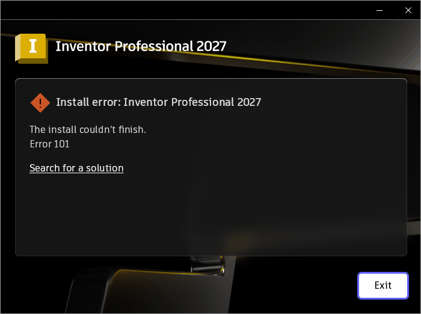

# 007 Inventor install fails with "Error 101"
Status: fixed · Owner: worker · Branch: fix/007-tasklist-no-match (wt/007, from master) · Found in: Inventor web installer, build/ at integ (74cceca78b1)

## Observed
- Original web installer `inst/webinstall/Setup.exe`, prefix `prefixes/inv`,
  detached; stderr `inst/wine-setup.log`. UI renders fine now (005 fixed).
- Pages: update notice → install location (defaults C:\Program Files\Autodesk,
  C:\ProgramData\Autodesk) → additional components (all three unticked, as on
  the VM) → Install. Progress sat at 5% and within ~5 min became
  "Install error: Inventor Professional 2027 — The install couldn't finish.
  Error 101" (screenshot below). Dialog left open with Exit.
- The VM installed the same product successfully (its ODIS logs: inst/vmlogs/).

## Suspected (unverified)
Error 101 is often reported as a download failure by Autodesk; could equally be
a failed package/MSI step. Compare the ODIS logs (DDA/install_manager/
DownloadManager, ProgramData\Autodesk\ODIS, Temp) with inst/vmlogs.

## Task
Find the failing step and the Wine API behaviour behind it; reduce, fix, test
per notes/worker.md. If the installer must be rerun, previous partial state
in the prefix may matter — note what you clean up.

## Findings (worker)
- Failing package is ODIS itself ("Autodesk Installer", Summary.log):
  install_manager runs `odis_download_dest\14695981039346656038\ODIS\AdODIS-installer.exe
  --mode unattended --useService 1` (InstallBuilder), which exits 101 in ~1 s.
  Its log `%TEMP%\installbuilder_installer_<pid>.log`: runs
  `%TEMP%\pidcheck_*.bat 536` -> exit 1 -> "Another Autodesk Installer is running!".
- 536 comes from `C:\ProgramData\Autodesk\ODIS\AdODISInstaller.run.lock`, left by
  an earlier extraction run (pid 536, 21:34) that was killed mid-way. A stale
  lock is expected to be harmless: pidcheck.bat (captured) is
  `tasklist /fi "pid eq %1" /fi "imagename eq AdODIS-installer.exe" | findstr ":" > nul`
  i.e. "not running" == output contains ':'.
- Windows (VM): no match -> stdout is only
  `INFO: No tasks are running which match the specified criteria.` (no blank
  line/header, exit 0; same for /fo csv). Wine prints the empty table header
  (no ':') -> findstr fails -> 101.
- Fix: programs/tasklist prints header lazily, INFO line when nothing matched.
- Repro without the UI: scratch prefix + that lock file, run AdODIS-installer.exe
  with the args above (exit 101 before the fix).

## Outcome
Commit a96a97aa782 on fix/007-tasklist-no-match ("tasklist: Print an info
message when no tasks match the filters."), test in programs/tasklist/tests
(no-match output for table and CSV). VM + Wine: 82 tests, 0 failures (x86_64,
i386); unfixed Wine fails the 2 new checks.
Real flow: integ + fix (wt/007-integ, wt/007-integ-build; prefix inv now
updated to that build), stale lock planted -> pidcheck exit 0, ODIS package
installs (exit 0). Install then fails with Error 4005 -> issue 008.
Note: clicking Exit on the error dialog rolls back and empties
C:\ProgramData\Autodesk\ODIS (lock included).
