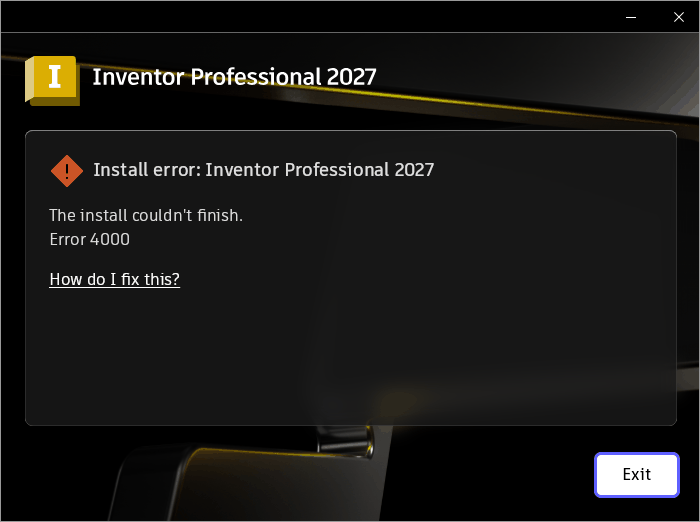

# 010 RegLoadKey can't load binary (regf) hives → Inventor Core install "Error 4000"
Status: wip · Owner: worker · Branch: fix/010-regf-hive (wt/010, from master) · Found in: Inventor web installer, prefix `inv`, integ + fix/008 (wt/008-integ-build)

## Observed
- With 008 fixed, the .adix signature checks pass (LP and Anark packages no
  longer fail), then "Inventor Core 2027" fails: UI "Install error ... Error 4000"
  (dialog left open, not clicked).
  
- Install.log (22:35:19): `MsixCoreLib::WriteAdIXRegistry::WriteRegistries ...
  hrOpenVirtualKey error code: -2147024890` (0x80070006 E_HANDLE), then
  `HandleInstallFailure ... Inventor Core 2027 Error Code: 4000`; rollback noise
  (`CreateStreamOnFileUTF16 ... 0x8BAD0001`, `CreateProcess failed`) follows.
- Only InvCore.adix contains a `Registry.dat` (40 KB, binary `regf` hive);
  InvAnark/InvCoreLP have none and installed fine.
- The upstream MsixCore equivalent (msix-packaging
  `MsixCore/msixmgr/RegistryDevirtualizer.cpp`): enables SeRestore/SeBackup,
  `RegLoadKey(HKEY_USERS, "{guid}", Registry.dat)`, opens `{guid}\Registry`
  (errors other than FILE_NOT_FOUND ignored), then `OpenSubKey` per mapping →
  a NULL root key gives E_HANDLE. Matches the log.

## Windows ground truth / repro
`tests/regloadkey_hive.c` (mingw) with the InvCore Registry.dat
(`unzip InvCore.adix Registry.dat`, from `%TEMP%\{447AF3F0-...}\x64\InvCore\`):
- VM: RegLoadKey 0, `wine008hive\Registry` opens, subkey `MACHINE`.
- Wine: RegLoadKey 1017 (ERROR_BADDB), open → 2.
Wine's server `load_registry` only reads Wine's text registry format.

## Task
Support loading binary regf hives in RegLoadKey (server side, read-only is
probably enough here: MsixCore copies the tree into the real registry, then
RegUnLoadKey). Conformance test with a tiny regf hive.

## Design (worker)
- No regf parsing anywhere in Wine (server, regedit, reg.exe: text/.reg only);
  nothing upstream found. NtLoadKey already hands the server a file handle
  (`load_registry` request), so the server is the natural place.
- server/registry.c `load_registry`: if the file starts with "regf", read it
  into memory and walk it from the root nk cell: root values -> the loaded key,
  subkeys (li/lf/lh/ri lists) -> `create_key_recursive`, values (vk, inline
  data <= 4 bytes, db big-data segments) inserted like the text loader does.
  nk timestamps -> key modif. Every cell offset/size is bounds-checked; visited
  nk cells are marked so cycles/shared cells can't loop; depth capped at 512.
  Bad input -> STATUS_REGISTRY_CORRUPT. Text format still accepted.
- Not done: key classes, security (sk) cells, transaction logs (.LOG1/2),
  writing back (RegLoadKey keys stay in memory as before), RegSaveKey in regf.
- adixhandler also imports RegLoadAppKeyW (Wine: stub returning 0xdeadbeef);
  check if the install path uses it.
