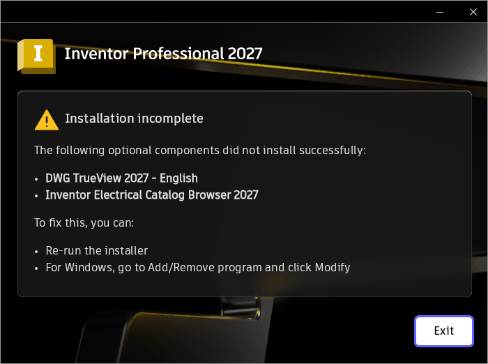

# 013 WinVerifyTrust fails (CRYPT_E_ASN1_BADTAG) on Microsoft-signed .NET runtime → Inventor install "Error 15"
Status: open (draft) · Owner: - · Branch: - · Found in: Inventor web installer, prefix `inv`, integ d4d52733ba7 + fix/010 (wt/010-integ-build)

## Observed
- With 010 fixed, Inventor Core installs; the bundle ends with "Installation
  incomplete" (DWG TrueView, Electrical Catalog Browser optional components failed;
  dialog left open, not clicked).
  
- Install.log 23:17:19: `SignatureUtils::VerifyCertificate WinVerifyTrust returns
  error code: -2146881269` (0x8009310B CRYPT_E_ASN1_BADTAG) for
  `%TEMP%\{447AF3F0-...}\3rdParty\x64\dotNet\100\windowsdesktop-runtime-10.0.9-win-x64.exe`
  → ".NET Windows Desktop Runtime 10.0.9 (x64)" Error 15 (Summary.log), needed by
  TrueView and Inventor. Also `AceInvAddIn-ca.msi` returned 1603 (not looked at;
  possibly a consequence).
- Regression from the integ wintrust time-stamp work: `wt/010-work/wvt.exe FILE`
  (WinVerifyTrust GENERIC_VERIFY_V2, file, no revocation; source
  `wt/010-work/wvt.c`, copy of the exe at `wt/010-work/wdr.exe`):
  VM → 0; old `build/` (integ incl. 007+008) → 0; integ d4d52733ba7 → 0x8009310B.

## Cause (first look)
- The Authenticode signature's RFC 3161 token (unsigned attr 1.3.6.1.4.1.311.3.3.1,
  CMS v3 SignedData from "Microsoft Time-Stamp Service") has, inside its
  `certificates [0]` SET, a `[1]` CertificateChoices element (v1AttrCert per
  RFC 5652) after the X.509 certs.
- crypt32 hands it out as a CRL (CMSG_CRL_COUNT_PARAM/CMSG_CRL_PARAM); in
  `CRYPT_MsgOpenStore` `CertAddEncodedCRLToStore` fails to decode it
  (tag a1, expected 06) and the whole `CertOpenStore(CERT_STORE_PROV_MSG)` fails.
  The caller is the new token verification in wintrust softpub.c
  (8d07e7a6cf8 "Verify RFC 3161 time-stamp tokens"), so WinVerifyTrust fails.
- Trace: `WINEDEBUG=+crypt,+wintrust,+cryptasn` (kept in `wt/010-work/wvt-trace.log`).

## Task
Decode CMS SignedData `certificates` choices other than plain certificates the
way Windows does (skip / don't count as CRLs), and/or make the msg store not fail
on them; conformance test with a synthetic token. Check against current integ tip.
