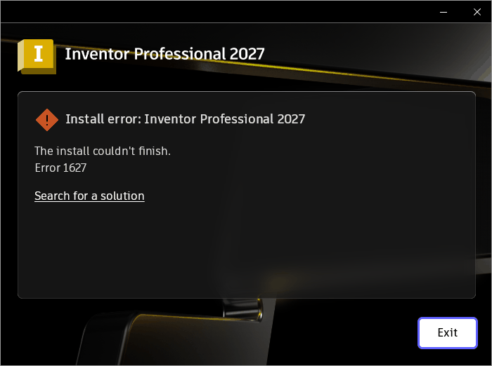

# 014 Go services never start: service processes run in session 1, not 0
Status: fixed · Owner: worker-014 · Branch: fix/014-services-session0 · Found in: inv-vm transplant (build/ at integ) — verify on real install path before fixing

## Observed
- `AdskLicensingService` and `Autodesk CER Service` (auto-start, OWN_PROCESS)
  fail: `err:service:process_send_start_message service L"AdskLicensingService"
  failed to start` (1053), same for `net start`. With `ServicesPipeTimeout`
  raised to 120 s they still never call StartServiceCtrlDispatcher.
- The processes do run: AdskLicensingService.log shows the HTTP server up and
  AdskLicensingAgent registered; winedbg shows the main thread in the app's own
  IOCP loop. Inventor then says "Unable to connect with the Autodesk Desktop
  Licensing Service"; SCM kills the service process after the timeout.
- Both exes are Go (go1.26) and contain
  `golang.org/x/sys/windows/svc.IsWindowsService`. That function (public Go
  source) returns true only if the parent process (NtQuerySystemInformation
  SystemProcessInformation, matched by InheritedFromUniqueProcessId) is named
  `services.exe` **and has SessionId 0**. Under Wine every process, including
  services.exe, is in session 1 (`tasklist`; `server/process.c` takes the
  session from the token, `default_session_id`), so Go services think they run
  interactively and never connect to the SCM.
- Workaround for testing: start AdskLicensingService.exe by hand as a console
  process; Inventor then gets past the licensing check.

## Windows ground truth
VM (`Get-Process ... SessionId`): services.exe, AdskLicensingService.exe and
cer_service.exe are in session 0, explorer.exe (autologon desktop) in session 1.

## Task
Services started by services.exe (and services.exe itself) should report
session 0 (process SessionId, token session). Check what else keys off the
session (window stations/desktops, ProcessIdToSessionId, WTS*), since session-0
processes normally have no interactive desktop. Cheap repro: a C service that
logs its parent's SessionId from SystemProcessInformation.

## Windows ground truth (tests/svc_session.c, VM)
Own-process service started by SCM vs. elevated user process (winrun):

| | service | user process |
|---|---|---|
| PEB / ProcessIdToSessionId / ProcessSessionInformation / TokenSessionId | 0 | 1 |
| WTSGetActiveConsoleSessionId, KUSER_SHARED_DATA.ActiveConsoleId | 1 | 1 |
| WTSQueryUserToken(1) | ok, token session 1 | fails 1314 (no SeTcb) |
| WTSEnumerateSessions | 0 Services (disconnected), 1 Console (active) | same |
| window station | Service-0x0-3e7$ | WinSta0 |
| unqualified CreateEvent name | \BaseNamedObjects\x | \Sessions\1\BaseNamedObjects\x |
| parent in SystemProcessInformation | services.exe, session 0 | cmd.exe, session 1 |

## Wine today (master 4e819f054dd)
- Session comes from the token: `server/process.c:create_process` sets
  `process->session_id = token_get_session_id(token)`; the first process gets
  `token_create_admin(..., default_session_id = 1)`, children duplicate the
  parent token. So everything is session 1. PEB (init_first_thread reply),
  ProcessSessionInformation, SystemProcessInformation, TokenSessionId all
  read that one value; nothing can change it (`NtSetInformationToken
  (TokenSessionId)` is a FIXME stub returning success).
- `server/directory.c:create_session(0)` already builds the Windows layout:
  `\Sessions\0\BaseNamedObjects` -> `\BaseNamedObjects`,
  `\Sessions\0\Windows` -> `\Windows`, own WindowStations dir.
  kernelbase/user32/win32u pick the dir from PEB->SessionId, so a session-0
  process gets Windows-like namespaces for free.
- Upstream already has `kernel32/tests/process.c:test_services_exe`
  (todo_wine, Timoshkov 2022, for .NET IsWindowsService) — no fix upstream.
- `WTSGetActiveConsoleSessionId` returns the caller's PEB session;
  `WTSQueryUserToken` duplicates the caller's token.

## Design
Windows shape: session 0 is a token property set with SeTcbPrivilege.
1. server + ntdll: implement `NtSetInformationToken(TokenSessionId)` (new
   request `set_token_session_id`, needs TOKEN_ADJUST_SESSIONID on the
   handle and SeTcbPrivilege enabled in the caller -> else
   STATUS_PRIVILEGE_NOT_HELD, like Windows for an admin).
2. wineboot: enable SeTcb, duplicate own token, set session 0, start
   services.exe with CreateProcessAsUserW. Every service inherits it.
3. `SVCCTL_STARTED_EVENT` (wineboot session 1 <-> services.exe session 0)
   becomes `Global\__wine_SvcctlStarted`; it is the only unqualified named
   object shared across the boundary (audited services, rpcss, winedevice,
   plugplay, sechost/advapi32, combase/rpcrt4, schedsvc, msiexec).
4. server: `grant_process_admin_token` keeps the process session.
5. WTSGetActiveConsoleSessionId: KUSER_SHARED_DATA.ActiveConsoleId, set to 1
   by the server; WTSQueryUserToken: token for the requested session.
Behaviour changes / risks (all match Windows):
- Services' unqualified named objects move to \BaseNamedObjects (global).
- Interactive services and anything services spawn use session 0's own
  WinSta0; the At service (schedsvc) runs jobs in session 0.
- COM LocalServers are started by the client (combase), unaffected.

## Outcome (branch fix/014-services-session0, on master 4e819f054dd)
Implemented as designed (9 commits incl. 015), plus
`server: Keep window station enumeration and hardware input within their
session.` (regress found user32:winstation listing session 0's
__wineservice_winstation from session 1; hardware input without a target
window now picks the console session's WinSta0 only). Wine now matches the VM table
except: services' winstation is still `__wineservice_winstation`, and
WTSEnumerateSessions/WTSQuerySessionInformation stay semi-stubs listing only
the caller's session (a service sees just session 0 "Console").
- Repro `tests/svc_session.c`: master -> parent services.exe session 1,
  IsWindowsService 0; fixed -> session 0, IsWindowsService 1.
- AdskLicensingService + cer_service (copied from inv-vm into wt/014-prefix,
  registered by hand) start via `sc start` and as auto-start at boot, stay
  RUNNING, AdskLicensingAgent registers.
- Consequence: services now call StartServiceCtrlDispatcher, which makes
  them Wine "system" processes, so an Autodesk prefix's wineserver goes idle
  again once user processes exit (previously the hung services kept it up).
- Seen: an interactive service (SERVICE_INTERACTIVE_PROCESS) now gets its
  own explorer.exe /desktop in session 0's WinSta0; its windows still show
  on X. `display_device_init` mutex is per session, so the two explorers
  don't serialize display-registry updates (unlikely to matter; not fixed).
- NtSetInformationToken(TokenSessionId) now fails without SeTcb (Windows
  behaviour; the old stub returned success). wineboot enables SeTcb, so
  services inherit it enabled (like SYSTEM).

## Review (fix/014 tip 96d8bad)
- Regression found and fixed: plugplay/mountmgr (session 0) broadcast
  WM_DEVICECHANGE with BroadcastSystemMessage, which only enumerates the
  caller's session, so session-1 windows stopped getting DBT_DEVNODES_CHANGED /
  volume arrival. `user32: Broadcast system messages from other sessions to
  the console session.` (ordered before the wineboot commit) also broadcasts
  into `\Sessions\<console>\Windows\WindowStations\WinSta0`.
  Repro (session-0 child broadcasts, session-1 parent window counts): master 1,
  branch 0, fixed 1.

## Confirmed on the real install path (installer driver, build/ at d1fbaf04951, without 014)
Web installer, prefix `inv`, 2026-09-28 01:18: `cer.msi` (Autodesk CER Service 7.2.5)
StartServices waits the 10 s pipe timeout, `err:msi:ITERATE_StartService failed to
start service L"Autodesk CER Service" (1053)` → msi 1627 → bundle rolls back,
UI "Install error ... Error 1627" (dialog left open). `tasklist`: services.exe
in session 1. VM installed the same package fine. Needs build/ rebuilt at integ
tip (77645e2b221 has 014) to continue.

