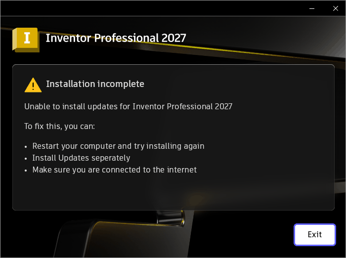

# 019 imagehlp can't read certificates past 2 GB → Inventor 2027.1 update "Installation incomplete"
Status: open · Owner: - · Branch: - · Found in: Inventor web installer, prefix `inv`, build/ at integ 77645e2b221

## Observed
- With 014 in build/, the base product installs (Install.log 01:32:22
  `INSTALL_COMPLETE errorCode 0`; `C:\Program Files\Autodesk\Inventor 2027` exists).
  The bundled 2027.1 update then fails and the UI ends at "Installation incomplete —
  Unable to install updates for Inventor Professional 2027" (dialog left open).
  
- Install.log 01:34:19: `WinVerifyTrust returns error code: -2146762496`
  (0x800B0100 TRUST_E_NOSIGNATURE), `Failed to validate the signature of the package:
  ...\{447AF3F0-...}\5HY\Inventor_2027.1_Update.exe` → errorCode 15.
- The file is 3 375 903 464 bytes; its PE security directory is at file offset
  3 375 892 880 (0xC9380990, > 2^31), size 0x2958.
- `tests/cms/wvt.c` on it (scratch prefix): 800b0100, step 32 (OBJPROV). Trace
  (`+crypt,+wintrust,+imagehlp`): `IMAGEHLP_GetSecurityDirOffset ret = 1 size = 2958
  addr = c9380990`, then `CryptSIPGetSignedDataMsg returning 0`.
- VM: the same update installed fine (inst/vmlogs/Summary.log, "Inventor Professional
  2027.1 Update" bundle, all packages INSTALLED), so WinVerifyTrust succeeds there.

## Suspected cause (unverified by a fix)
`dlls/imagehlp/integrity.c` `IMAGEHLP_GetCertificateOffset` (and the similar
`SetFilePointer(handle, sd_VirtualAddr + offset, NULL, FILE_BEGIN)` calls around
lines 409/440, ImageRemoveCertificate/ImageAddCertificate paths) passes a DWORD offset
as the LONG distance with a NULL high part, so offsets ≥ 2 GB are sign-extended to a
negative seek → INVALID_SET_FILE_POINTER → ImageGetCertificateData fails. Offsets up
to 4 GB are valid (the directory fields are DWORDs). wintrust's own PE hashing
(`softpub.c` `hash_file_data`/`SOFTPUB_HashPEFile`) also uses `SetFilePointer(file,
start, NULL, ...)` with DWORD starts, but its starts are all header offsets; the
hashed range itself is read sequentially, so it's probably fine — check after the fix
that the 3.3 GB file verifies end to end.

## Repro
Any PE whose certificate table starts beyond 2 GB (sparse file: small signed exe,
pad the last section / overlay to > 2 GB before the cert table, fix the security dir).
Real file: prefix inv `%TEMP%\{447AF3F0-5A11-3D54-B8C1-9D1C88C26148}\5HY\Inventor_2027.1_Update.exe`
(kept while the installer UI is open; may be deleted on Exit).

## Task
Seek with 64-bit-safe calls (SetFilePointerEx or a zero high part) in imagehlp's
certificate functions; test in imagehlp tests with a sparse > 2 GB file if cheap
(else a synthetic one on Wine only), rerun `wvt` on the real update exe.
