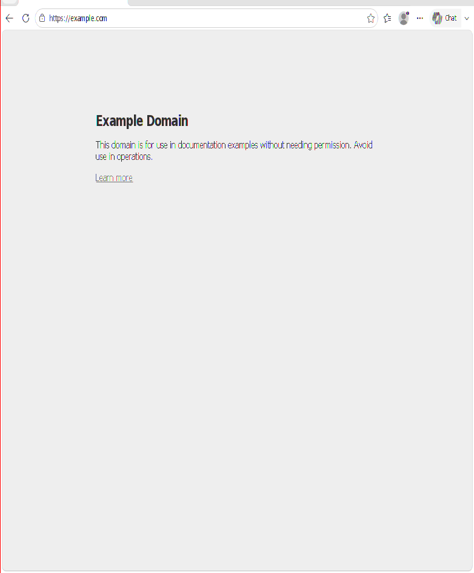

# 026 Edge: sandboxed renderer processes are never launched (blank page)
Status: fixed · Owner: worker 026 · Branch: fix/026-appcontainer-token (on master) · Found in: Edge 154 in inv-vm (wt/017-build)

## Symptom
Edge (msedge.exe, not WebView2) shows its toolbar, but every page stays blank white.
No --type=renderer process is ever created: +process shows no CreateProcess attempt
for it in 60+ s. Network, storage, GPU and utility processes do start.
With --no-sandbox, renderers start and pages render, including the Autodesk sign-in.
--disable-features=NetworkServiceSandbox doesn't help. The WebView2 runtime of the
same version starts its (sandboxed) renderers fine.

## Notes
- The Edge log says "Edge is running elevated: 3": Wine processes run with an
  elevated admin token.
- No failing sandbox API found in a relay trace (CreateRestrictedToken,
  DuplicateTokenEx, job objects and CreateProcessAsUserW all succeed for utilities).
  The browser just never requests a renderer. Chromium logging (--v=3) shows nothing.
- Workaround in inv-vm (tools/transplant.sh): the HKCR http/https/MSEdgeHTM open
  commands add --no-sandbox.
- Repro: `msedge.exe --user-data-dir=C:\users\xl0\edgetest https://example.com` in inv-vm.

## Cause
Edge (unlike WebView2) sandboxes its renderers in a lowbox app container
(package SID S-1-15-2-3251537155-...). Chromium's PolicyBase::MakeTokens ->
AppContainerBase::BuildPrimaryToken -> base::win::AccessToken::CreateAppContainer
resolves kernelbase `CreateAppContainerToken` (undocumented, Win8+; Chromium switched
from NtCreateLowBoxToken to it in 2022). Wine didn't export it, so PreSpawnTarget failed
before CreateProcessAsUser and the renderer was silently never launched (found with
+relay: GetProcAddress(kernelbase, "CreateAppContainerToken") on the launcher thread,
right after the lockdown CreateRestrictedToken). NtCreateLowBoxToken was a stub
returning a NULL handle (bug 45646 era), so implementing the export alone isn't enough.

## Windows ground truth (tests/lowbox_token.c, kernelbase security tests, Win11)
- NtCreateLowBoxToken: result is always a primary token (also from an impersonation
  token), granted access = requested, IL low, TokenIsAppContainer 1, TokenAppContainerSid
  = package SID, TokenCapabilities as given. Needs TOKEN_DUPLICATE on the source
  (else STATUS_ACCESS_DENIED). NULL or non-package SID (e.g. S-1-15-3-1) ->
  STATUS_INVALID_PARAMETER.
- CreateAppContainerToken(token or NULL = process token, SECURITY_CAPABILITIES, &out):
  TOKEN_ALL_ACCESS primary lowbox token, last error untouched; non-package SID ->
  ERROR_NOT_APPCONTAINER.

## Fix (fix/026-appcontainer-token)
include SECURITY_CAPABILITIES; ntdll NtCreateLowBoxToken semi-stub = validated primary
NtDuplicateToken (app container SID/capabilities/low IL not stored: todo_wine);
wow64 thunk for it; wow64 NtQueryInformationToken(TokenAppContainerSid) no longer
crashes on the NULL SID (found by the new test on i386); kernelbase
CreateAppContainerToken; kernelbase security tests (VM 64/32: 68 tests, 0 failures;
Wine: 0 failures, 16 todo). Edge in a clean inv-net48 copy renders pages without
--no-sandbox: .
Regress (ntdll/kernel32/kernelbase/advapi32 vs integ 220b086): no regressions.
Follow-ups (not needed by Edge): real lowbox tokens in the server (TokenIsAppContainer,
app container SID, capabilities, low IL) and the AppContainerNamedObjects directories.
Remove the --no-sandbox HKCR workaround in tools/transplant.sh once merged.
