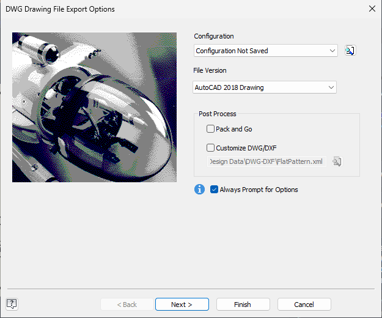

# 036 Inventor dialogs render black (DWG export wizard, plain #32770 message box)
Status: open (draft) · Owner: - · Branch: - · Found in: test campaign, invscen drawing2

## Symptom
`DrawingDocument.SaveAs("x.dwg", true)` on an .idw opens Inventor's "DWG
Drawing File Export Options" wizard (it does on Windows too, despite
SilentOperation — the scenario now uses the DWG translator instead). On Wine
(:98, integ 91495f487ad, wined3d-vk) the dialog frame appears but the whole
client area stays black: no picture, combo boxes, checkboxes or
Back/Next/Finish/Cancel buttons. It is alive: Escape closes it and the
SaveAs call returns.

- Windows: 
- Wine: 

On Windows it is a classic property-sheet wizard (bitmap, Configuration /
File Version combos, Post Process group, "Always Prompt for Options").

## Repro
Inventor running on :98, open any .idw (e.g. inst/invscen/drawing2/holed.idw),
File > Save As > Save Copy As, type DWG — or via the API as above. Screenshot
with x/shot.sh.

## Also: a plain message box
During a suite run Inventor showed an error box (an extrude was cancelled,
cause unknown, seen once). Also completely black
(), and while it was up the
MDI area behind it went black too. `tests/wintext.exe 'Autodesk Inventor
Professional'` (dumps window trees) shows an ordinary dialog:
`#32770` > `Static` (icon 32x32), `Static`, `SysLink` "The operation is
canceled. If you're experiencing an issue, ... <a href=...>Forum</a>", `Button`
"OK". A mouse click on the OK position closed it (xdotool `key` to it did not).

So it is not WPF/Qt specific: standard user32/comctl32 dialogs owned by
Inventor's main window don't paint. The trial welcome dialog (WebView2) and
the ribbon (WPF) do. Suspects: the owner/parent is a GPU/layered or
composited surface (cf. 027 layered colour-key, 023/005 surfaces), or
WM_PAINT/WM_CTLCOLOR handling with Inventor's dark theme hooks.

## Notes
Inventor.exe has WPF (wpfgfx_cor3, PresentationCore) and Qt6 loaded besides
Win32; `tests/wintext.exe` on the wizard would show its class tree.
