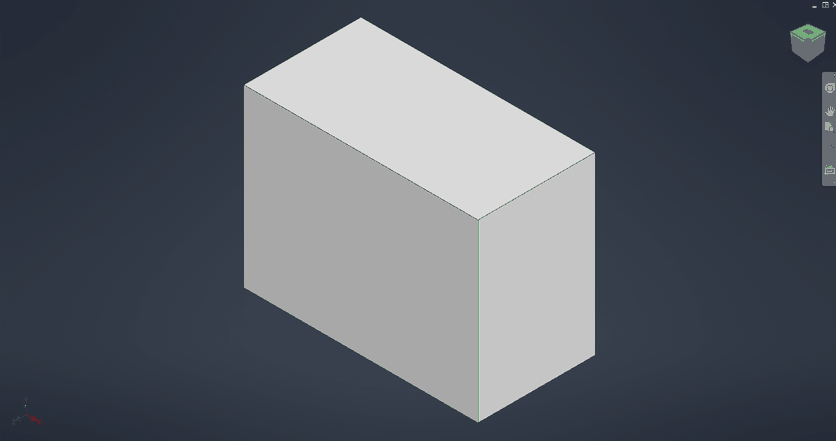
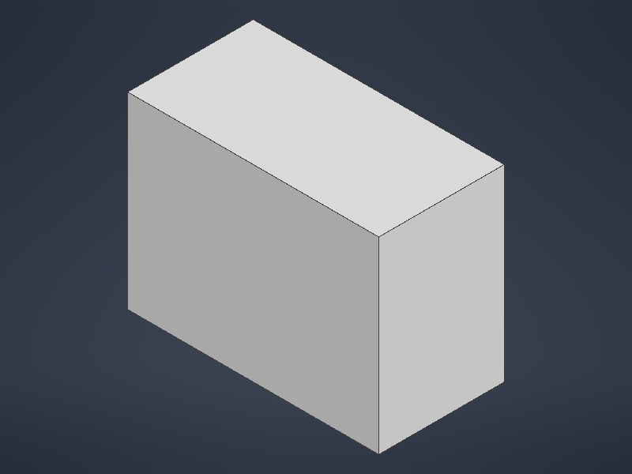

# 037 Inventor graphics window: stale Home page in the viewport, SaveAsBitmap unshaded
Status: fixed · Owner: worker-037 · Branch: fix/037-d3d11-display-fx-statics (wine-src, on master)
Found in: test campaign (invscen part, probe)

## Symptoms (integ 91495f487ad, :98, WINE_D3D_CONFIG=renderer=vulkan)
1. After `Documents.Add(part, visible=true)` the part tab is active but the graphics
   area keeps showing the Home page (nothing is ever presented there).
   
2. `View.SaveAsBitmap(png, 800, 600)` of a 4x3x2 box after `GoHome()`: Windows gives
   the grey-gradient background with shaded faces + edges; Wine gave black with only
   edge lines, and framed off-centre.
   - VM: 
   - Wine: 
   Saved .ipt were smaller (box.ipt 71 KB vs 128 KB): the embedded thumbnail.

## Graphics stack
Inventor renders through Autodesk OGS: OGSDeviceDX11.dll (D3D11; no D3D12 device is
created although OGSDeviceDX12/d3d12 get loaded). Shaders are HLSL effects compiled at
run time with D3DCompile(fx_5_0) and loaded by an Effects11 (FX11) copy linked into
OGSDeviceDX11. D3DCOMPILER_47 is a static import; Inventor ships an app-local MS
d3dcompiler_47, but Wine's version heuristic (Microsoft CompanyName) loads the builtin
(vkd3d-shader) instead, like the in-box one on Windows.
Same result on wined3d-vk, wined3d-GL and DXVK 3.1.1 (all use Wine's d3dcompiler).
`WINEDLLOVERRIDES=d3dcompiler_47=n` fixed symptom 2 only (workaround, no longer needed).

## Cause and fix (two bugs)
- Symptom 2: vkd3d-shader fx_4/fx_5 writer emitted `static` globals (e.g. OGS's
  `static float2 gTexelSize = 1.0 / gScreenSize;` in Common10.fxh) as effect
  variables in `$Globals`, all at offset 0 overlapping real uniforms. Native omits
  them (VM: d3d10 effect test). Effects11 then sets wrong constants; the tone-mapping
  (Canon curve) and SSAO passes write black, only the edge pass survives.
  Fix: skip non-uniform globals in write_fx_4_buffer (libs/vkd3d fx.c). Upstream vkd3d
  master (e75e92b1, 2026-09-28) still has the bug.
- Symptom 1: d3d11 CheckFormatSupport never reported D3D11_FORMAT_SUPPORT_DISPLAY.
  OGS picks its swapchain format among formats with DISPLAY; with none it calls
  CreateSwapChain with DXGI_FORMAT_UNKNOWN, which fails with E_INVALIDARG (same on
  Windows, tested) and the view is never presented. Fix: report DISPLAY for the DXGI
  display formats (R8G8B8A8/B8G8R8A8 (+SRGB); R16G16B16A16_FLOAT, R10G10B10A2 and
  XR_BIAS from FL 10_0) when they are render targets. Existing d3d11/d3d10core tests
  had todo_wine for this; removed (XR_BIAS stays todo: wined3d doesn't support it).
  Still missing vs Windows (VM, format 28): MIP_AUTOGEN, BLENDABLE, CPU_LOCKABLE,
  BACK_BUFFER_CAST; not needed by Inventor.

## Commits (fix/037-d3d11-display-fx-statics)
- 060a762cf79 vkd3d-shader/fx: Do not write static globals as fx_4/fx_5 buffer variables.
  (+ d3d10/tests/effect.c test_effect_compiler: static global not an effect variable)
- 8045bdc09a3 d3d11: Report D3D11_FORMAT_SUPPORT_DISPLAY for swapchain formats.

## Tests
- d3d10 effect: VM 5052 tests, 0 failures; Wine x86_64 + i386 0 failures (4 before the fix).
- d3d10core: VM 195865 tests, 0 failures; Wine pass (DISPLAY todos removed).
- tools/regress.sh on d3d11 d3d10 d3d10_1 d3d10core dxgi d3dcompiler_43/47 d3dx10_43
  d3dx11_43 d3d9 d3d8 vs master baseline 4e819f054dd: no regressions (d3d11: 36 fewer todos).
- Inventor (inv2, :99, integ 228616fa47c + both commits): `run.sh part` PASS 3/3,
  box.png equals the VM reference (mean abs diff 0.05/255), box.ipt 117 KB; the live
  viewport renders the part (ViewCube, nav bar):
  
  

## Notes
- One run crashed Inventor during GoHome with issue 047's signature
  (ogsdevicedx11+0x32ebb on a TBB worker, dump inv2 Temp\Inventor260928160346.dmp);
  pre-existing, intermittent, not caused by these fixes.
- OGS's include handler (FXDx11IncludeHandler::Open) fails unless GetLastError() is 0
  on entry (it checks it after MultiByteToWideChar). Wine behaves like Windows here;
  it only bit my own instrumentation (CreateFile OPEN_ALWAYS left 183).
