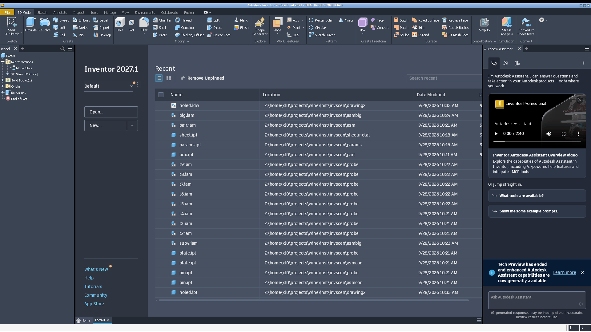

# 037 Inventor graphics window: stale Home page in the viewport, SaveAsBitmap unshaded
Status: open (draft) · Owner: - · Branch: - · Found in: test campaign (invscen part, probe)

## Symptoms (integ 91495f487ad, :98, WINE_D3D_CONFIG=renderer=vulkan)
1. After `Documents.Add(part, visible=true)` the part tab is active (ribbon
   3D Model, browser shows Part/Extrusion1) but the graphics area keeps
   showing the Home page (Recent list), shifted right by the browser pane
   width. Clicking the part tab doesn't change it.
   
2. `View.SaveAsBitmap(png, 800, 600)` of a 4x3x2 box after `GoHome()`:
   Windows gives the grey-gradient background with shaded faces + edges
   (124 KB); Wine gives a black background with only the silhouette/edge
   lines (4.5 KB).
   - VM: 
   - Wine: 
   Saved .ipt/.idw files are smaller on Wine (box.ipt 71 KB vs 128 KB,
   holed.idw 249 KB vs 298 KB), presumably the embedded thumbnail.

3. Early in a session (first ~1-2 min after an Inventor start, 3 of 3 cold
   starts): right after `Documents.Add(part, visible)` + sketch/extrude,
   `Application.ActiveView` is null (`new part` of the very first document
   also took 10 s). Later in the session it is set. Not checked on Windows
   (the VM's Inventor is never restarted). `run.sh hello` checks ActiveView of
   the first part; part/export now use `doc.Views[1]` instead.
4. SaveAsBitmap varies between calls on Wine: in `run.sh export` the BMP is
   black background + edges, the JPG/PNG right after it white background +
   white faces with only the hole shaded; Windows gives the same shaded image
   (39% light pixels) for all three.

Symptom 2 is independent of the window (offscreen render), so the
renderer itself loses faces/background (triangles or clears not drawn,
lines are). Symptom 1 may be a separate composition issue (Home WebView2
surface left above the graphics child) or the same renderer failure.

## Repro
`tools/invscen/run.sh part` → inst/invscen/part/box.png (VM reference:
inst/invscen/vm/part/box.png). For 1: any scenario leaving a part open,
then `x/shot.sh`.

## Next
Which API the viewport uses (Inventor.exe loads d3d11, d3d9, opengl32;
Application Options > Display > graphics settings / "Software graphics"),
WINEDEBUG=+d3d11,+d3d warnings during SaveAsBitmap, compare with DXVK
(deps/dxvk.sh on a copy of the prefix).

## UI campaign (manual, :98, integ d53133a66a1)
Viewport stays blank (background only) in part/assembly/drawing: no model,
sketch geometry, ViewCube, navigation bar, origin, orbit overlay; same for
all visual styles. Input still reaches it (status bar coordinates track the
mouse; rectangle corners and component placement by click work; heads-up
value boxes render). Picking does not: edges/faces never prehighlight or
select (Dimension, Fillet edge pick, face click), so fillet-by-pick, drag
component and pick-based constraints are blocked. Possibly GPU-based
selection failing with the renderer, or a separate bug: recheck once
rendering works. The Save As preview of a drawing sheet did render.
