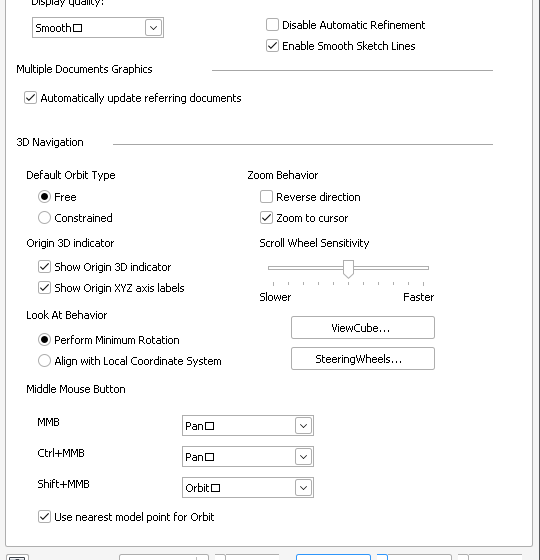
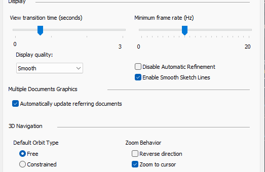
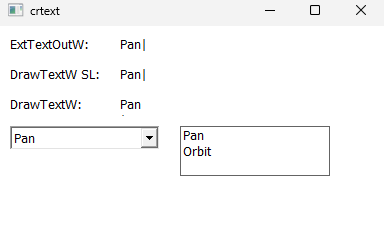
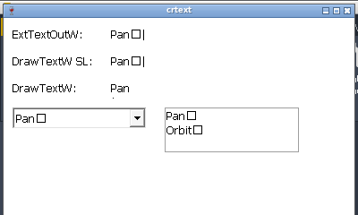
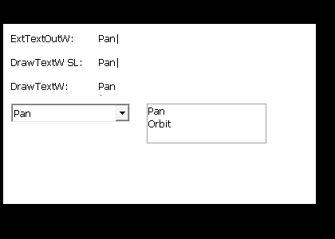

# 039 Control characters (CR) drawn as .notdef boxes in text output
Status: fixed · Owner: worker 039 · Branch: fix/039-ctrl-char-glyphs · Found in: UI test campaign (Application Options)

## Symptom (integ d53133a66a1, :98)
Inventor's combo box strings end in `\r` (read with CB_GETLBTEXT: "Smooth\r",
"Medium\r", "Pan\r", "Orbit\r"; also "Default - Gray", "1 Color", "DirectX 11"
in Colors/Hardware). Wine draws the CR as an empty box after the text in
Application Options > Display (Display quality, MMB/Ctrl+MMB/Shift+MMB),
Colors (Section Capping texture, preview type), Hardware (Graphics Driver).
Windows shows the plain text.
- Wine: 
- VM: 

## Windows ground truth (Win11 VM, `tests/ctrlchar_text.c`)
"Pan\r|" in Tahoma: ExtTextOutW and DrawTextW(DT_SINGLELINE) draw "Pan|" (no
glyph, no advance visible for CR); a user32 ComboBox and ListBox item "Pan\r"
shows "Pan". Wine draws a box in all four. Windows' own tahoma.ttf has no cmap
entry for U+000D either (checked with fontTools), so Windows GDI handles
control characters without a glyph specially rather than via the font.
- VM: 
- Wine: 

## Windows ground truth, full (`ctrlchar_text.exe [FONT...]` probe, Win11)
Tahoma, Segoe UI, Arial, Courier New, MS Sans Serif (bitmap), Wingdings:
- Unmapped TAB, LF, CR, U+001C-001F, U+0080-009F: ExtTextOutW / TextOutW /
  DrawTextW (all flags) / ScriptStringOut draw nothing, zero advance, also with an
  explicit lpDx (no ink). GetTextExtentExPointW gives them 0 width too.
  If the font maps the char (Segoe UI maps CR to a 2px glyph) its glyph is used.
- Other unmapped C0 (0x01-0x08, 0x0B, 0x0C, 0x0E-0x1B) and 0x7F: default glyph,
  or a font-fallback glyph (Arial draws them with a narrow fallback glyph; Tahoma
  has own glyphs for 0x00/0x02). Not addressed.
- GetGlyphIndicesW: 0 / 0xffff (GGI_MARK) for all unmapped controls.
- Per-glyph APIs don't apply the rule: GetGlyphOutlineW, GetCharWidth32W,
  GetCharABCWidthsW return .notdef metrics for CR in Arial. GetTextExtentPoint32W:
  C0 = .notdef width, C1 = 0 (differs from GetTextExtentExPointW).
  Looks like the LPK/Uniscribe layer: set = usp10's Script_Control blank set,
  with SetTextCharacterExtra CR gets a non-zero width in ExPoint.
- GetCharacterPlacementW: all controls 0x00-0x1F, 0x7F-0x9F -> space glyph, dx 0.
- ExPoint fit: a zero-width char at exactly max_ext doesn't fit
  ("A\r", max = ext("A") -> fit 1).
- usp10 ScriptShape/Place: blank glyph, fZeroWidth for the same set (Wine already OK).

## Fix (fix/039-ctrl-char-glyphs, 2 commits)
`user32: Break DrawText lines after a tab.` Windows DT_WORDBREAK wraps after a
tab like after a space but keeps the tab on the line ("aaaa\tbbbb cc" -> 5 drawn).
Wine only broke at spaces; the wide .notdef tab hid it (user32 text.c:682
failed once the tab became zero-width). Test added in user32 text tests.
`win32u: Draw unmapped control characters as empty zero-width glyphs.`
get_glyph_outline() (char path) returns an empty zero-advance glyph when
get_glyph_index_linked() finds none for that set. All text drawing (dibdrv,
xrender) and GetTextExtentExPoint go through it, so user32/comctl32 combo,
listbox, DrawText are fixed. NtGdiGetTextExtentExW fit loop: a char only fits if
it starts before max_ext (needed for gdi32 font.c:1468 "One\ntwo 3" test).
regress (gdi32 win32u usp10 user32 comctl32 dwrite riched20, both arches) vs
integ baseline 91495f487: clean (i386 user32:win flaky, same on base).
Test: gdi32 font.c test_control_chars (Tahoma): GGI 0xffff, zero ExPoint
advance, no ink from ExtTextOutW. Passes on the VM and Wine.
Known deviations (deliberate, small): GetGlyphOutline/GetCharWidth32/ABC and
GetTextExtentPoint32 now give 0 for these chars (Windows: .notdef, except
Point32 C1); GetCharacterPlacement still returns glyph 0 (Windows: space glyph).
- Wine after fix: 
