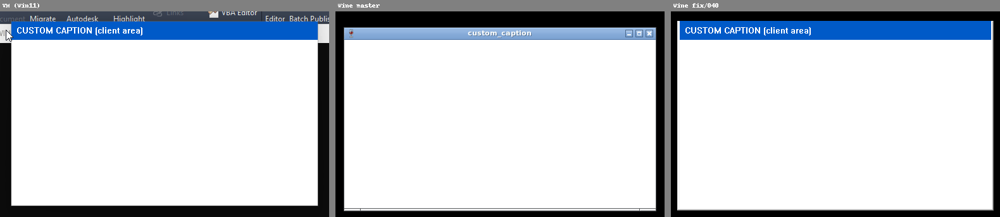

# 040 Custom title bar (client over caption) replaced by WM decorations
Status: merged, verified · Owner: worker-040 · Branch: fix/040-custom-caption-decor (6f82c0dfd0e) · Found in: UI test campaign (main window)

## Symptom (integ d53133a66a1, :98 openbox)
Inventor's main window (AfxMDIFrame140u, style 0x15cf0000 = WS_CAPTION|
WS_THICKFRAME|WS_MAXIMIZE...) extends its client area over the caption
(WM_NCCALCSIZE): client origin is screen 0,0 like on Windows (window
-4,-4..1924,1084, client 1920x1078 at 0,0; VM: -8,-8, client at 0,0). The top
26 px of the client hold `AdImpApplicationFrame` with the Quick Access Toolbar
(QATHwndSource: New/Open/Save/Undo/Redo/Home...) and InfoCenter (Search Help &
Commands, account, trial counter). On Wine that strip is not shown: the X
window starts at y=26 (xwininfo), openbox draws its own 16 px title bar
(_NET_FRAME_EXTENTS 1,1,16,1) and the rest is black. QAT and InfoCenter are
unreachable by mouse (Ctrl+Z/Y etc. still work).
- VM: 
- Wine: 

## Windows ground truth (Win11 VM, `tests/custom_caption.c`)
WS_OVERLAPPEDWINDOW, WM_NCCALCSIZE = DefWindowProc minus the caption (sides and
bottom kept; when maximized top += frame width):
- normal: window 100,100-600,400, client 484x292 at 108,100; no system caption,
  the 8 px side/bottom frame is invisible (DWM), the app's strip is the top.
- maximized: window -8,-8-1032,728, client 1024x720 at 0,0.
- Wine master under openbox: openbox title bar over the app strip (X window
  starts below the style caption). 

## Cause
win32u `get_visible_rect()` removes the style-based NC area (driver style masks)
from the window rect; the X window is placed at that visible rect and winex11 asks
for MWM_DECOR_TITLE whenever window != visible. Only `window == client` (47f69a22484,
Steam/Battle.net, bug 40930) disabled it. No upstream fix for the partial case
found (bugzilla is behind Anubis; user reports e.g.
https://forums.linuxmint.com/viewtopic.php?t=465397).

## Fix
`win32u: Don't let host decorations cover the client area.` — if the client rect
sticks out of the computed visible rect, visible = window rect (generalizes the
window == client case). winex11 (and winemac) then drop decorations since
window == visible. Win32 rects/messages unchanged, so no user32 test.
Verified on Xvfb :160 + openbox with the repro (normal: app strip at the top, Wine
draws the side/bottom frame, no WM title). Regress (user32 win32u comctl32
uxtheme dwmapi imm32 dxgi, both arches): only user32:win i386 flagged, FLAKY
(base re-run fails the same foreground tests).
Leftover: maximized, the WM places the undecorated X window at the work area while
the surface starts at the off-screen frame -> 4 px Wine frame top/left, 4 px client
cut right/bottom: issues/045. Inventor check pending (coordinator).

## Verified in Inventor
2026-09-28, integ 13704a2e74b, :98 openbox, maximized main window: no openbox
title bar (_NET_FRAME_EXTENTS 0,0,0,0); QAT, title and InfoCenter strip
(search, account, trial counter) drawn at the top like the VM, and the QAT is
mouse-reachable (clicking Open opens the Open dialog).
 (cropped left of the account name;
the white 4 px line at top/left is 045).
