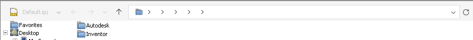

# 041 Inventor file dialogs: breadcrumb segments have no names
Status: open (draft) · Owner: - · Branch: - · Found in: UI test campaign (Open / Save As)

## Symptom (integ d53133a66a1, :98)
Inventor's own Open / Save As dialogs (WPF window `HwndWrapper[...]` hosting
Wine's ExplorerBrowser: ExplorerBrowserControl / SHELLDLL_DefView /
NamespaceTreeControl) show the address bar as a folder icon followed by empty
`>` chevrons, one per path level (C:\users\xl0\Documents\Inventor gives 6),
no folder names. The chevron dropdown lists child items with icons but no names.
Clicking the bar switches to the text path, which is correct; navigation,
the file list and Save/Open work.
- Wine: 
  dropdown: 
- VM (C:\t\scen\part): 
  "This PC > Windows (C:) > t > scen > part" (Documents shows "icon > Documents >")

So the icons resolve and the display names don't: suspect a shell32 name query
(IShellItem::GetDisplayName / SHGetNameFromIDList / IShellFolder::GetDisplayNameOf
with some SIGDN/SHGDN flag, or SHGetFileInfo SHGFI_DISPLAYNAME) that
returns empty or fails on Wine for these pidls.
Candidate code: "breadcrumb" strings in Bin\aduicore.dll, AdUIModel.dll,
adwindows.dll, CommonUI.dll (Autodesk, may be decompiled).

## Repro
Start Inventor on :98, Ctrl+O (or File > Save As on a part). Run with
`WINEDEBUG=+shell` (Inventor start) to see which name calls fail.

## Also seen (not bugs by themselves)
The dialog's navigation tree is Wine's namespace (Desktop, My Computer,
Documents, Trash, `/`); Windows shows Quick access / This PC / libraries, a
"New folder" toolbar and Details view by default (ExplorerBrowser differences).
