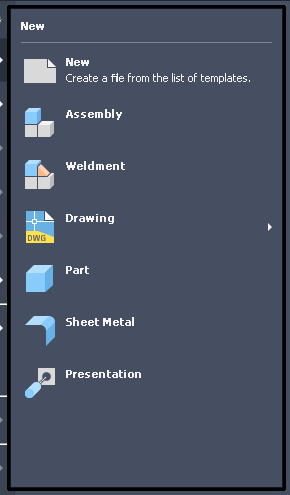

# 042 Per-pixel-alpha popups: translucent shadow drawn opaque black (low)
Status: open (low): black without a compositing manager, fine with one · Owner: - · Branch: - · Found in: UI test campaign (tooltips, menus)

## Symptom (integ d53133a66a1, :98 openbox, no compositor)
Inventor's WPF popups (ribbon tooltips, File-menu flyouts, floating
Properties panel) have a soft drop shadow on Windows. On Wine the shadow area
is a solid black frame (~4 px, rounded) around the popup. Cosmetic; content
and input are fine.
- VM: 
- Wine: ,
  submenu 

## Notes
WPF AllowsTransparency popups are WS_EX_LAYERED + UpdateLayeredWindow with
per-pixel alpha. winex11 maps them with the default (non-ARGB) visual, so
partially transparent pixels can only be blended against black / cut by the
window shape. Check whether a compositor on the display plus an ARGB visual for
per-pixel-alpha layered windows fixes it, and whether upstream has work on
this; likely a long-standing Wine limitation rather than a quick fix.
062 (worker-061): winex11 does give these windows an ARGB visual (depth 32, xwininfo); only
alpha-0 pixels are cut from the shape, the rest is drawn opaque because nothing blends without
a compositing manager. See 062 "Why no fix" for the X11 shape/input trade-off.
062 rework: with a compositing manager (picom) the shadows blend like on Windows (probe tests/layered_splitter.exe:
00009c = VM). Without one they stay black: cutting alpha < 128 pixels from the X shape (tried on fix/062-v2)
made them click-through and was dropped in review.
