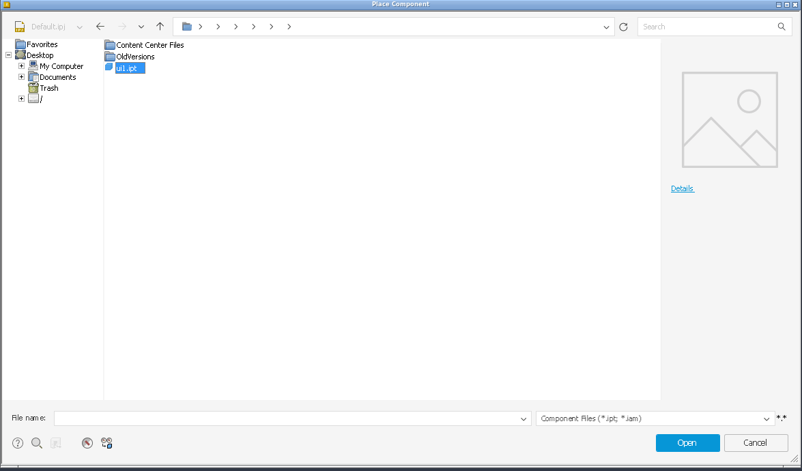
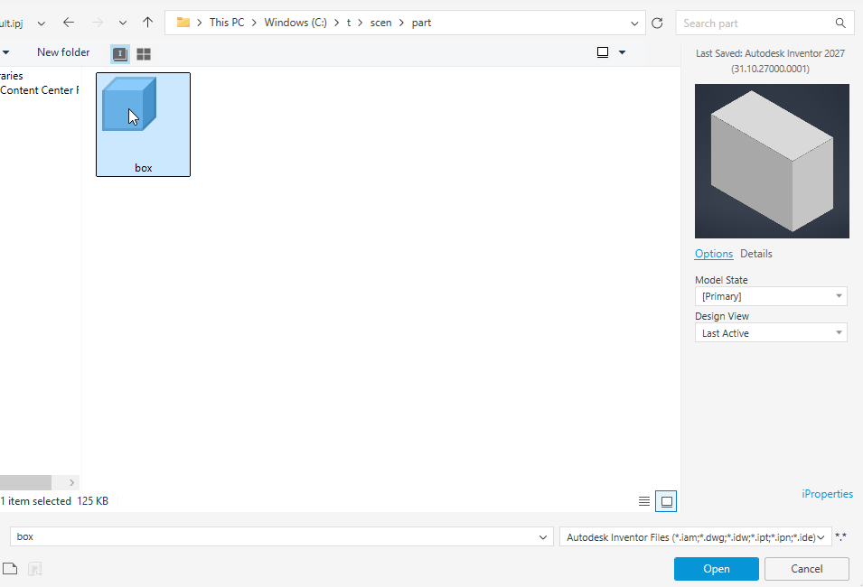

# 043 Inventor file dialogs: selecting / double-clicking a file does nothing
Status: open (draft) · Owner: - · Branch: - · Found in: UI test campaign (Place Component, Open)

## Symptom (integ d53133a66a1, :98)
Inventor's Open / Place Component / Save As dialogs host Wine's ExplorerBrowser
(ExplorerBrowserControl > SHELLDLL_DefView > SysListView32) in a WPF window.
Clicking a file highlights it in the list, but Inventor never hears about it:
the File name box stays empty, no preview/Options/"1 item selected".
Double-clicking a file does nothing (double-clicking folders navigates, which
the browser does itself). Workaround: type the name and press Enter / Open.
- Wine (ui1.ipt selected): 
- VM (box.ipt selected): 
  File name "box", thumbnail, Model State / Design View options, status
  "1 item selected".

## Suspects
The host learns about selection / default command through callbacks the
view makes to its browser: ICommDlgBrowser(2/3)::OnStateChange(CDBOSC_SELCHANGE),
OnDefaultCommand, IncludeObject (obtained via IServiceProvider on the site,
SID_SExplorerBrowserFrame / IID_ICommDlgBrowser), or
IExplorerBrowserEvents / IShellView events (e.g. IFolderView selection via
DIID_DShellFolderViewEvents). Check which one Wine's shellview/ExplorerBrowser
fails to call (`WINEDEBUG=+shell` during a click). The filter
("Component Files (*.ipt;*.iam)") is applied, so IncludeObject may already work.
Related: 041 (breadcrumb names) is the same dialog.

## Repro
Inventor on :98: Assemble > Place (or Ctrl+O), open a folder with an .ipt,
click the file.
