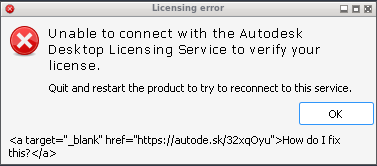

# 049 SysLink shows raw markup for `<a>` with attributes other than href/id
Status: open (draft) · Owner: - · Branch: - · Found in: samples campaign, integ 228616fa47c (prefixes/inv3, :100)

## Symptom
Inventor's "Licensing error" dialog (#32770) has a SysLink footer with the text
`<a target="_blank" href="https://autode.sk/32xqOyu">How do I fix this?</a>`.
Wine draws that whole string literally. It is not a link.

(`tests/wintext.exe` shows the SysLink control and its raw text.)

## Windows ground truth (`tests/syslink_attr.c`, Win11 VM vs Wine)
The probe uses comctl32 v6 SysLink. It reports LM_GETITEM links and the
LM_GETIDEALSIZE width. The plain text "How do I fix this?" is 112 px wide.

| markup | Windows | Wine |
|---|---|---|
| `<a href="u">` | link url u, 112 | same |
| `<a target="_blank" href="u">` | link url u, 112 | no link, 373 (literal) |
| `<a href="u" target="_blank">` | link url u, 112 | no link, 373 |
| `<a id="i" target="_blank">` | link id i, 112 | no link, 308 |
| `<a  href="u">` (2 spaces) | link, 112 | no link, 273 |
| `<a foo>`, `href='u'`, `href=u` | no link (literal) | same |

Windows skips unknown `name="value"` attributes and extra blanks between
attributes. It still rejects bare words, single quotes and unquoted values.

## Cause
`SYSLINK_ParseText` (dlls/comctl32_v6/syslink.c) accepts only `href="` and
`id="` after `<a `. It needs exactly one BreakChar between attributes.
Anything else invalidates the tag.

## Task
Skip unknown quoted attributes and runs of blanks in the parser. Add
conformance tests in dlls/comctl32/tests/syslink.c (LM_GETITEM url/id for the
cases above). Low impact: cosmetic, and only in error dialogs seen so far.
