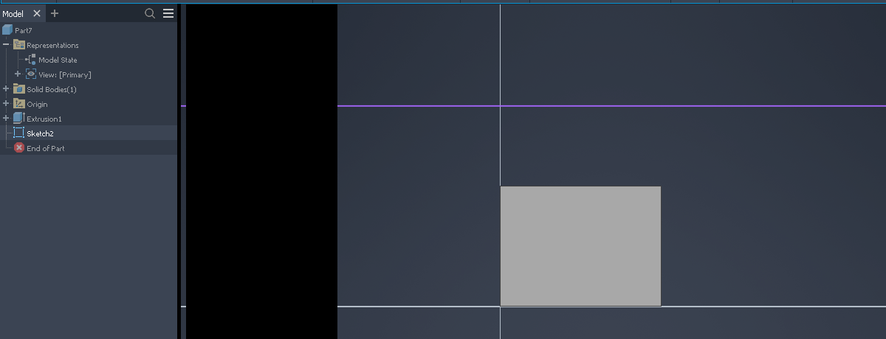
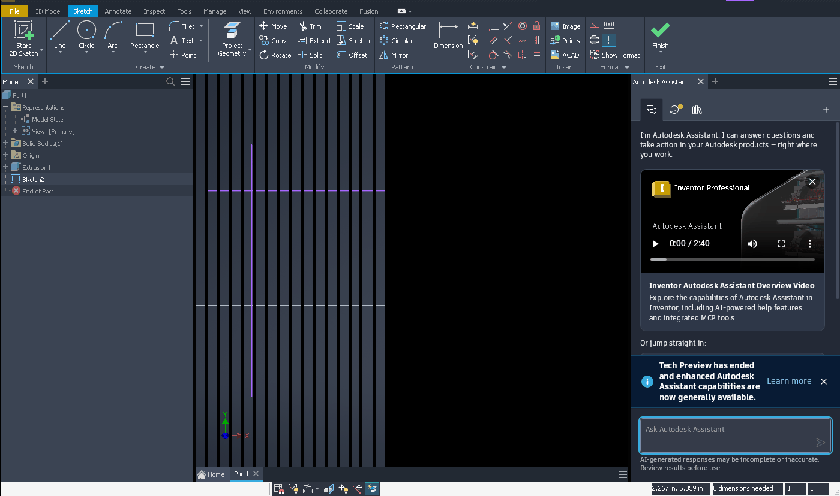
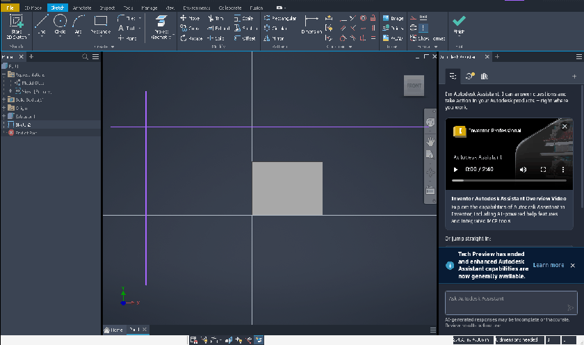

# 061 GPU child content lost on Expose (black trail after window drag)
Status: fixed · Owner: worker-061 · Branch: fix/061 (87d587c6997; also 11a48992263 = 076) · Found in: UI latency pass (tools/uilat wmdrag)

## Symptom (integ 061fa687382, :98 openbox, wined3d-vk)
Inventor restored (not maximized), drag the main window by its caption strip 200 px to
the right: the left 200 px of the 3D viewport stay black until Inventor presents again
(hover over geometry, orbit, ...). Repeated drags leave black vertical stripes.

The window itself follows the pointer in ~1 ms at 60 fps (openbox moves the frame,
server-side copy): the lag is not in the move, the damage is.

## Cause
- Screen-fixed windows over the viewport expose strips of it while the main window moves:
  issue 062's two 5 px WPF splitter popups stay at their screen position during a drag (same
  on Windows, see 062); Inventor repositions them when the move loop ends (presumably on
  WM_EXITSIZEMOVE: they stay behind after SetWindowPos or WM-driven moves, 077).
- The viewport is an offscreen client surface (window-surfaces.md): each present StretchBlts
  the offscreen X window onto the toplevel X window, nothing keeps that image. fix/005
  RedrawWindow()s the exposed client-surface part, but inside Wine's _NET_WM_MOVERESIZE wait
  loop OGS doesn't present (outside it, an expose by another window does get repainted:
  presumably OGS renders from the MFC idle loop, which a modal loop doesn't run), so it stays black.
  On Windows (DWM) the content is never lost.

## Fix (fix/061 87d587c6997)
`win32u: Present offscreen client surfaces again when their toplevel is exposed.`
expose_window_surface(): when the exposed rect reaches outside the surface clip (client
surfaces), re-run the driver present of the toplevel's offscreen client surfaces
(present_offscreen_client_surfaces()): the composite-redirected offscreen X window still
holds the last presented image. fix/005's RedrawWindow stays. Only winex11 has offscreen
surfaces (wayland/android expose paths are unaffected). Limit: surfaces owned by *another*
process (Chromium/WebView2 GPU process children) aren't in this process' list — not covered.

## Verification
- tests/expose_present.c (project test; screen readback, no upstream test): D3D11 child that
  presents red once and ignores WM_PAINT, a top-level window covers it and goes away.
  VM: 0000ff/0000ff exit 0. Wine :101 (NVIDIA, openbox) and Xvfb+lavapipe: without the fix
  after = 000000, with the fix 0000ff.
- Inventor (inv4, :101, openbox, 1400x850 restored, `uilat wmdrag --hz 60`): black pixels in
  the viewport after the drag 67.0% -> 0.0%; caption-strip lag unchanged (p50 1.1 ms, 60 fps),
  CPU Inventor 8->9%, Xorg 7->4%.
  Before 
  after 
- regress user32/d3d11/dxgi/opengl32/gdi32 vs master: nothing new (user32:win i386 FLAKY,
  same failures on the base build).

## WM comparison (awesome 4.3 = the user's WM, no compositor; openbox = our default)
| drag | openbox (integ) | awesome (integ) | awesome (fix/061) |
|---|---|---|---|
| caption (Wine SC_MOVE) | WM moves it via _NET_WM_MOVERESIZE, lag p50 1.1 ms; trail 67% black | window doesn't move at all (076) | Wine's own move loop: 60 fps, lag p50 3.5 ms p95 5-6 ms; no trail; splitters follow on release |
| Mod4+drag (WM) | - | lag p50 1.1 p95 2.2 ms; no trail | same; splitters stay behind (077) |
awesome 4.3 doesn't implement _NET_WM_MOVERESIZE, so Wine runs its own move loop (each
mouse move -> SetWindowPos -> ConfigureRequest -> awesome), ~2.5 ms more lag than a WM move but
60 fps. In that loop and in Mod4+drag Inventor presents as it moves (CPU 16-35%), so no trail.
Numbers: inst/uilat/061/summary.txt; screenshots inst/uilat/061/*.png. Other exposes (a window
moved over the viewport, xlogo test) did repaint under awesome even before the fix.

## Repro
tools/invscen/run.sh uilat; restore Inventor (xdotool click the restore button) and
`tools/uilat/uilat.py wmdrag --hz 60`, then screenshot (x/shot.sh). With another prefix/display:
`--display :101 --prefix prefixes/inv4`.
