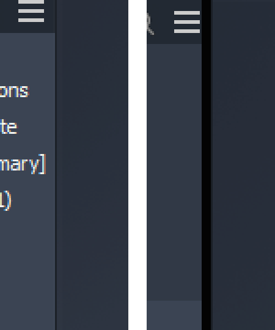
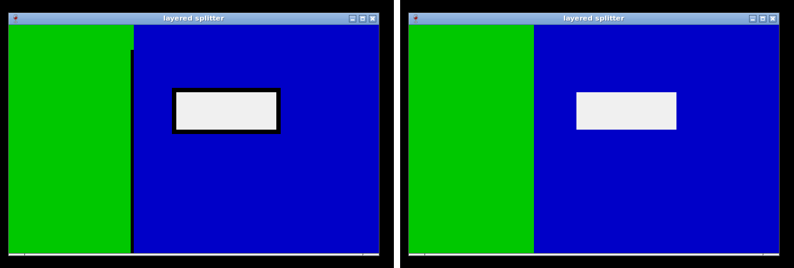

# 062 WPF per-pixel-alpha popup (browser pane splitter) drawn as a black bar
Status: fixed on fix/062 (eb92c8c23f7), Inventor check by the coordinator pending · Owner: worker-062 · Branch: fix/062 · Found in: UI latency pass (tools/uilat wmdrag)

## Symptom (integ 061fa687382, :98 openbox, no compositing manager)
In a part document a solid black 5 px vertical bar sits between the Model browser and the
viewport (maximized: x 240-245, y 145-1055), a second one between the viewport and the
Autodesk Assistant panel. When the main window is moved they stay at their old screen position
until the move ends (and punch the black trail of 061 into the viewport while it slides under).
Left Windows (VM), right Wine: 

## Window
`HwndWrapper[DefaultDomain;;...]`, 5 px x pane height, style 96080000
(WS_POPUP|WS_VISIBLE|WS_CLIPSIBLINGS|WS_CLIPCHILDREN|WS_SYSMENU), ex 00080080
(WS_EX_LAYERED|WS_EX_TOOLWINDOW), owned by Inventor's main window, Inventor.exe.
WPF AllowsTransparency window: UpdateLayeredWindow(ULW_ALPHA, AC_SRC_ALPHA, a 32 bpp DIB).
Content (Wine trace and Windows measurement agree): every pixel premultiplied 0x03030303 or
0x06030303, i.e. alpha 3-6 (1-2%): a hit-test surface, meant to be invisible.
X11 (winex11): ARGB visual (depth 32), managed (WS_POPUP|WS_SYSMENU counts as a caption in
is_window_managed), _NET_WM_WINDOW_TYPE_DIALOG, WM_TRANSIENT_FOR the main window,
SKIP_TASKBAR/PAGER, no decorations. openbox and awesome both keep it where Wine puts it.

## Windows ground truth (VM, tests/layered_popup_probe.exe, tests/layered_alpha.exe)
- Invisible: screen over it (CAPTUREBLT grab) = its neighbours. Composited alpha measured by
  grabbing it over our own white and black windows: 3-6, colour 3 (same bits as on Wine).
- Hit-testable: WindowFromPoint over it returns the popup; it's the pane-resize handle.
- Screen-fixed during a caption drag (the modal move loop): the popups' screen x doesn't change
  while the main window moves 240 px, and they jump to the new place after the button release.
  After a plain SetWindowPos move of the main window (another process) they stay behind for good.
- layered_alpha.exe (ULW_ALPHA popup with bands of alpha 0/1/16/64/128/255 over a red window):
  screen = red blended by alpha; WindowFromPoint and a SendInput click hit the popup for every
  alpha > 0, the window below for alpha 0.

## Cause
Without a compositing manager X can't blend: winex11 gives layered windows an ARGB visual
(which a compositor would blend correctly) and additionally cuts pixels with alpha == 0 out of
the window shape (dce.c set_surface_shape). Pixels with any other alpha are drawn opaque with
their premultiplied colour: alpha 3 of white = (3,3,3), black.
Wine on Xvfb (no WM) with layered_alpha.exe: screen 000000 for every alpha > 0, clicks right;
WindowFromPoint wrong for alpha 0/1 (080).

## Why no fix
An X window region (bounding shape) is both what is drawn and what gets input; the input shape
can only be a subset. So without a compositor a pixel is either drawn opaque or click-through.
Cutting low-alpha pixels out of the shape makes the bar invisible but kills the splitter:
tested by shaping the X window empty on :101 — xdotool drags at the splitter then no longer
resize the browser pane (with the black bar they do). Keeping input correct (current Wine)
is the better trade-off. Other routes (InputOnly sibling windows, background None, Wine
compositing its own windows) are hacks with worse failure modes.
With a compositing manager (picom etc.) the ARGB visual gives the Windows look (per the code;
not verified here, no compositor installed on the server).

## Related
- 061: the black trail during drags (fixed there, independent of the bar colour).
- 042: the same limitation for WPF popup shadows.
- 077: after WM-driven moves (awesome Mod4+drag) the popups stay at the old screen position.

## Reopened: don't draw nearly transparent layered windows, keep their input
User feedback (laptop, awesome, no compositor): the bar visibly lags behind window moves. On
Windows it is ~98 % transparent, so its lag (it only repositions when the move ends, same on
Windows) is invisible. Idea: without a compositor, for per-pixel-alpha layered windows, draw only
pixels above an alpha threshold (X Shape bounding region) and keep hit-testing for the remaining
alpha > 0 pixels with an InputOnly X window (or a ShapeInput region if it is not clipped by the
bounding shape) so dragging the splitter still resizes the pane. Windows hit-tests layered
per-pixel-alpha windows where alpha != 0.

## Fix (fix/062, 4 commits on integ d7799da4d5c)
Left: old drawing, right: fix (tests/layered_splitter.exe, openbox, no compositor)

Windows ground truth (VM; tests/layered_alpha.exe, layered_splitter.exe auto): a per-pixel-alpha
pixel takes clicks and WindowFromPoint for every alpha >= 1, alpha 0 falls through; the screen is
the plain blend (alpha 3-6 over green c8: 03c903). LWA_ALPHA 128 blends, takes clicks; a colour-key
hole falls through.

X facts (checked on Xvfb, scratch tests): the ShapeInput region is clipped by ShapeBounding, an
InputOnly child is clipped by its parent's shape, and an InputOnly/extra top-level would have to
follow the stacking the WM gives the frame. But a window that a client redirects with
XCompositeRedirectWindow(CompositeRedirectManual) while no compositing manager runs is not drawn,
doesn't clip what is below it (the server treats manually redirected windows as transparent) and
still gets all input, with its bounding shape as before. One X window, so coordinates, capture,
cursor and the WM's view are unchanged. With a WM the frame must be redirected instead: openbox's
frame is black, awesome's has no background (stale pixels).

Design (winex11 only, when _NET_WM_CM_Sn has no owner at surface creation):
- Per-pixel alpha is rounded to 1 bit: pixels with alpha < 128 are left out of the X shape, the
  rest is drawn opaque as before. 128 = the nearest of the two things X can do; WPF's stock drop
  shadow peaks at alpha 113 (#71000000), so shadows go away completely instead of leaving a rim.
- A surface without any pixel >= 128 (but some > 0) keeps the old alpha > 0 shape and win32u flags
  it `shape_hidden`; winex11 then redirects the top-level's outermost X ancestor below the root
  (WM frame, or the window itself), again on ReparentNotify, and undoes it when a pixel becomes
  visible / the window stops being layered. The flag travels by a posted driver message
  (WM_X11DRV_SET_REDIRECTED): the flush can run with the window data locked.
- win32u: `window_surface.alpha_threshold` (driver knob, 0 = old rule) and `shape_hidden`; the shape
  of such surfaces is recomputed over the whole surface. Two side fixes it needs: ULW clears the
  surface padding (surfaces are rounded up to 128 px and start opaque white), and the padding no
  longer counts as client-surface area (fix/027 forced it opaque in the shape).
- With a compositing manager nothing changes (ARGB visual, shape = alpha > 0, real blending).

Limits (X can't do better with one window):
- A window with both visible and faint pixels: the faint ones (0 < alpha < 128: shadows, AA edges)
  are not drawn and click-through; Windows hit-tests them. layered_alpha.exe: alpha 1/16/64 bands
  now show the window below and click it. A translucent overlay below 50% inside a window that also
  has opaque pixels disappears.
- awesome doesn't shape its frame: alpha 0 holes of a managed layered window swallow clicks there
  (before and after; openbox and no-WM pass them through).
- A compositing manager started while a hidden window exists can't redirect the root's children
  (one manual redirection per window: BadAccess); CM detection is at surface creation only.
- First show: the frame is visible until ReparentNotify is processed (a few ms).
- UpdateLayeredWindowIndirect with a dirty rect on a fresh surface leaves the padding opaque:
  such a window is never hidden (old look). DPI-scaled surfaces likewise.

Tests (Xvfb, no compositor; tests/layered_splitter.sh drag/move/cycle drives tests/layered_splitter.exe with xdotool):
| | no WM | openbox | awesome (x/awesome-rc.lua) |
|---|---|---|---|
| bar pixels on screen (was 030303) | 00c800 = pane | 00c800 | 00c800 |
| press on the bar, drag 60 px out of it (capture), release | down 2,100; split 200->257 | same | same |
| click on the bar's alpha 0 rows | main | main | swallowed by the frame (as before) |
| tooltip shadow (was 000000) / body | 0000c8 / f0f0f0 | same | same |
| click on shadow / body | main / tip | same | same |
| WM move (title drag / Mod4+drag): bar during, after | - | invisible, follows at the end, drag ok | same |
| hide + show, resize (new surface) | ok | ok | ok (awesome re-places a re-shown window) |
| _NET_WM_CM_S0 owned (fake owner) | old behaviour | old | - |
layered_alpha.exe kinds (LWA_ALPHA 128, LWA_COLORKEY + hole, opaque ULW): same as before the fix.
layered_child_gpu.exe (colour key + D3D child, lavapipe): child 00ff00. expose_present.exe ok.
user32:win test_layered_window_alpha (screen under alpha 3 pixels = the window below, mixed and
all-faint): VM 0 failures; Wine passes, and fails with 030303 on the old path.
awesome's placement rule moves newly mapped managed popups into free screen space (seen with the
small probe window; Inventor repositions its popups afterwards): the probe re-places the bar.
