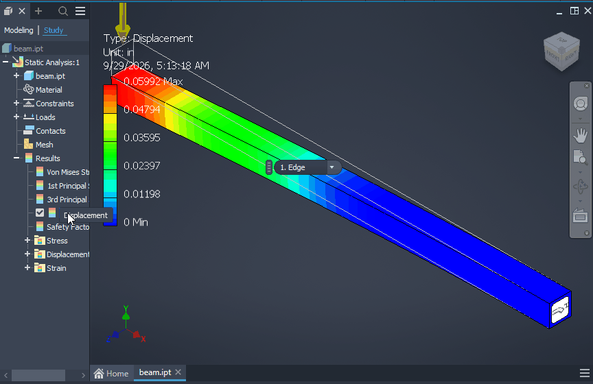

# 063 Stress Analysis hangs Inventor: manifest threadingModel="free" parsed case-sensitively
Status: fixed · Owner: worker 063 · Branch: fix/063-actctx-threadingmodel · Found in: specialised-environments pass (inv3/:100, integ c036c687c47)

## Symptom
Part open, 3D Model → Stress Analysis (or Environments → Stress Analysis): Inventor's UI
freezes for good (no repaint, no input), 0% CPU. Every time, first entry per session.

## Evidence (winedbg bt, Inventor main thread 0x2c0)
```
WaitForSingleObject                     <- INFINITE
fea_addin_utils  ROTUtils::RegisterCommunicator (+0x7e2d2)
fea_application_common (+0x2ab9e ...)   <- add-in activation from the ribbon command
```
`RegisterCommunicator` (Autodesk code, Ghidra) creates event "CommunicatorNamedEvent", starts
an MFC thread and waits for it. That thread: `CoInitializeEx(NULL, COINIT_MULTITHREADED)`,
activates FEA_Application_Common.dll's manifest context, `CoCreateInstance({E4E2FE54-5A90-
4006-AC58-9E11DE19817B}, CLSCTX 0x17)`, registers it in the ROT, then sets the event. On Wine it
is stuck in:
```
apartment_hostobject_in_hostapt(multi_threaded=0, main_apartment=1)   combase/apartment.c
apartment_get_inproc_class_object(class_context=0x17)
CoCreateInstance(rclsid={E4E2FE54-...})
fea_addin_utils (+0x7e3dd)
```
i.e. combase treats the class as main-threaded and marshals the creation to the main STA,
which is the blocked UI thread: deadlock.

The class comes from FEA_Application_Common.dll's embedded manifest:
`<comClass clsid="{E4E2FE54-5A90-4006-AC58-9E11DE19817B}" ... threadingModel="free">`
(lowercase). ntdll `parse_com_class_threadingmodel` compares with `xmlstr_cmp`
(case-sensitive), so "free" becomes ThreadingModel_No (= main-threaded).

## Windows ground truth
`tests/actctx_tmodel.c` (manifest with one comClass, FindActCtxSectionGuid COM server
redirection, model field): 1 Apartment, 2 Free, 3 No, 4 Both, 5 Neutral.

| threadingModel | Win11 VM | Wine |
|---|---|---|
| Apartment / apartment | 1 / 1 | 1 / 3 |
| Free / free / FREE | 2 / 2 / 2 | 2 / 3 / 3 |
| Both / both | 4 / 4 | 4 / 3 |
| Neutral / neutral | 5 / 5 | 5 / 3 |
| "" / "bogus" / " Free" / "Free " | CreateActCtx fails 14001 | 3 / 3 |
| Single / single | 3 | 3 |
| attribute absent | 3 | 0 |

`<clrClass>`: identical, except absent attribute = 4 (Both) on Windows (Wine: 0 = main-threaded).
combase's registry `ThreadingModel` path already compares with `wcsicmp`.

## Task
Case-insensitive threadingModel values in ntdll actctx (and, per the table, reject empty /
unknown values). Add the cases to kernel32/tests/actctx.c. Then retest: Stress Analysis
environment → Create Simulation (specialised-environments pass, beam.cs scenario part).

## Outcome
`fix/063-actctx-threadingmodel` (on master), 2 commits:
- `ntdll: Parse comClass threadingModel values case-insensitively.` — xmlstr_cmpi, "Single" → No,
  anything else (incl. empty) → set_error (14001). Shared by comClass and clrClass.
- `ntdll: Set default threading models for comClass and clrClass.` — absent attribute: No / Both.
Test `test_com_class_threadingmodel` in kernel32/tests/actctx.c (both elements, all rows above):
passes on Win11 VM (x86_64 + i386) and Wine; unfixed master fails 18 checks.
regress (kernel32 ntdll ole32 combase sxs) vs integ c036c687c47: only ntdll:time (flaky in base).
Still to do: Inventor retest (Stress Analysis → Create Simulation, invscen `beam`) once on integ.
Verified in Inventor (2026-09-29, integ 7f6770b075c = wt/verify-build, inv3/:100): the hang is gone —
Environments → Stress Analysis enters at once, Create Study → Static Analysis works, Fixed constraint
+ 100 N edge force on `beam` set up normally. Mesh View then kills Inventor: unimplemented
`RPCRT4.dll.NdrStubCall3` (new issue [068](068-rpcrt4-ndrstubcall3.md)), so no solve on Wine yet.
VM reference (same setup, default mesh, Simulate): max displacement 0.05992 in = 1.522 mm, max von Mises
17.37 ksi = 119.8 MPa vs beam theory 1.52 mm / 120 MPa (agree within ~0.2 %; mesh-dependent, compare
Wine within a few %). 
