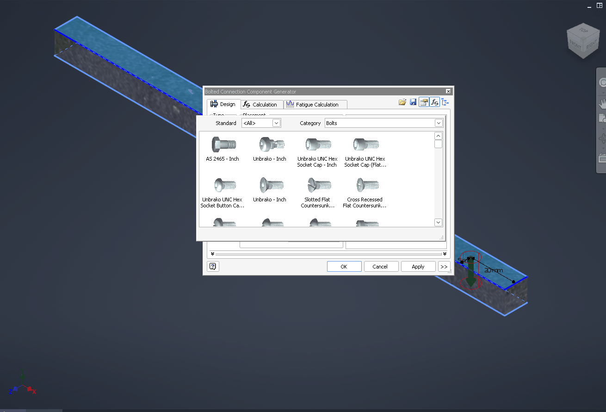

# 064 Content Center empty: GetWindowsAccountDomainSid returns ERROR_INVALID_SID for non-account SIDs
Status: fixed · Owner: worker-064 · Branch: fix/064-account-domain-sid · Found in: specialised-environments pass (inv3/:100, integ c036c687c47)

## Symptom
Content Center shows no libraries although the desktop libraries are installed
(`C:\ProgramData\Autodesk\Inventor 2027\Content Center\Libraries\*.idcl`, configured in
Default.ipj, App Options → Content Center = Inventor Desktop Content):
- Place from Content Center / Content Center Editor: empty category tree, Library list empty.
- API: `ContentCenter.TreeViewTopNode.ChildNodes` is empty.
- Frame Generator → Insert Frame: "Content Center server query failed. Please check your Content
  Center configuration ..."; the Frame Member section has no Standard/Family/Size.
Blocks everything built on Content Center: Frame Generator, Design Accelerator bolted
connection (fasteners), Tube & Pipe (fittings), Place from CC. (The VM has no CC libraries
installed, so there is no Inventor-level reference.)

## Evidence
Inventor started with a .NET EventPipe trace of exceptions (CoreCLR add-ins, .NET 10):
`DOTNET_EnableEventPipe=1 DOTNET_EventPipeOutputPath=C:\t\inv.nettrace
DOTNET_EventPipeConfig=Microsoft-Windows-DotNETRuntime:0x8000:4`, then `strings -el` on the
file. Opening Place from Content Center throws, once per configured library (13x):
```
System.ComponentModel.Win32Exception: Invalid SID.
  Connectivity.Core.Util.IOUtil::HasWritePermission(string, WindowsIdentity)
  Connectivity.Core.Database.TransactionContext::.ctor(...)
  Connectivity.Core.DataAccess.KnowledgeLibraries::GetKnowledgeLibraryByName(string)
```
(the .idcl SQLite files are never opened). HasWritePermission walks the library folder's ACL
(Everyone S-1-1-0, SYSTEM S-1-5-18, the user) with managed SecurityIdentifier APIs.
`SecurityIdentifier.AccountDomainSid` throws on Wine for non-account SIDs (.NET 4.8 probe:
Wine `S-1-1-0` / `S-1-5-18` → SystemException "Invalid SID."; Windows → null). .NET maps the
Win32 error of `GetWindowsAccountDomainSid`: success, ERROR_NON_ACCOUNT_SID (→ null) and
ERROR_INSUFFICIENT_BUFFER are expected, anything else is thrown.

## Windows ground truth (`tests/account_domain_sid.c`)
| SID | Win11 VM | Wine |
|---|---|---|
| S-1-1-0, S-1-5-18, S-1-5-32-544, S-1-5-11, S-1-2-0, S-1-5-4, S-1-16-12288 | FALSE, 1257 ERROR_NON_ACCOUNT_SID | FALSE, 1337 ERROR_INVALID_SID |
| S-1-5-21-1-2 (3 subauths) | FALSE, 1257 | FALSE, 1337 |
| S-1-5-80-1-2-3-4-5, S-1-5-22-1-2-3-4 | FALSE, 1257 | TRUE (S-1-5-80-1-2-3, S-1-5-22-1-2-3) |
| S-1-5-21-1-2-3[-...] | TRUE, S-1-5-21-1-2-3, size 24 | same |
EqualDomainSid already matches Windows for all rows (1258 ERROR_NON_DOMAIN_SID for non-domain).

## Task
kernelbase `GetWindowsAccountDomainSid` (semi-stub): only S-1-5-21-x-y-z[-...] are account
SIDs; everything else (valid) fails with ERROR_NON_ACCOUNT_SID. Add the table to
advapi32/tests/security.c. Then retest Content Center (ccprobe-like tree query, Place from CC)
and Frame Generator (tools/invscen/frame.cs + Insert Frame UI).

## Outcome
Extended `tests/account_domain_sid.c` (more SIDs + argument-order matrix). Windows rules:
NULL/invalid sid → 1337 (before anything else); NULL size → 87; non-account → 1257, size and
buffer untouched; account = authority 5, >= 4 subauths, first = 21; size < 24 → 122 (even with
NULL output), size set to 24; NULL output with enough size → 87, size set to 24.
Fix (2 commits on master, kernelbase): non-account check → ERROR_NON_ACCOUNT_SID (the app bug);
size checked before the output pointer. FIXME semi-stub → TRACE. Probe output on Wine is now
byte-identical to the VM; SID table added to advapi32 security tests (fail on unfixed Wine).
Not retested in Inventor (Content Center / Frame Generator) — needs an Inventor display/prefix.
Verified in Inventor (2026-09-29, integ 7f6770b075c = wt/verify-build, inv3/:100): fixed.
invscen `content`: tree has 10 categories (Cable & Harness, Fasteners(5), ..., Structural Shapes(10),
Tube & Pipe). Place from Content Center: tree + family thumbnails (Hex Head: 161 items), DIN EN ISO 4017
M10 x 50 generated into Content Center Files and placed in frame.iam. Frame Generator Insert Frame:
Standard/Family/Size filled (ANSI AISC rectangular tube 2x1x1/8), preview of 4 members on the `frame`
skeleton, file-naming dialogs — but OK then creates nothing (new draft [069](069-frame-generator-no-members.md)).
Bolted connection: fastener picker lists CC bolts; Unbrako UNC socket cap 1/4 x 1 1/2 generated and
placed. 
