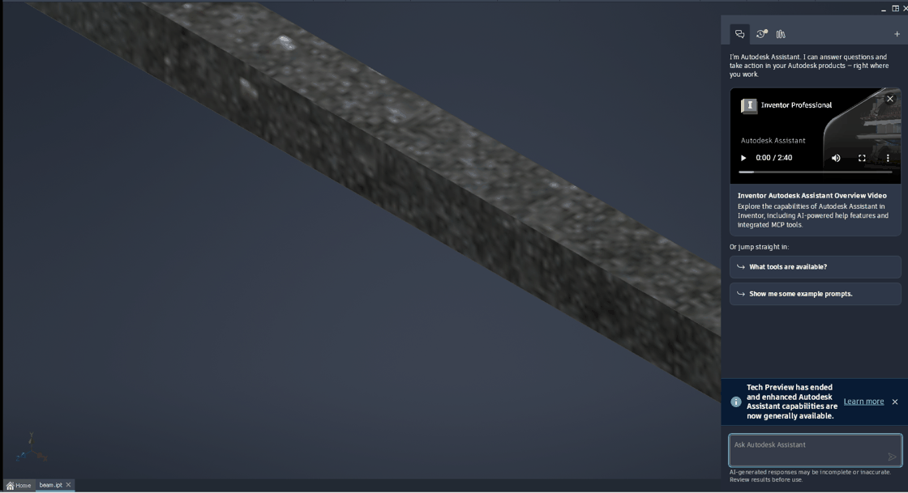
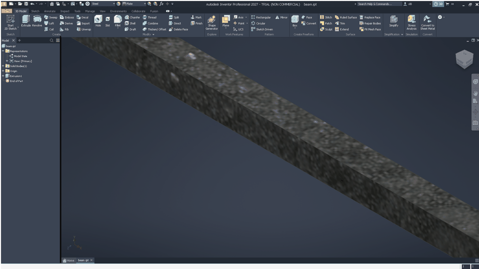

# 065 Closing the Autodesk Assistant panel leaves its image over the viewport; viewport clipped to the old size
Status: fixed · Owner: worker-065 · Branch: fix/065-client-surface-clip (wine-src, on integ b339a450dd5) · Found in: specialised-environments pass (inv3/:100, integ c036c687c47, openbox, wined3d-vk)

## Symptom
Part or assembly open, Autodesk Assistant docked on the right (WebView2, cross-process).
Click the panel's X: the panel's frame/title go away and Inventor grows the graphics window
to the right edge (Win32: panel ControlBar + its Chrome_WidgetWin_* children now hidden,
MDI view 1678 px wide instead of 1328), and Inventor renders for the new size (model re-centred
175 px to the right). But on screen:
- the last Assistant image stays at x >= 1574 (never repainted),
- the 3D view is cut off at the old right edge x = 1574 (zoom/orbit redraw only the left part),
- the ViewCube and navigation bar (top-right of the viewport) are not visible.
Restore/maximize of the main window does not repair it (the stale strip moves around).

On Windows the viewport extends over the freed area (expected; not re-checked on the VM:
it needs UI clicks there).

## Notes
- X side after closing: the WebView2 host's client window (350x884) is still mapped but as a
  child of a 1x1 dummy parent (not visible); the stale pixels belong to the main window.
- Looks like the viewport's GPU (client-surface) region / window-surface clip is not
  recomputed when a sibling hides and the view grows, cf. 061 (black exposed areas under
  closed dialogs, also seen in this pass after Design Accelerator / print dialogs).

## Repro
`INV_PREFIX=prefixes/inv3 DISPLAY=:100 DRI_PRIME=pci-0000_16_00_0 tools/invscen/run.sh beam`
(opens a part visible), click the X of the "Autodesk Assistant" panel tab, scroll-zoom in the
viewport, screenshot (x/shot.sh).

## Cause
Not Inventor's viewport: its present region, surface clip and Vulkan image were right
(+win/+x11drv trace via gdb-toggled debug channels; the viewport's offscreen X window held
the full new frame). The stale strip is drawn by the Assistant's WebView2 GPU process
(`kill -STOP` of it made the viewport render fully): its dcomp compositor keeps presenting
the last frame on its own child window ("Intermediate D3D Window") inside the now hidden
panel, and each present blits through that process' *cached* DCE visible region. win32u
NtUserGetDCEx only refreshes cached DCEs of foreign windows; the hide happened in Inventor's
process, so the GPU process' DCE for its own window was never invalidated
("cross-process invalidation is not supported yet").

## Fix
e82bfd7afbe win32u: Always update the DC visible region of windows inside another process'
window tree (also when the window's GA_ROOT belongs to another process), + user32 dce test
(child process caches a DC on its child of our container, we hide the container, its SYSRGN
must be empty).
Note for repros: "static" has CS_PARENTDC; hiding the parent flips DCX_PARENTCLIP off, which
picks another DCE and hides the bug. Use a class without it.

## Tests
- Windows ground truth: tests/xproc_hidden_present.c (child process presents green in a loop
  on its child of our container; we hide the container; screen pixel must stop being green):
  VM pass (after = f0f0f0); Wine unfixed fail (still 00ff00), fixed pass (Xvfb + lavapipe).
- user32 dce: VM x86_64 + i386 0 failures; Wine unfixed 1 failure, fixed 0 (both arches).
- Inventor (inv3, :100, wt/065-build): closing the Assistant leaves a full-width viewport
  with ViewCube and nav bar, reopening works.
  
- Not re-checked on the VM's Inventor (the xproc test covers the Windows behaviour).
