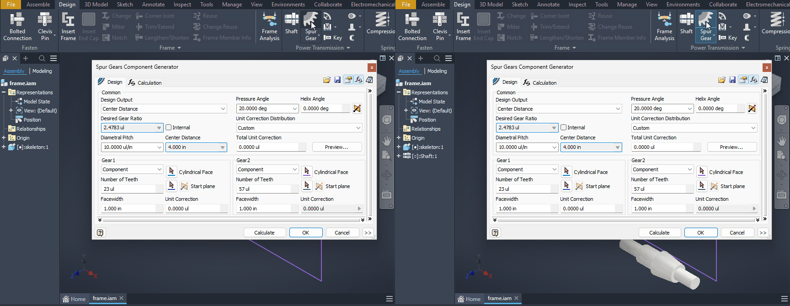

# 066 Design Accelerator: generated component vanishes when the next generator starts (unconfirmed vs Windows)
Status: not a Wine bug (same on Windows: the shaft is still a pending Place; VM 2026-10-02) · Owner: - · Branch: - · Found in: specialised-environments pass (inv3/:100, integ c036c687c47)

## Symptom
Assembly (tools/invscen/frame.cs frame.iam), Design tab:
1. Shaft → OK → File Naming OK: `Shaft:1` appears in the browser and viewport.
2. Directly click Spur Gear on the ribbon: as soon as its dialog opens, `Shaft:1` is gone from
   the browser, viewport and `Occurrences` (the Shaft1.ipt document stays loaded, dirty).
Same the other way round (Spur Gears:1 dropped when Shaft starts). Seen 3 of 3 times.
If instead you click once into empty viewport space after the generator closes, the component
survives the next generator (Shaft:1 + Spur Gears:1 both kept, volumes/extent as expected).

## Evidence (TransactionManager, tools/invscen/tx.cs with INVSCEN_KEEP=1)
After a generator's OK: committed [..., "Shaft", "Toggle Visibility"], current transaction
"Unidentified transaction" still open. Clicking the viewport commits it as " " and the
component stays. Starting the next generator instead ends it and the occurrence is removed.

## Open question
Whether Windows behaves the same (it would be a severe Inventor bug, unlikely): needs a
Windows UI run of steps 1-2 (VM clicks are off-limits for workers). If Windows keeps the
component, look at what ends the post-generator transaction on Windows (idle / mouse-move
processing after the modal dialog closes vs. Wine).

## Windows ground truth (VM, 2026-10-02): same behaviour, not a Wine bug
frame.iam from `run.sh --vm frame`, Design tab:
1. Shaft > OK > File Naming OK: `Shaft:1` appears in the browser and viewport, status bar "Place
   component" (the shaft hangs on the cursor waiting for a placement click).
2. Click Spur Gear right away: as the dialog opens, `Shaft:1` is gone from the browser and the viewport
   (first screenshot, left). Cancel: still gone.
3. Repeat, but click once into the viewport after the File Naming OK (status "Ready", Shaft:1 placed at
   the cursor), then Spur Gear: `Shaft:1` stays (right).
Identical to Wine. It is Inventor's design: the generated component is still in unplaced "Place
component" state until clicked, and starting another command cancels it. Close as not-a-bug.

