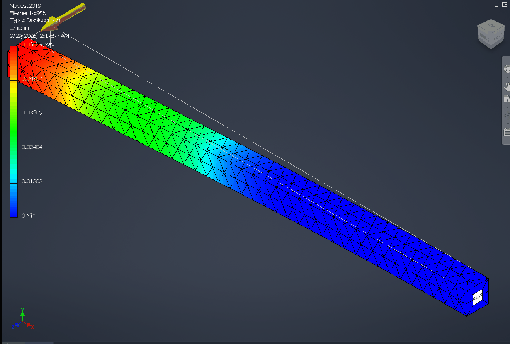

# 070 Stress Analysis mesh: manifest CLSID not found inside an incoming COM call (no activation context)
Status: fixed · Owner: worker 070 · Branch: fix/070-com-call-actctx · Found in: 068 verification (inv3/:100, integ 7f6770b075c + 068 fix)

## Symptom
`beam` → Stress Analysis → Create Study → Fixed + 100 N edge force → Mesh View: Inventor dies
(CER dialog). With 068 fixed the NdrStubCall3 abort is gone; the crash is now an access violation in
`FEA_Addin_Utils!ProgressIndicator::GetProgressIndicator` (+0x74b30): it AddRefs a NULL IProgress.
Same steps on the Win11 VM mesh and solve fine (063: 1.522 mm / 119.8 MPa).

## Evidence
Relay trace (`WINEDEBUG=+relay,warn+ole` with RelayInclude on NdrStubCall3, CoCreateInstance,
Rtl(De)ActivateActivationContext): FEAComputeServer.exe calls back into Inventor; on the Inventor
RPC thread:
```
Call rpcrt4.NdrStubCall3(...)
  Call combase.CoCreateInstance({...}, CLSCTX_INPROC_SERVER)          -> S_OK
  Call combase.CoCreateInstance({A9485C80-1DCC-4F77-9F26-E2569F4C03F1}, 0x17) ret=FEA_Application_Common+0x330c
    err:ole:com_get_class_object class {a9485c80-...} not registered   -> 0x80040154
Ret  rpcrt4.NdrStubCall3() retval=0
```
No Rtl*ActivationContext call on that thread during the call. The caller (FEA_Application_Common
FUN_180003264, a Communicator "create progress" method, Ghidra) wraps the call in MFC's
AFX_MAINTAIN_STATE2 and does `CoCreateInstance(A9485C80, 0x17, ...)`. A9485C80 is registered only in
FEA_Application_Common.dll's embedded manifest (`<comClass ... threadingModel="free">`, next to
E4E2FE54 from 063); it isn't in the registry. Without an active activation context, the lookup
fails, the progress bar is NULL, and Inventor later AVs on it.

## Open question (needs Windows ground truth)
How does the class resolve on Windows inside that call? Candidates:
1. Windows activates, for an incoming cross-apartment/cross-process call, the activation context that was
   active when the object was created/marshaled (the callee is an Inventor-side object of an
   FEAComputeServerPS.dll interface).
2. MFC's AFX_MAINTAIN_STATE2 activates the DLL module's context on Windows but not on Wine (e.g.
   module state m_hActCtx not created, or its creation fails on Wine).
Probe idea: a server object created on thread A under an actctx (a manifest with a comClass),
marshaled to a second process. Inside a method called from there: GetCurrentActCtx, plus
CoCreateInstance of a class that only the manifest declares. Also test the in-process cross-apartment case.

## Task
Find which of the above Windows does and match it. Retest Mesh View + Simulate on `beam` (063 numbers).

## Findings (worker 070)
- The failing call is not the cross-process one. FEA_Addin_Utils `ProgressIndicator` ctor runs on
  Inventor's main STA with FEA's manifest context active (its own CreateActCtx/ActivateActCtx
  helper), creates the Communicator {E4E2FE54} (threadingModel free → lives in the MTA) and calls
  its method +0x40 through the proxy. That in-process STA→MTA call is the NdrStubCall3 on the RPC
  thread (ICommunicator's PS is FEACommunicator.dll, MIDL /protocol all); it reaches
  FEA_Application_Common FUN_180003264 → CoCreateInstance(A9485C80) with no context.
- MFC is not involved: AFX_MAINTAIN_STATE2 on FEA's static module state activates nothing, on
  Windows too (probe `tests/actctx_comcall/mfc_state.c`, calls mfc140u's ctor by ordinal on the
  VM's installed FEA DLL: A9485C80 is CLASSNOTREG on every thread, inside the state or not).
- Windows ground truth (`tests/actctx_comcall/`: probe.dll with a resource-2 manifest declaring the
  classes, actctx_comcall.exe): an in-process call into another apartment (STA→MTA, STA→STA) runs in
  the caller's active context — the caller's ctx or none (a NULL frame hides the server thread's
  own). Cross-process calls get no context from the caller; nothing is captured at object
  creation or marshal time. Only exception seen: an STA whose OLE window was created under a
  context runs cross-process calls in that context (window activation context; Wine lacks it,
  not needed here).
- Wine: no propagation; in-process calls into the MTA went through rpcrt4 (server thread), so
  nothing of the caller's state could be carried.

## Fix
`fix/070-com-call-actctx` (on master 4e819f054dd), 2 commits:
- `combase: Bypass the RPC runtime for in-process calls into the multithreaded apartment.` —
  like the existing STA shortcut, but run rpc_execute_call on a thread-pool thread joined to the MTA.
- `combase: Run in-process calls in the caller's activation context.` — GetCurrentActCtx in
  ClientRpcChannelBuffer_SendReceive, activate it around IRpcStubBuffer_Invoke for bypass calls.
  Test ole32 marshal.c test_call_actctx (MTA and STA host, call with/without an active context).
  ole32_test marshal: Win11 VM x86_64 1202 tests / i386 1205, 0 failures; Wine x86_64 + i386
  0 failures (unfixed: 2). regress kernel32 ntdll ole32 combase oleaut32 rpcrt4 vs master
  4e819f054dd: 184 units, 0 worse.

## Retest in Inventor (integ 9c25f8c8a4b + fix, inv3/:100)
`beam` → Stress Analysis → Create Study → Fixed (end face) + 100 N edge force (far end) →
Mesh View: mesh shown (2019 nodes / 955 elements), no crash. Simulate: max von Mises 17.41 ksi =
120.0 MPa, max displacement 0.06009 in = 1.526 mm (VM 119.8 MPa / 1.522 mm, within 0.3 %).

