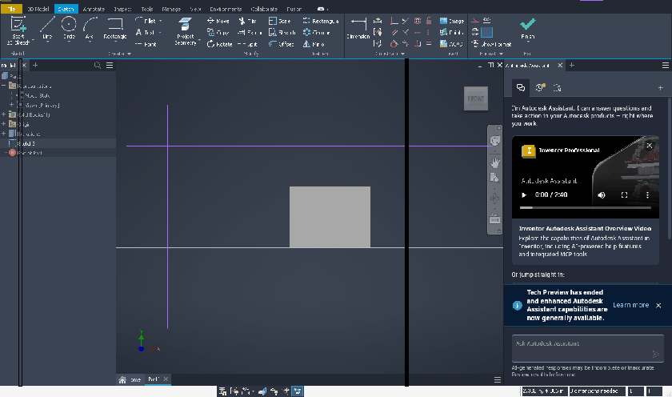

# 077 WM-driven moves: no WM_ENTERSIZEMOVE/EXITSIZEMOVE, Inventor's splitter popups stay behind
Status: open (draft) · Owner: - · Branch: - · Found in: 061/062 WM comparison (awesome)

## Symptom
awesome Mod4+drag (the WM moves the frame itself, Wine only sees ConfigureNotify) of Inventor's
main window: the two WPF splitter popups (062) stay at their old screen position after the
drop, black bars across the browser and the viewport, and the pane-resize hot zones are in the
wrong place until the next caption drag.

## Windows ground truth
The popups follow only at the end of the modal move loop (caption drag). A SetWindowPos move of
the main window from another process leaves them behind on Windows too
(tests/layered_popup_probe.exe + a SetWindowPos helper, VM). So Inventor presumably relayouts
on WM_EXITSIZEMOVE, which Wine sends around its own loop and around _NET_WM_MOVERESIZE, but not
for moves the WM starts by itself (Mod4+drag, keyboard moves, openbox Alt+drag).

## Ideas
X has no "interactive move started/ended" notification; a heuristic would be needed (e.g.
ConfigureNotify moves while the pointer is grabbed by another client -> ENTERSIZEMOVE, the
grab ending -> EXITSIZEMOVE). Workaround for users: drag by the caption.
