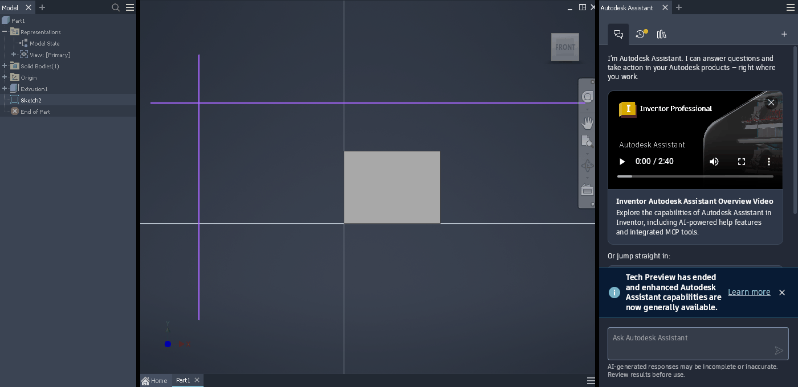

# 077 WM-driven moves: no WM_ENTERSIZEMOVE/EXITSIZEMOVE, Inventor's splitter popups stay behind
Status: fixed · Owner: worker-077 · Branch: fix/077 (163f31eb6bc) · Found in: 061/062 WM comparison (awesome)

## Symptom
awesome Mod4+drag (the WM moves the frame itself, Wine only sees ConfigureNotify) of Inventor's
main window: the two WPF splitter popups (062) stay at their old screen position after the
drop, black bars across the browser and the viewport, and the pane-resize hot zones are in the
wrong place until the next caption drag.

## Windows ground truth
The popups follow only at the end of the modal move loop (caption drag). A SetWindowPos move of
the main window from another process leaves them behind on Windows too
(tests/layered_popup_probe.exe + a SetWindowPos helper, VM). So Inventor relayouts on
WM_EXITSIZEMOVE, which Wine sent around its own loops but not for moves the WM starts by itself
(Mod4+drag, keyboard moves, openbox Alt+drag). Windows has no WM-started moves; the app-visible
contract of every move is ENTERSIZEMOVE ... WINDOWPOSCHANGED ... EXITSIZEMOVE.

## What X shows (xev + Wine traces, Xvfb)
- No "interactive move" notification exists; _NET_WM_MOVERESIZE is client -> WM only.
- awesome 4.3 Mod4+drag: passive button grab on the client window, then mousegrabber on root.
  No crossing event at the start; EnterNotify(NotifyUngrab) at the end only if the pointer is
  inside our window (not after a Mod4+right resize: the pointer sits on the frame corner).
  Synthetic ConfigureNotify per motion; no keyboard grab.
- openbox Alt+drag / keyboard move: grabs keyboard + pointer (FocusOut/FocusIn NotifyGrab/
  NotifyUngrab on the focused window). Moves send no client ConfigureNotify during the move,
  only the frame's (Wine's host window -> GravityNotify); the synthetic ConfigureNotify comes
  after FocusIn(NotifyUngrab). Resizes send ConfigureNotify per step.
- Proton (ValveSoftware/wine proton_11.0): nothing for this; it only waits for a WM pointer
  grab to end on FocusIn by polling XGrabPointer (wait_grab_pointer). No other fork found.

## Fix (fix/077 163f31eb6bc)
`winex11: Send WM_ENTERSIZEMOVE/WM_EXITSIZEMOVE around moves the WM starts itself.`
- Start: a WM config change (ConfigureNotify that window_update_client_config reports as a WM
  change, or a frame move seen as GravityNotify that differs from the last configured position)
  while the WM holds input: `keyboard_grabbed` or a mouse button down (XQueryPointer state, real
  device state whoever grabs). Skipped while Wine's own loops run: win32u's (capture set, also
  app drags) and move_resize_window's (_NET_WM_MOVERESIZE; new thread flag).
- End: XI2 XI_RawButtonRelease, selected on the root only during the size-move (raw events
  reach every root selection whatever grab is active; upstream doesn't select raw buttons
  otherwise since 24309da4c30), or FocusIn ending a keyboard grab; ends only when neither a
  keyboard grab nor a button is left. Without XI2 only keyboard-grab moves are tracked.
- Both messages are posted (WM_X11DRV_SIZE_MOVE) to stay in order with the posted
  WM_WINE_WINDOW_STATE_CHANGED; the EXIT handler first applies the pending state (the WM may
  send the final ConfigureNotify after releasing the grab), so the last WINDOWPOSCHANGED comes
  before WM_EXITSIZEMOVE.
- Robustness: EXIT is only posted for a recorded ENTER (one thread field); no timers. Limits: a
  WM keyboard grab whose FocusIn(NotifyUngrab) goes to another window (focus moved during the
  grab) keeps the size-move open until our next FocusIn or button release; a WM config change
  while the user holds a button for other reasons (e.g. WM placement of a window mapped during
  a click) gives a balanced ENTER/EXIT pair.

## Verification
Probe tests/sizemove_log.c (logs ENTER/EXIT/MOVING/WINDOWPOSCHANGED/...; exit 1 on unbalanced
pairs), driver tests/sizemove_scen.sh. Logs: inst/077/{before,after}-{awesome,openbox}-*.log.
| scenario | awesome before | awesome after | openbox before | openbox after |
|---|---|---|---|---|
| Mod+drag move | 0/0, 10 POSCHANGED | 1/1 around them | 0/0, 1 POSCHANGED at end | 1/1, POSCHANGED before EXIT |
| Mod+drag resize | 0/0 | 1/1 (pointer ends outside) | 0/0 | 1/1 |
| keyboard move / resize | - | - | 0/0 | 1/1 / 1/1 |
| caption drag (Wine loops) | 1/1 (win32u) | 1/1 unchanged | 1/1 (_NET_WM_MOVERESIZE) | 1/1, same order |
| plain clicks (raise) | - | 0/0 | - | 0/0 |
| 5 quick drags / Mod released first | - | 5/5 / 1/1 | - | 5/5 |
Inventor (inv4, :101 on fix/077, restored 1400x850): awesome Mod4+drag 200 px -> both splitters
at the new pane borders (awesome reports 499,264 / 1304,264 for the window at 260,120);
openbox Alt+drag likewise.

regress user32 + winex11.drv vs 492d5679270: 0 worse of 48 units.
Not done: a Wine conformance test (needs a WM; the regress Xvfbs have none).
