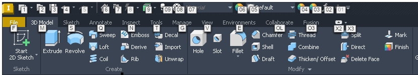
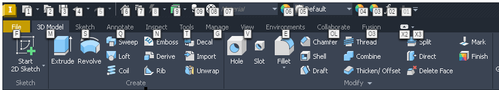

# 083 Inventor ribbon key tips crash in WPF font fallback
Status: fixed on fix/083 (wt/083, ad75f606df3 on integ 02c2e3f4c37), not merged · Owner: issue-083 worker · Branch: fix/083 · Found in: local Inventor 2027.1

## Symptom
On the local workstation, `integ 38e4c1c00c`
(`wine-11.18-367-g38e4c1c00c`), Inventor exits with status 35.
This is distinct from the old-build `SetWindowSubclass` crash (046).
The application requests `Environment.FailFast("Unrecoverable system error.")`
while rendering ribbon keyboard hints. Pressing Alt is a suspected trigger,
not yet confirmed by the user.

Environment: Ubuntu 24.04, new WoW64, desktop `:0`, Vulkan renderer,
144 DPI, `prefixes/inv`, Inventor's .NET 10.0.9 / CoreCLR 10.0.926.27113.
Native .NET Framework 4.8 is also installed, but is not the runtime named
in this crash.

## Evidence
Private local log: `inst/local/debug-20260928-190541/inventor.log`.
Wine exception `80131623`; the event log contains:

```text
System.Environment.FailFast
MS.Internal.Invariant.FailFast
MS.Internal.Shaping.TypefaceMap.MapUnresolvedCharacters
MS.Internal.Shaping.TypefaceMap.MapByFontFamilyList
MS.Internal.Shaping.TypefaceMap.GetShapeableText
...
System.Windows.Media.FormattedText.get_Width
Autodesk.Private.Windows.KeyTipAdorner.CreateAdornerContent
Autodesk.Private.Windows.KeyTipAdorner.CreateKeyTip
Autodesk.Private.Windows.KeyTipAdorner.OnRender
```

The prefix had Autodesk fonts, Arial Unicode MS and Liberation Sans, but no
standard Arial or Segoe UI files. Host fontconfig substitutes Liberation Sans
for Arial; that does not establish that WPF's font fallback can use it.
Missing fonts are a hypothesis, not a confirmed Wine root cause.
No Windows reference test has been run; this workstation has no reference VM.

## Installation / verification
User approved installing `corefonts` into this prefix only.
Use distro Winetricks **20240105**, whose individual font downloads have
SHA-256 checks in the recipe. No unpinned Winetricks update or host font install.
Corefonts supplies Arial and other Microsoft core fonts, **not Segoe UI**.

With Inventor closed, from the repository root:

```sh
export WINEPREFIX="$PWD/prefixes/inv"
export WINE="$PWD/build/wine"
export WINESERVER="$PWD/build/server/wineserver"
export DISPLAY=:0 WINEDEBUG=-all
"$WINESERVER" -k
"$WINESERVER" -w
disabled=AdskLicensingService.exe,AdskAccessServiceHost.exe,cer_service.exe
disabled="$disabled,FNPLicensingService64.exe,AdskAccessCore.exe,AdskAccessService.exe"
WINEDLLOVERRIDES="$disabled=d" winetricks --force -q corefonts
"$WINESERVER" -k
"$WINESERVER" -w
```

Do not stop this prefix if other Inventor sessions share its licensing service.
The initial attempt (`inst/local/corefonts-20260928-191435.log`) stalled:
Winetricks waits for `wineserver -w` after copying each font, but Autodesk's
persistent services prevent exit. The command above disables those executables
only for the installer's environment; service registry settings are untouched.
`--force` retries the partially copied Andale font rather than skipping it.
Do not carry these DLL overrides into the Inventor launch.
Retry log: `inst/local/corefonts-20260928-191838.log`.

Installation completed successfully. Verified `corefonts.installed`, the
regular/bold/italic/bold-italic Arial files, and
`HKLM\Software\Microsoft\Windows NT\CurrentVersion\Fonts`:
`Arial (TrueType) = arial.ttf`.
The prefix was stopped afterwards to drop cached font data, then Inventor
relaunched without the temporary overrides.
Post-install log: `inst/local/debug-20260928-192035-corefonts/inventor.log`.

The post-install run exited 0, with no logged fatal exception or new Inventor
dump. User confirmation of the key-tip action is still pending.
A successful launch/exit alone does not verify the key-tip crash is fixed.
Segoe UI remains absent; do not install further fonts or declare a Wine fix
without evidence. The later captured CoreCLR access violation
([124](124-open-dialog-resize-coreclr-crash.md)) has a different signature;
the CJK Format Text preview problem ([125](125-format-text-preview-cjk-richedit.md))
is also not established as related.

## Root cause (server, 2026-10-02)
Not key-tip specific: WPF terminates whenever it has to draw text and the DirectWrite system font
collection has no family named **Arial**.

WPF (dotnet/wpf, same logic in .NET Framework 4.8) maps text in `TypefaceMap.MapByFontFamilyList`: the
requested families, then the composite font "Global User Interface". .NET 10 embeds the composite fonts in
PresentationCore; 4.8 reads `Microsoft.NET\Framework64\v4.0.30319\WPF\Fonts\*.CompositeFont` (installed
by the .NET 4.8 setup, present in our prefixes; Wine needn't ship any). They have one section per OS
version. For Windows 10 1809+ Latin/Cyrillic/Greek map to `Segoe UI, Segoe UI Symbol, Ebrima` only (older
sections: `Segoe UI, Tahoma, Arial, ...`). When no physical family was found at all,
`MapUnresolvedCharacters` looks up the "null font" `#ARIAL` and `Invariant.Assert`s it:
`Environment.FailFast("Unrecoverable system error.")`, exit status 35 under Wine.

So the crash needs: the text's own family missing, no Segoe UI / Segoe UI Symbol / Ebrima, no Arial.
Wine's Tahoma doesn't help (not in the list), nor does fontconfig's Arial -> Liberation Sans alias or
Arial Unicode MS (dwrite matches family names). "Arial Black" alone is enough: DirectWrite puts it in the
Arial family. Inventor's key tips presumably ask for a family the prefix lacks (adwindows.dll names Artifakt Element
and Segoe UI; not traced), which would make them the first such text on the laptop.

Windows 11 (VM): Arial, Segoe UI, Segoe UI Symbol, Ebrima and Tahoma are all inbox; the probe measures
every family, also a non-existent one (via Segoe UI).

## Repro
- Probe `tests/r083/wpf_fallback.cs` (build line in the file, .NET 4.8 csc of the prefix; runs on the VM
  too): system families, then `FormattedText` in Tahoma, Arial, Segoe UI, Global User Interface and a
  missing family; `png=OUT.png` renders the lines. Scratch prefix = copy of inv-net48 with the host font
  values removed from HKLM `...\Fonts` and HKCU `Software\Wine\Fonts\External Fonts` (both, else they
  are not re-added), run under a `FONTCONFIG_FILE` with only Liberation + DejaVu:
  integ: `measure 'Arial':` then exit 35. VM: exit 0.
- Inventor on inv2 (build/, d7799da4d5c): with the server's msttcorefonts Arial, Alt shows the key tips
  and nothing crashes 
  After removing the `Arial*` and `Arial Black` values from those keys and starting the prefix and Inventor
  with that `FONTCONFIG_FILE`: Inventor dies during startup with the same stack
  (`TypefaceMap.MapUnresolvedCharacters` from a `TextBlock.MeasureOverride` of the home page host).
  inv2 was restored afterwards (a start with the default fontconfig re-registers the fonts).

## Fix (fix/083)
`dwrite: Always provide an Arial family in the system font collection.` (ad75f606df3): after the
`HKCU\Software\Wine\Fonts\Replacements` entries, a system collection without Arial gets an Arial family
made of the faces of the first of Liberation Sans, Arimo, DejaVu Sans, Tahoma (Tahoma ships with Wine, so
there always is one). Same mechanism as a user replacement; GDI is untouched (it already picks a sans
font for a missing face name).

Results on wt/083-build:
- probe without Arial: exit 0, Arial = Liberation Sans; without Liberation/DejaVu: Arial = Tahoma. Text in
  missing families is drawn with real glyphs from that Arial, not boxes.
- Inventor on inv2 without Arial: starts, Alt shows the key tips
  
  (narrow letters: inv2's `Liberation Sans` regular/bold values name files that don't exist in
  `C:\windows\Fonts`, so only the host's Liberation Sans Narrow faces are in that family; prefix state,
  not part of this bug).
- dwrite:font `test_system_fontcollection` checks that Arial is found: Wine x86_64 + i386 0 failures with
  or without a host Arial (fails on integ without one); VM: passes (5 unrelated refcount failures at
  font.c:8999-9051).
- `regress.sh` dwrite + d2d1 vs build/: 0 worse of 8 units.

Not done: no Segoe UI stand-in (text falls back to Arial, as measured), no GDI-side Arial family
(`EnumFontFamilies("Arial")` stays empty without a host Arial).
