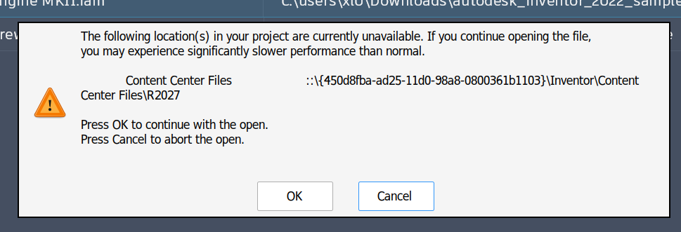

# 084 Content Center Files path retains the My Documents shell identifier
Status: open (confirmed locally: missing ShellFolder registration) · Owner: worker 084 · Branch: fix/084 (no commits) · Found in: local Inventor 2027.1 file open

## Symptom
Inventor warns when opening a document:

> The following location(s) in your project are currently unavailable.
> If you continue opening the file, you may experience significantly slower
> performance than normal.

The unavailable **Content Center Files** path is:

```text
::{450d8fba-ad25-11d0-98a8-0800361b1103}\Inventor\Content Center Files\R2027
```



Observed on the local workstation with the native Inventor 2027.1 install,
`prefixes/inv`, Wine `integ 3951ce31e3`
(`wine-11.18-397-g3951ce31e3`), Windows 11 mode. The warning also occurred
on an earlier local build. The latest screenshot was taken while opening an
Autodesk 2022 sample assembly.

The dialog offers OK to continue or Cancel to abort. The advertised slowdown
has not been measured; do not conflate it with the separate desktop/Xorg lag.
This is also separate from the Electrical Catalog Browser installer failure
(050).

## Evidence and uncertainty
- The GUID is `CLSID_MyDocuments` (`wine-src/include/shlguid.h`), not a
  filesystem drive or directory.
- The prefix's `Explorer\Shell Folders` `Personal` value is
  `C:\users\xl0\Documents`; `Explorer\User Shell Folders` `Personal` is
  `%USERPROFILE%\Documents`. The registry itself does not contain the GUID
  in those values.
- At filing, the corresponding filesystem folder
  `C:\users\xl0\Documents\Inventor\Content Center Files\R2027` is absent.
  Missing-directory creation must be investigated alongside path conversion.
- The installed `Default.ipj` has `FolderOptions/ContentCenterFolder` with
  `ContentCenterConfig`, but no explicit path child. This is not proof that
  it is the user's active project; the effective setting's origin is unknown.
- A shell parsing name can legitimately contain this GUID. Its appearance
  alone does **not** prove a Wine API violation or literal filesystem use.
  No trace yet identifies the API/flags Inventor uses to obtain the setting.

## Windows ground truth
Not yet collected; the local workstation has no reference VM.
On the server's Windows reference, compare the same Inventor version with
an unmodified/default project and the equivalent Documents location.
Check both an absent and an existing `R2027` directory.

## Proposed workaround (not yet verified)
Create the real directory and set **Tools → Application Options → File →
Default Content Center Files** explicitly to:

```text
C:\users\xl0\Documents\Inventor\Content Center Files\R2027
```

If the active project overrides it, use **Projects → Folder Options →
Content Center Files** instead. This is a configuration workaround, not a
Wine fix or a way to restore missing component files in an existing assembly.
The coordinator has not changed this setting or created the directory.

## Task
Trace how Inventor obtains the effective Content Center Files path and where
it checks/creates the directory. Separate a persisted bad setting from an
API result produced on every launch.

Once the actual API and flags are known, build a small Windows/Wine probe.
Candidate boundaries include known-folder paths, PIDL display names and
`IShellItem::GetDisplayName`; distinguish filesystem names from shell parsing
names. Existing shell-dialog probes/issues 041 and 043 may help, but this
symptom is not established as either regression.

Match Windows behavior at the faulty boundary if a Wine discrepancy is found;
do not globally rewrite GUID-containing shell names or hard-code Inventor's
path. Preserve the user's active project and open documents during testing.
If this is only an absent prerequisite directory or application configuration,
document that finding rather than proposing a speculative Wine patch.

## Findings (worker 084, server, integ 3951ce31e31)

### Where Inventor gets the path
Decompiled (utx.dll, UTxShared.dll, WinSupport.dll):
`UTxFolderPreferences::GetDefaultFolderString(4)` =
`UTxSharedUtil::GetMyDocumentsPath()` + `\Inventor\` + `Content Center Files\R` + year,
then `UTxShared::CanonicalizePath`. `GetMyDocumentsPath` calls
`OSxFolder::GetMyDocumentsDir` (WinSupport.dll):
`SHGetSpecialFolderLocation(NULL, CSIDL_PERSONAL)` + `SHGetPathFromIDListW`.
Not persisted: on the server `UserApplicationOptions.xml` has an empty
`<ContentCenter/>`, no registry value; it's computed at every launch.
So the local warning means `SHGetPathFromIDListW` returned
`::{450d8fba-...}` in the local Inventor process.

### Windows ground truth (VM, `tests/mydocs_path.c`, `tests/inv_mydocs.c`)
- CSIDL_PERSONAL PIDL: 1 item, cb 58, type 0x1f. `SHGetPathFromIDListW` →
  TRUE, `C:\Users\dev\Documents` (also without COM). Desktop
  `GetDisplayNameOf(SHGDN_FORPARSING)` is the path; `INFOLDER|FORPARSING` is
  `::{A8CDFF1C-...}` (uppercase). ParseDisplayName(`::{450D8FBA-...}`) gives a
  PIDL with the same path.
- Inventor's own `OSxFolder::GetMyDocumentsDir` (WinSupport.dll loaded from
  the Bin dir): TRUE, `C:\Users\dev\Documents`.
- Windows' `HKCR\CLSID\{450D8FBA-...}\ShellFolder` has Attributes 0xf090013d,
  CallForAttributes 0x20040, FolderValueFlags, and **no WantsFORPARSING**.

### Wine
- Fresh prefix and prefixes/inv4 (same probes): identical to Windows at this
  boundary: `SHGetPathFromIDListW` → TRUE, `C:\users\xl0\Documents`;
  `GetMyDocumentsDir` → `C:\users\xl0\Documents`. Only cosmetic diffs
  (PIDL 22 bytes; INFOLDER parsing name is the lowercase 450d8fba GUID).
- Inventor UI on inv4/:101 (File open by double-clicking Tuner.iam, not
  SilentOperation): no "Unavailable project location(s)" warning, also with
  `Documents\Inventor\Content Center Files\R2027` renamed away: Inventor
  recreates R2027 on its own. So the missing directory alone is not the
  trigger; it is missing locally because the path Inventor tries is the GUID one.
- The lowercase `::{450d8fba-...}` format is Wine's (shfldr_desktop.c
  `SHELL32_GUIDToStringW`), Windows prints GUIDs uppercase: the string is
  produced by Wine's shell32, not persisted from Windows.
- Reproduced mechanism: deleting
  `HKLM\Software\Classes\CLSID\{450D8FBA-...}\ShellFolder\WantsFORPARSING`
  (or the whole ShellFolder / CLSID key) makes `SHGetPathFromIDListW(CSIDL_PERSONAL)`
  return TRUE with exactly `::{450d8fba-ad25-11d0-98a8-0800361b1103}`:
  desktop `GetDisplayNameOf` only asks the folder for its path when
  WantsFORPARSING exists (a Wine-only value for this CLSID, written by
  shellpath.c `set_folder_attributes` at DllRegisterServer), and
  `SHELL32_GetItemAttributes` flags the GUID item SFGAO_FILESYSTEM when the
  ShellFolder attributes can't be read.
- Not triggers (tested): HKCU\Software\Classes\CLSID\{450D8FBA}(\ShellFolder)
  overrides (merged view falls back per value), missing HKCU\Software\Classes(\CLSID),
  missing/dangling Documents (then TRUE with an empty path, not the GUID),
  no COM on the thread. utx.dll's RegOverridePredefKey only runs with the
  `ISOLATE_REGISTRY_KEY` env var.
- All server prefixes (inv, inv2-4, inv-vm, inv-net48, smoke, dxvk) have
  WantsFORPARSING.

### Conclusion so far
Wine matches Windows at the API Inventor uses whenever the prefix's shell32
registration is intact. The local result can only come from Wine's registry
dependency: in the local Inventor process HKCR\CLSID\{450D8FBA-...}\ShellFolder\
WantsFORPARSING is not readable. Not confirmed, because it can't be observed from
the server. No Wine patch without that. If confirmed, the root-cause fix is in
shell32 (Windows doesn't need WantsFORPARSING for My Documents; Wine's desktop
shouldn't either, like its MyComputer exception) and a `wineboot -u` workaround
re-runs `set_folder_attributes`.

### Needed from the local machine (prefixes/inv, with local build)
```sh
wine reg query 'HKLM\Software\Classes\CLSID\{450D8FBA-AD25-11D0-98A8-0800361B1103}' /s
wine reg query 'HKCU\Software\Classes\CLSID\{450D8FBA-AD25-11D0-98A8-0800361B1103}' /s
x86_64-w64-mingw32-gcc -O2 -o mydocs_path.exe tests/mydocs_path.c -lshell32 -lshlwapi -lole32 -luuid
x86_64-w64-mingw32-gcc -O2 -o inv_mydocs.exe tests/inv_mydocs.c
wine mydocs_path.exe; wine inv_mydocs.exe
```
If the probes print the GUID, it's prefix registry state; the reg dumps show
what's missing. If they print the real path while Inventor still warns, it's
process-specific: trace a launch with `WINEDEBUG=+shell,+reg` around
`SHGetPathFromIDListEx`.

Side note (not fixed): with the Documents dir missing, Wine's
`SHGetPathFromIDListW` returns TRUE with an empty string.

## Laptop confirmation (2026-09-29, local build 3951ce31e3)
Pulled the probes at project commit `da26843` and ran both against the unchanged
`prefixes/inv`, using `build/wine` (`wine-11.18-397-g3951ce31e3`).
**Inventor.exe was not launched**: the license server is at its device limit.
The second probe only loads WinSupport.dll and calls its folder-path export.
An environment-only `WINEDLLOVERRIDES=Inventor.exe=d` guarded against accidental
application launch.

### Registry
The 64-bit HKLM class exists, with these values:

```text
HKLM\Software\Classes\CLSID\{450D8FBA-AD25-11D0-98A8-0800361B1103}
    (Default)       REG_SZ My Documents
    LocalizedString REG_SZ @C:\windows\system32\shell32.dll,-46
    InprocServer32
        (Default)    REG_SZ C:\windows\system32\shell32.dll
        ThreadingModel REG_SZ Apartment
```

The **entire `ShellFolder` subkey is missing**, hence no `WantsFORPARSING`
or `Attributes` there. HKCU's corresponding CLSID key does not exist
(`reg query` exit 1). The on-disk hive was inspected before running any Wine
command; it already lacked ShellFolder in both the normal and Wow6432Node
class registrations. Live 64-bit queries agree.

### Probe results
`tests/mydocs_path.c`, both with and without COM initialization:

```text
SHGetSpecialFolderLocation(PERSONAL): 1 items, 22 bytes, first cb 20 type 1f
  SHGetPathFromIDListW 1 ::{450d8fba-ad25-11d0-98a8-0800361b1103}
  parent GetAttributesOf 0 attrs 0x40400177
  SHGetNameFromIDList(0x80058000) ::{450d8fba-ad25-11d0-98a8-0800361b1103}
```

The same GUID result occurs with `SHGetKnownFolderIDList(Documents)` and
`ParseDisplayName(::{MyDocuments})`. `0x80058000` is `SIGDN_FILESYSPATH`.

`tests/inv_mydocs.c`:

```text
GetMyDocumentsDir 1 ::{450d8fba-ad25-11d0-98a8-0800361b1103}
```

Thus this is reproducible outside the Inventor process and matches the
worker's missing-registration reproduction. The cause of the lost registry
subkey is still unknown.

Local evidence is retained under `inst/local/084/`:
`registry-before.txt`, `registry-live.log`, `mydocs_path.log`, `inv_mydocs.log`,
and the two compiled probes. No registry repair, directory workaround or
`wineboot -u` was applied; the broken state remains available for patch testing.
Proceed with the shell32 fix and conformance test proposed above. Validate
with these probes first; do not launch Inventor until licensing is cleared.
