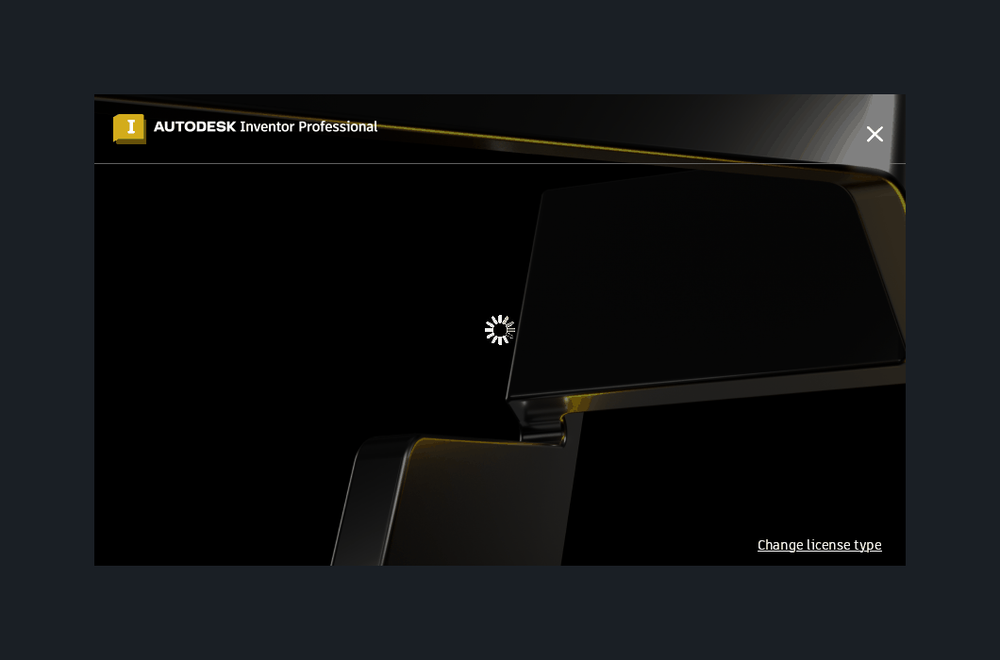
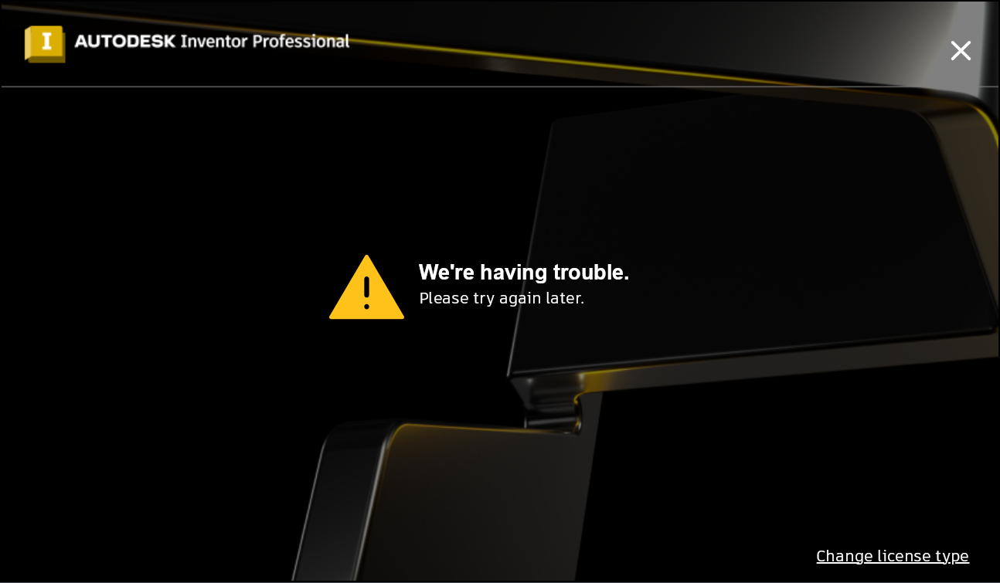
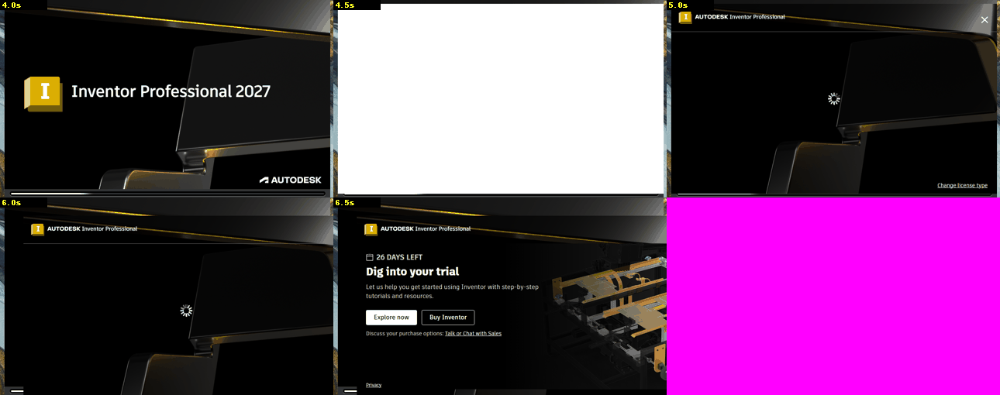
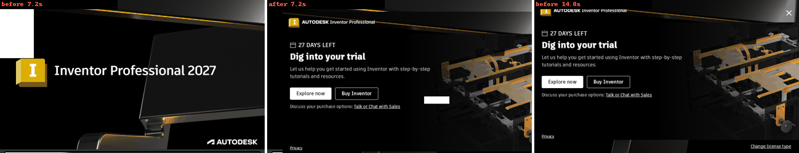

# 085 Trial welcome popup stays white long after Inventor has loaded
Status: fixed (awaiting review) · Owner: 085 worker · Branch: fix/085 (wt/085, on integ 77b5f2b6729) · Found in: user's laptop + inv4 (integ 3951ce31e31) · launch-to-content time: fix/085b (wt/085b, 2 commits, awaiting review)

## Symptom
On start, the licensing/trial popup ("Dig into your trial"; it is AdskLicensingAgent's
WebView2 window, class `webview`, not AdskAccessUIHost) appears as a plain white window next to the
Inventor splash plaque and stays white for a while after Inventor's main window
is up (user report, laptop). The same white 860x500 rectangle is on inv4/:101
over the Home area at 530,290 (same geometry as the popup) well after load:

It eventually renders (on inv2 after "Check again" it showed its content).

Also (user, laptop): the mouse pointer is invisible over the popup, yet clicks
work (the X closes it). Possibly separate from the blank rendering: Chromium sets
the cursor from the browser process (SetCursor / cursor created from the
renderer's bitmap). Check what cursor the window gets (+cursor, XDefineCursor)
vs Windows.

## Findings (085 worker, inv3/:100 openbox, NVIDIA)
The popup is AdskLicensingAgent's WebView2 (untitled `webview` 860x500 WS_POPUP, child
`webview_widget` from msedgewebview2). AdskAccessUIHost (Electron "Autodesk Access",
`--appName ada --minimized`) is unrelated and stays hidden.

### 1. White phase = WebView2 GPU process crash loop (rendering, not loading)
Base build (integ 77b5f2b6729): popup white from <15 s to ~45 s after launch
(inst/085/r1-*.png, Inventor main window up at ~15 s). Crashpad dumps at +22/+27/+33/+39 s
(4 GPU crashes), then `--type=gpu-process --gpu-recent-crash-count=3` (software) at +38 s,
content right after. Same in Edge (`inst/085/edge.sh`, cheap repro: 6 int3 in 30 s).
Chain of hardware-path failures (WINEDEBUG=+dcomp,+d3d11,+dxgi,+seh; each fixed, then the next):
- dcomp desktop device QI {4ca97a18-...} E_NOINTERFACE -> CHECK (issue 022).
- immediate context QI ID3D11VideoContext1 E_NOINTERFACE -> CHECK.
- visual SetClipObject(NULL), SetTransformObject(NULL), SetOffsetY(0) E_NOTIMPL -> CHECK.
- visual SetClip(rect) E_NOTIMPL -> CHECK (only WebView2 in the agent, not plain Edge).
- IDXGIDevice2::EnqueueSetEvent E_NOTIMPL -> Chromium DumpWithoutCrashing
  (dxgi_swap_chain_image_backing.cc:287, first present): a 110-125 MB full dump per
  WebView2 instance (3 per Inventor start), no crash.
Fixed (below): 0 GPU crashes/dumps; white 10.5 -> 15.8 s (~5 s: WebView2 start), then the
page's own spinner, content at 16.6 s (inst/085/fix4, 0.8 s screenshots).
Before (+36 s) / after (+16 s):
 
Windows: not checkable (VM Inventor stuck at device limit). tests/dcomp_qi.c on Win11:
4ca97a18 S_OK only on DCompositionCreateDevice3 devices, pointer == IDCompositionDevice3;
ID3D11VideoContext1 S_OK.

### 2. Invisible pointer = cursor of another process
The pointer is over the agent's toplevel (agent owns the X window) but WM_SETCURSOR goes to
msedgewebview2's child window (implicitly attached input), which SetCursor()s its own
IDC_ARROW. The server sends WM_WINE_SETCURSOR to the agent; win32u there can't read
another process' cursor ("icon handle from other process"), so the X cursor stays the
empty one set for the agent's own NULL cursor. XFixes (xcur) over the popup: 1x1 empty.
tests/xproc_cursor.c (host toplevel + child process's child window + its cursor): Win11
GetCursorInfo = child's cursor; Wine same, but the screen shows the host's arrow (bitmap
cursor) or nothing (IDC_HAND). Fix: the toplevel's process posts WM_WINE_SETCURSOR to the
thread that owns the cursor handle; winex11 there XDefineCursor()s the foreign whole window
(X ids are server-wide). After: arrow over the popup, hand over its X / links, repro shows
the child's bitmap/hand cursor. Not WM-specific (seen on openbox).

### "We're having trouble" (laptop, and once here)
Seen once on the server (run2, base build, inst/085/r2-popup.png); 8 other runs showed
the trial content. That run had no GPU crash dumps, so it isn't the white phase. The
service log (inv3) shows a PubNub `monitor:{pause:{}}` push ("Pause request from agent",
"show monitor blocking dialog", `sou url .../ui/v2/sou`: subscription overuse = another
device using the seat) right before the popup's `source:"error"` analytics events (every
30 s, as on the laptop). Pause pushes also hit later runs without the error, so the link is
suspected, not shown. Page loading itself is fast here (<1 s spinner).

## Fix (fix/085)
- winex11: Set the cursor on windows of other processes.
- win32u: Let the owner of a cursor from another process set it.
- dcomp: Return the device for {4ca97a18-cbfd-4b0d-89e1-f7fa86d8d63e}. (test)
- dcomp: Implement visual_SetOffsetY() and accept removing clips and transforms. (test)
- d3d11: Add ID3D11VideoContext1 stubs. (test)
- dxgi: Implement dxgi_device_EnqueueSetEvent(). (test; waits for the GPU synchronously)
- dcomp: Store the clip rectangle in visual_SetClip(). (test)
Tests: dcomp Wine 753/0 fail, VM 1099/0; d3d11 VM 505081/0 (Wine suite hangs later
in vkCreateDevice, known; no failure before); dxgi new test passes on both (other failures
pre-existing mode-change ones). regress user32 win32u dcomp d3d11 dxgi imm32 vs integ: 0 worse.
Caveat: WebView2/Edge now take the hardware DComp path. Staging's compositor ignores
visual offsets/clips/transforms, so multi-visual layouts (video overlays, etc.) could be
misplaced; Edge UI, the popup and Inventor's WebView2 panels render fine.

## Laptop: rendered "having trouble" dialog and full licensing log

User-provided screenshot from the 2026-09-29 14:29:53 -0300 launch,
`prefixes/inv`, `wine-11.18-398-g77b5f2b672`. The previous instance exited
cleanly; the prefix's wineserver was stopped before this launch.
Vulkan and `WEBVIEW2_ADDITIONAL_BROWSER_ARGUMENTS=--disable-gpu` were retained
(the latter has not been shown to actually disable WebView2 GPU use).

Exact dialog text:

> We're having trouble.
> Please try again later.

The bottom link reads **Change license type**. Screenshot cropped to the dialog;
no email or underlying recent-document names are included:

This captures the rendered error, not the earlier white-window state.
Whether those two symptoms share a cause remains unverified; also see
[048](048-cold-start-first-doc-hang-trial-dialog.md).

[Full non-ENCODED licensing section](attachments/085-licensing-20260929-142953.txt):
all 86 lines, including 79 `[I]`, one `[E]`, two `[W]` and four header/blank
lines. Selected by date and time from 14:29:50 through capture at 14:43:08
local time; no severity filter or head/tail truncation. Only ENCODED lines
were omitted; account/device/session identifiers are redacted.
The original full section remains private under
`inst/local/debug-20260929-142953/licensing-evidence/`.

Notable sequence:
- 14:30:04: service starts, HTTP server on `127.0.0.1:40345`.
- 14:30:09: `authorize_succ:true`, `cls_check_succ:true`; then
  `[E] File does not exist:` with no filename.
- 14:30:12: cached license is valid for auth avoidance.
- 14:30:13: `subscription overuse enabled = true for status ALLOW`,
  followed by `CoFlowReturnNode`.
- 14:30:15: PubNub monitor connection succeeds.
- 14:30:50 and 14:31:20: UI analytics report `source:"error"`,
  `page:"main"`, message ID `1359509856`.

This excerpt does **not** show an explicit device-limit denial. The rendered
dialog alone therefore does not establish licensing refusal or its cause.

## Laptop recheck (user, 2026-09-29, integ ed241c72d09) — handed to the local agent
- The blank white phase still happens on the laptop (server: fixed, ~19 s to content).
- NEW regression: once rendered, the popup's text sits in a narrow column at the left
  edge of the window. Suspects: this branch's dcomp changes (SetOffsetY/SetClip now
  accepted but Wine's compositor ignores visual offsets/clips/transforms), i.e. the
  hardware-compositing path now taken instead of the software fallback. Compare
  with commits 55dd37db46b / d5a3a4bf755 reverted, and with the GPU-crash evidence
  (crash dumps, GPU process restarts) on the laptop's hybrid-GPU setup.
- 078 (server): the remaining white phase (~4 s) is WebView2 presenting white frames itself (its
  offscreen window is white too), no lost presents; fix/078 doesn't change it. The laptop's
  `WEBVIEW2_ADDITIONAL_BROWSER_ARGUMENTS=--disable-gpu` never reaches msedgewebview2's command line.
  Laptop hypotheses (PRIME/vblank-late presents, DPI): see 078.

## Windows ground truth: cold start (VM, 2026-10-02)
VM Inventor closed, then `Start-ScheduledTask invstart`, screendump every ~0.5 s from the launch
(t = 0 just before the start command; the process StartTime is ~t+2 s). Frames:

| t | screen |
|---|---|
| 0-2 | desktop |
| 2.5-4.0 | Inventor splash ("Inventor Professional 2027" with progress bar) |
| 4.5 | **popup window appears: pure white, one frame (<= 0.5 s)** |
| 5.0-6.0 | popup chrome (Autodesk logo, X, "Change license type") on black with a spinner |
| 6.5 | popup content ("26 DAYS LEFT / Dig into your trial", image) |
| 10.5-19 | Inventor main window appears behind it, then loads Home; popup unchanged |

So on Windows the white phase is <= 0.5 s (the popup is shown white for a single sampled frame, then
a black page with a spinner for ~1.5 s), content ~2 s after the popup window appears. Wine: white ~4 s+
(~19 s to content). Also one single-frame white flash at t=13.5 s (main window area) while Inventor's
window initialises. Frames: issues/attachments/085-vm-trial-popup-cold.png (4.0 / 4.5 / 5.0 / 6.0 / 6.5 s).

## Launch-to-content time (085b worker, 2026-10-02) — fixed on fix/085b (wt/085b on integ 7e8ed9554cb)
Measured on inv3/:100, prefix restarted per run, t = 0 at the Inventor.exe launch, screenshots every 0.1 s
(`inst/085b/run.sh` + `grab.py`: "white" = a popup-sized white area, "content" = the trial image).
Timeline (Wine, from +process, a Chromium startup trace and a netlog):

| step | Windows | Wine before | Wine after |
|---|---|---|---|
| AdskLicensingAgent starts | ? | 1.5 | 1.5 |
| msedgewebview2 browser process | ? | 3.8 | 3.8 |
| popup shown (white, top-left, then centered) | 4.5 | 3.9 | 3.8 |
| GPU / renderer processes | ? | 4.6 / 4.8 | 4.6 / 4.8 |
| agent navigates to http://127.0.0.1:<svc>/ui/v2/ipm | ? | 7.5-15 (varies) | 5.0 |
| spinner page (local), iframe ipm-aem.autodesk.com/…/trl.html | 5.0-6.0 | | 5.4-6.2 |
| content | 6.5 | 14.2-14.6 (17.7 without restart) | 6.7-7.2 |

A/B (interleaved, 4+4, `inst/085b/ab_final.sh`): before 14.52 14.58 14.56 14.21 s, after 7.19 6.72 6.66 8.18 s
(8.18: whole Inventor startup slower, agent at 1.9 s). Host load makes everything up to ~1.5x slower (watch
/proc/loadavg; runs record it).

### Cause 1 (~8 s): winex11 made the popup's owner managed synchronously
The agent sets the popup's owner (GWLP_HWNDPARENT) to Inventor's main window, then resizes/centers it.
X11DRV_WindowPosChanged -> make_owner_managed() did NtUserSetWindowPos(owner) on every SetWindowPos of the
(active, so managed) popup; is_managed(owner) is always FALSE for another process's window, so each call
sent WM_WINE_SETWINDOWPOS to Inventor's UI thread and waited 3-4 s while it was busy loading. The agent's UI
thread (browser_native.dll CenterWindowOnScreen / resize) sat in NtUserSetWindowPos (gdb sehbt snapshots),
so the agent navigated late and WebView2's NavigationThrottle (host callbacks) waited too.
Windows: tests/owner_blocked.c (popup owned by a window of a hung process, resize/move): 0 ms; Wine 3947 ms,
fixed 1 ms. Fix: SWP_ASYNCWINDOWPOS for the owner (+ user32:win test_blocked_owner; VM x86_64 0 failures,
i386 only the pre-existing win.c:2750 scrollbar failures).

### Cause 2 (~0.7 s): 1 TB reservations wrote 256 MB of vprot bytes
Every renderer (V8 sandbox) reserves 1 TB (VirtualAlloc2 placeholder) and splits/frees parts; ntdll memset the
per-page protection table for the whole range: 140 ms + 256 MB RSS per reservation, ~35 ms per free, all
under virtual_mutex (other threads' VM calls stalled, RenderThreadImpl::Init 360 -> 30 ms).
tests/bigmap_perf.c: Win11 0.0 ms; Wine 141 / 36 / 33 ms (placeholder reserve / plain reserve / free),
fixed 0.2 / 0.0 / 0.9 ms. A/B (fix 1 applied): content 10.26 -> 9.55 s (4+4, non-restarted prefix).
Fix: create_view() skips writing zero vprot bytes (pages outside views are always 0) and set_page_vprot()
replaces whole cleared 1 MB directories with fresh zero pages.

### Checked, not Wine-side bottlenecks now
- Network: Chromium's own stack (BoringSSL, not schannel); the local UI (agent's service on 127.0.0.1)
  answers in < 10 ms, trl.html + subresources from ipm-aem.autodesk.com in 0.1-0.2 s (netlog).
- Remaining Wine costs on the path (each 0.05-0.5 s, mostly overlapped): msedge.dll (335 MB, FileAlignment
  0x200) is pread into every Chromium process (~250 ms + 335 MB private each, Win11: 1 ms map, shared);
  GPU init 0.5 s (CollectDriverInfoD3D 0.28 s + eglInitialize 0.23 s); DWriteFontProxy::MatchUniqueFont
  150 ms (browser-side dwrite lookup during the first style recalc); first DComp present 115 ms. See 117.
- Laptop note: the user's ~19 s white phase there likely includes cause 1 (Inventor's UI thread is busy
  longer on slower hardware).

### Tools (inst/085b)
- `edge-args-hack.patch` (debug-only kernelbase hack): `WINE_EDGE_ARGS` appended to the agent's WebView2
  browser command line. WEBVIEW2_ADDITIONAL_BROWSER_ARGUMENTS can't work: the agent uses the open-source
  webview library's built-in loader (browser_native.dll), not WebView2Loader, so no env/policy lookup.
  Useful args: `--enable-logging --v=1 --log-file=C:\t\x.log` (opens a console window),
  `--log-net-log=C:\t\net.json`, `--trace-startup=CATS --trace-startup-format=json --trace-startup-file=...
  --trace-startup-duration=12` (default format is protobuf). Parsers: crlog.py, netlog.py, ctrace.py.
- `snap.sh` (agent PE backtraces at given times), `restart.sh`, `use.sh` (swap .so/server variants by
  rename), `ab_final.sh`, `tl.sh` (process start + popup times per run).
