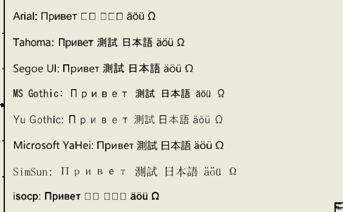

# 119 CJK text shows as boxes in Inventor unless the font itself has CJK glyphs (no GDI font fallback)
Status: draft · Owner: - · Found in: 118 environment campaign (inv4, build/ 43790927731)

## Symptom
Drawing notes (and the UI edit fields, e.g. Application Options > User name) with Chinese/Japanese
characters render as empty boxes in Arial, Tahoma, Segoe UI, MS Gothic and SimSun. Cyrillic and Latin-1 are
fine. Picking a CJK-capable font explicitly works ("Noto Sans CJK JP" / "Noto Serif CJK JP" render the
same text correctly), so fontconfig exposes the fonts (30 CJK faces in `fc-list`) and Inventor stores the
text correctly (a UTF-16 round trip through X clipboard, iProperty, sketch text and STEP/file names is intact).

## Windows
GDI/DirectWrite fall back per character (font linking via
`HKLM\Software\Microsoft\Windows NT\CurrentVersion\FontLink\SystemLink`, MS Gothic / Yu Gothic /
Microsoft YaHei), so a Japanese or Chinese note in Arial is readable. Not verified on the VM (Inventor
must not be started there); this is standard Windows text behaviour. A Japanese or Chinese user sees
boxes in every note/dimension/title block with the default fonts.

## Evidence
`issues/attachments/119-cjk-no-fallback.png` (top: Arial/Tahoma/Segoe UI lines, bottom: explicit Noto CJK).
Also seen under `LC_ALL=ja_JP.UTF-8` (the locale does not change it).

## Repro
`INV=inv4 INVSCEN_KEEP=1 tools/invscen/run.sh cjk` leaves a drawing with the notes open; edit the `fonts`
array in `tools/invscen/cjk.cs` to compare. Check what Wine's FontLink key holds in the prefix
(`reg query "HKLM\Software\Microsoft\Windows NT\CurrentVersion\FontLink\SystemLink"`) and whether
win32u/freetype.c has any per-character fallback when a face lacks the glyph.

## Windows ground truth (VM, 2026-10-02)
`run.sh --vm cjk` (Windows 11 Pro VM, Inventor 2027.1, fonts Arial, Tahoma, Segoe UI, MS Gothic, Yu Gothic,
Microsoft YaHei, SimSun, isocp; same note text as the scenario). Screenshot:
`issues/attachments/119-vm-cjk-fallback.png`.

- **Arial: boxes on Windows too** (Chinese/Japanese shown as empty squares). Also the scenario's Noto fonts
  (not installed on the VM, Inventor substitutes Arial) and the SHX-like `isocp`: boxes.
- **Tahoma and Segoe UI: CJK renders** (font linking per character), glyphs from a linked CJK face.
- MS Gothic, Yu Gothic, Microsoft YaHei, SimSun render CJK themselves (MS Gothic/SimSun/Yu Gothic show Cyrillic
  with wide spacing, i.e. their own Cyrillic glyphs).
- So the Wine symptom is the same for Arial; the real difference is Tahoma/Segoe UI (the UI fonts), which have
  SystemLink entries. UI edit fields were not checked on the VM.
- VM CJK fonts in C:\Windows\Fonts: msgothic.ttc (MS Gothic/PGothic/UI Gothic), YuGoth{B,L,M,R}.ttc, msyh*.ttc
  (YaHei), msjh*.ttc (JhengHei), mingliub.ttc, simsun.ttc + simsunb + SimsunExtG, malgun*.ttf; the FontLink
  list also names Meiryo, Batang, Gulim, Dotum, MS Mincho (Windows Fonts folder holds only those present as files).
- SystemLink (`HKLM\SOFTWARE\Microsoft\Windows NT\CurrentVersion\FontLink\SystemLink`, full dump in
  `issues/attachments/119-vm-systemlink.txt`):
  - **Arial: no entry**, **MS Sans Serif: no entry**.
  - Tahoma: MSGOTHIC.TTC,MS UI Gothic; MINGLIU.TTC,PMingLiU; SIMSUN.TTC,SimSun; GULIM.TTC,Gulim;
    YUGOTHM.TTC,Yu Gothic UI; MSJH.TTC,Microsoft JhengHei UI; MSYH.TTC,Microsoft YaHei UI;
    MALGUN.TTF,Malgun Gothic; SEGUISYM.TTF,Segoe UI Symbol
  - Segoe UI: TAHOMA.TTF,Tahoma; MEIRYO.TTC,Meiryo UI,128,96; MEIRYO.TTC,Meiryo UI; MSGOTHIC.TTC,MS UI Gothic;
    MSJH.TTC (128,96 and plain); MSYH.TTC (128,96 and plain); MALGUN.TTF (128,96 and plain); MINGLIU.TTC,PMingLiU;
    SIMSUN.TTC,SimSun; GULIM.TTC,Gulim; YUGOTHM.TTC,Yu Gothic UI (128,96 and plain); SEGUISYM.TTF
  - Microsoft Sans Serif: MSGOTHIC,MS UI Gothic; YUGOTHM,Yu Gothic UI; MINGLIU,PMingLiU; SIMSUN; GULIM;
    MSJH,JhengHei UI; MSYH,YaHei UI; MALGUN; SEGUISYM
  - MS Gothic: MINGLIU,MingLiU; SIMSUN; GULIM,GulimChe; YUGOTHM; MSJH; MSYH; MALGUN; SEGUISYM
  - SimSun: MICROSS.TTF,Microsoft Sans Serif,108,122; MINGLIU,PMingLiU; MSMINCHO,MS PMincho; BATANG; MSYH; MSJH;
    YUGOTHM; MALGUN; SEGUISYM
  Implication: a Wine fix (if wanted) matters for Tahoma/Segoe UI/MS Sans Serif text; Arial needs nothing
  beyond what Windows does (boxes), unless GDI font association (not SystemLink) differs. Wine's SystemLink
  would need these keys for the fallback to exist at all.
