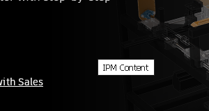

# 120 A visible "IPM Content" Chrome window (Unnamed Window, 82x24) at the top-left during Inventor start
Status: fixed (awaiting review) · Owner: 120 worker · Branch: fix/120 (wt/120, 4 commits on integ d22c74b6d6b) · Found in: 118 environment campaign (inv4 :101, build/ 43790927731)

## Symptom
About 15-25 s after launching Inventor (cold start), a tiny top-level window with an openbox frame ("Unnam...
indow") appears at 0,0 and stays until something closes it. It belongs to the WebView2 helper
(`Chrome_WidgetWin_1`, 82x24, text `IPM Content`, the agent's in-product-messaging host). The invscen
dialog watcher sees it for more than 1 s and fails the step: `hello` FAILs in `connect` with
`unexpected dialog(s): ''`, 5 of 5 cold starts on inv4 (also with 2 such windows at LogPixels 144).
A second run against the already running Inventor passes, so the suite looks green unless Inventor
was freshly started. The watcher dismisses it (WM_CLOSE) and the run goes on.

## Windows
The 82x24 IPM host window is not visible on a real desktop (it is a helper, WS_POPUP, never shown,
or shown off-screen). Not previously reported by the watcher in `inst/invscen/*/results` (first sighting
here), so it may be new since a recent build or specific to inv4's start timing; check with a cold start on
inv/inv2/inv3.

## Evidence
`issues/attachments/120-ipm-content-window.png` (top-left, 2x enlarged). Without the harness: `xwininfo -root -tree`
lists `msedgewebview2.exe` windows 82x24+0+0 (unmapped later) and 82x24+710+575.

## Repro
`tools/prefix.sh kill-inventor inv4`, then `INV=inv4 tools/invscen/run.sh hello` and a screenshot
(`x/shot.sh`) ~18 s after the start. To find the style that makes it frame-decorated and visible:
`WINEDEBUG=+win,+x11drv` on the agent's msedgewebview2, look for the window with title `IPM Content`.

## Windows ground truth (VM, 2026-10-02)
Cold start of Inventor on the VM (scheduled task `invstart`, Autodesk Access services already running, display
1024x768). A probe (`issues/attachments/120-vm-ipmprobe.c`, run through `vm/winrun.sh`) started the task and ran
EnumWindows every 100 ms for 25 s, logging every window of Inventor / Adsk* / msedgewebview2 processes with
class, title, visibility, style, ex-style and rect when first seen or changed
(`issues/attachments/120-vm-startup-windows.txt`). Screenshots every ~0.5 s over the same period.

- **No window titled "IPM Content" ever exists on Windows** (0 hits in the log), and nothing 82x24 and visible.
  No visible tiny window at 0,0 in any screenshot.
- The WebView2 hosts are all invisible (`vis=0`): `Chrome_WidgetWin_0` 768x519 (`style=06cf0000`) and
  `Chrome_WidgetWin_1` "Untitled"/"about:blank" 1020x720 at 4,0 (`06cf0000`/`46000000`, ex `00200100`);
  the agent's visible window is class `webview` (WS_POPUP, `94000000`, ex WS_EX_TOOLWINDOW `80`),
  640x480 at 0,0 for the first 0.1 s, then 860x500 at 82,110 (the trial popup).
- Other visible windows during startup: the Inventor splash `#32770` at t+3.4 s (860x525), a 5x3 / 5x554
  `HwndWrapper` (splitter), `FWxWindowButtons` 40x20.
- So on Windows the IPM host is a hidden (not WS_VISIBLE) Chrome window, or a differently titled one;
  the Wine 82x24 "IPM Content" is not shown by Windows. Note the title may be set only on a later navigation
  (the log has no 82x24 window at all), so check `WINEDEBUG=+win` on Wine for its creation style.

## Findings (120 worker, inv3 :100 openbox)
Two different windows were conflated above:
1. **The 82x24 `Chrome_WidgetWin_1` the watcher reports is a Chromium HTML tooltip** reading
   "IPM Content" (title attribute of the IPM iframe in AdskLicensingAgent's trial popup), created by
   the agent's msedgewebview2 browser process: WS_POPUP|WS_VISIBLE|WS_CLIPSIBLINGS (`96000000`), ex
   TOPMOST|TRANSPARENT|NOACTIVATE (`08000028`; Windows adds NOREDIRECTIONBITMAP), owner = the agent's
   `webview` popup, placed just below-right of the pointer. Its window text is empty; "IPM Content"
   is drawn text. It shows because the X pointer rests where the popup appears: X servers start with
   the pointer at the screen centre (960,540), inside the popup (530,290 860x500, then it slides to
   580,328). 
2. **The framed "Unnamed Window" with an icon at 0,0** (the issue's screenshot) is explorer.exe's
   standalone systray (programs/explorer/systray.c, `show_systray` when no XEmbed tray exists, as
   under openbox) holding AdskAccessUIHost's tray icon, 160x20 client at 1,16. Wine desktop
   integration, not a Windows mismatch and not seen by the watcher (not under Inventor.exe). Hide
   it with `HKCU\Software\Wine\Explorer\Desktops` `ShowSystray`=0 if it gets in the way.

### Windows ground truth (VM, Edge, no Inventor)
tests/hover_tooltip.c opens an Edge app window (one div with title="IPM Content") under a parked
cursor and logs Edge's visible windows; `hook` logs the mouse messages Edge gets
(tests/hover_tooltip_hook/hook.dll, global WH_GETMESSAGE hook).
- Window opens under the still cursor: no tooltip. Edge's legacy window gets 2 WM_MOUSEMOVE right at
  show time (extra info 0); more fake moves after load (`poke`: another window shown/moved) don't
  show one either.
- Cursor moved by 1 px (`move`), or the Edge window moved by 50,38 under the still cursor
  (`slide=50`, `slide=2000`, like the trial popup's slide): tooltip, same class/styles as on Wine.
So with the pointer over the popup's IPM area, Windows shows this tooltip too; the VM probe had none
because its cursor was elsewhere.

### Wine difference found and fixed
tests/fake_mousemove.c (which window changes post WM_MOUSEMOVE to the window under a still cursor):
Windows posts one after every show/hide/move/resize/create of any window; Wine only after
moves/resizes of visible windows (server/window.c set_window_pos, `update_cursor_pos`). In the Edge
test, Wine's first mouse move therefore came only ~1.3 s after show (a later layout change), after
the page loaded, and Chromium took it as the cursor entering: tooltip without any movement.
Fix `server: Sync the cursor position when a window is shown or hidden.` (+ user32 msg test in
test_setwindowpos: show under the cursor, show/hide of another window). After it, fake_mousemove
matches Windows step for step and the Edge open-under-cursor case shows no tooltip (slide still does,
as on Windows). Wine's fake moves also carry extra info 0xff515700 (Chromium: pen), Windows 0: 122.

The Inventor tooltip itself is legitimate (slide under the pointer), so the harness treats Chromium
tooltips as benign: Harness.cs skips `Chrome_WidgetWin_*` with WS_EX_TRANSPARENT|WS_EX_NOACTIVATE.

### Verification
- user32:msg on the VM: new checks pass (5 failures elsewhere: 8741-8744 paint, 12795 error 5).
  Wine (regress unit, both arches x2): only the pre-existing todo at 5744; old build fails all 3 new
  checks (no-WM Xvfb). regress user32 win32u comctl32 dinput imm32 uiautomationcore vs integ: 0 worse.
- Cold starts on inv3 (fix build + harness rule), screenshots every 0.5 s for 30 s, winlog of all
  Inventor/Adsk/WebView2 windows: pointer parked at 1030,590 (over the popup): tooltip appears as on
  Windows, `hello` PASS 3/3 (FAIL 3/3 before the harness rule, also with the Wine fix). Pointer at
  1919,1079: no 82x24 window at all, `hello` PASS 2/2.

## Rework after review (same day)
The review found that show/hide fake moves alone regress two things; the series is now 4 commits:
1. `win32u: Ignore mouse moves that don't change the position in the menu loop.` Windows menus ignore
   unchanged-position moves (a popup opened over the cursor highlights nothing, a keyboard selection
   survives window changes); Wine selected the hovered item. user32:menu test (fails 3 checks without).
2. `server: Delay and coalesce the cursor position sync after window changes.` Per-desktop 16 ms timeout,
   one pending; Windows: 15-32 ms latency, 20 show/hides -> 1 move. Immediate moves livelocked apps that
   change a window on every WM_MOUSEMOVE (2000+ moves/s, no timers). Dropped the caller-process
   RIDEV_NOLEGACY check in set_cursor_pos (no `current` in a timeout; queue_hardware_message handles it
   per target). user32:input test_GetMouseMovePointsEx now waits for the pending move first (the history
   records fake moves; the same flake exists on Windows).
3. `server: Sync the cursor position when a window is shown or hidden.` + msg tests (show/hide, hover-toggle
   loop: timers keep firing; without commit 2 the msg unit times out).
4. `server: Don't mark SetCursorPos mouse moves as pointer input.` (122): extra info 0, win32u skips the
   mouse-in-pointer conversion for IMO_SYSTEM origin. user32:input test in the EnableMouseInPointer children.

Probes tests/r120/fmm2.c (cases loops lat perf menu combo) and mip.c, outputs in inst/120/ (vm-* / wine-*):
loops, lat, menu, combo, mip match the VM (Wine loop rate ~32/s vs 30-44/s, 50 ms timers 40 vs 31 in 2 s,
latency 15-17 ms). `cases` leftovers: Windows also sends a move after moving a hidden top-level window and
after showing/hiding a message-only window; Wine doesn't (not needed by anything known).
Tests: VM user32 menu/input/msg/win: no new failures vs the stock test exe (menu 2, input 21 (base 23,
flaky), msg 5, win 0, all pre-existing); comctl32 tooltips/listview/trackbar 0, toolbar 1 (unchanged test).
Wine regress user32 win32u comctl32 dinput imm32 uiautomationcore: 0 worse.
Cold starts on inv3 (rebuilt series): pointer over the popup: `hello` PASS 3/3 (tooltip shows, as on
Windows); pointer in the corner: PASS 2/2, no 82x24 window. WebView2's fake moves now have extra info 0.
