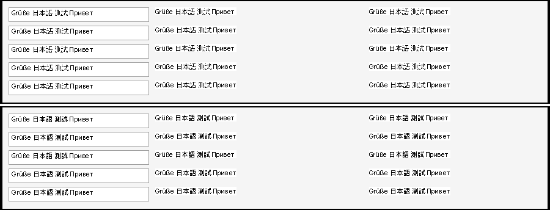

# 123 CJK font linking only works with Noto Sans CJK installed
Status: fixed on fix/123 (wt/123, 2 commits on integ d7799da4d5c), not merged; laptop squares still unexplained (needs the probe output) · Owner: issue-123 worker · Found in: user's laptop (squares after 119, 2026-10-02)

119 links Tahoma to "Noto Sans CJK JP/SC/TC/KR" by name. Hosts without those exact families
(other CJK fonts: WenQuanYi, Droid Sans Fallback, Source Han, IPA, Takao, AR PL, system fonts
with other names, or Noto CJK under another family name) still show boxes.

## Fix (fix/123)
- `win32u: Link Tahoma to the East Asian fonts fontconfig prefers.` (b472d8e2445): when none of the four
  Noto families is installed (119's by-name link stays first, so hosts with Noto are unchanged; non-fontconfig
  platforms keep it too), new backend call `get_language_fonts`: per language in ACP order (ja, zh-cn, zh-tw,
  ko; 936/949/950 put theirs first) `FcFontMatch("sans", lang, scalable)`; a match counts only if its FC_LANG
  has the language exactly (otherwise fontconfig hands back a Latin font), and a language already covered by
  an earlier match adds nothing. font.c maps file + face index to Wine's face (family names may differ from
  fontconfig's; `@` vertical families skipped) and appends the family to Tahoma's links, after registry
  SystemLink entries and real Windows fonts. Still only when Tahoma exists.
- `win32u: Link Tahoma to an East Asian font even when Tahoma has a substitute.` (ddd64feed24): see below.
- Tests: gdi32:font `test_font_link` and usp10 `test_ScriptString_fallback` skip on "no font with
  SHIFTJIS_CHARSET" instead of font names.

## Fonts on the server and results
`fc-list :lang=…`: Noto Sans/Serif/Mono CJK (all four), WenQuanYi Zen Hei (all four), Unifont (all four),
Droid Sans Fallback (ja, zh-tw only), IPAGothic/IPAPGothic (ja only). `fc-match sans:lang=X`: Noto Sans CJK
JP / SC / TC / JP(ko).
Private `FONTCONFIG_FILE` configs, each with its own fresh prefix (host fonts are sticky in a prefix,
notes/wine/fonts.md):

| config | fontconfig picks | Tahoma links | gdi32:font / usp10 (x86_64 + i386) |
|---|---|---|---|
| default (Noto visible) | - (by name) | Noto Sans CJK JP | 9 host todo-successes as on integ / 0 failures |
| all system dirs except opentype/noto | WenQuanYi Zen Hei for ja (covers all) | WenQuanYi Zen Hei | same / 0 |
| same without wqy + unifont | Droid Sans Fallback for ja (covers zh-tw); zh-cn, ko: DejaVu Sans, rejected | Droid Sans Fallback | same / 0 |
| only IPAGothic + Droid + DejaVu | IPAGothic (ja), Droid (zh-tw) | IPAGothic, Droid Sans Fallback | 0 / 1 (Latin SSA_FALLBACK check; no Arial-like font in this set, not CJK) |

`test_font_link` ran (no skip) in all of them; VM (Win11): font 9 failures (ntmCellHeight / line 5195, unrelated,
none in test_font_link), usp10 0. Locales ja_JP / zh_TW (LOCPATH): ACP 932 links JP, 950 links TC.
Edit controls (Uniscribe: the SimSun fallback is dropped by 119's rule, GDI links): top WenQuanYi, bottom Droid:

regress.sh subset (gdi32 usp10 user32 comctl32 dwrite gdiplus riched20 win32u) vs integ d7799da4d5c: 0 REAL
(FLAKY i386 user32:win, fails on base too).

## DirectWrite
`dlls/dwrite/analyzer.c` `system_fallback_config`: every range maps to Noto family names, looked up by name in
the system collection; a missing family = no fallback font (boxes). dwrite has no fontconfig access (FreeType
unixlib only), a by-language lookup needs a new path through win32u or its unixlib: not small, not done.

## Laptop: squares although Noto Sans CJK is installed and 119 is in the build
Checked on the server (same family set, Noto 2.004 TTC: faces 0-4 JP KR SC TC HK, 5-9 Mono):
- TTC faces / HK / localized names: Wine registers each face under its name-table family (JP, KR, SC, TC, HK
  all present; TC's only family record is tagged zh-tw, still "Noto Sans CJK TC"). Works under ACP 1252, 932, 950.
- Existing SystemLink\Tahoma: every Wine prefix has it (MSGOTHIC.TTC,MS UI Gothic ...); missing files are
  skipped and the Noto link is appended. Entries that resolve (real fonts, Replacements) come first.
- Tahoma: Wine's own tahoma.ttf is always loaded from the build's fonts dir; a real one has the same family name.
- Font cache: volatile, rebuilt per wineserver session.
- **Found**: a `FontSubstitutes` value named `Tahoma` (any target) made 119 drop the link: all fonts showed
  boxes although GetTextFace still says Tahoma. Reproduced with `reg add ...\FontSubstitutes /v Tahoma /d Arial`;
  fixed by ddd64feed24. Unknown whether the laptop prefix has such a value.
- Not checkable here: text not drawn by GDI. WPF (Inventor's HwndWrapper UI) and DirectWrite/WebView2 have their
  own fallback lists (Windows / Noto font names) and never see GDI links. Also possible: an earlier child in
  the fallback chain ("Microsoft Sans Serif" resolved to some host font, then Tahoma) that maps the character
  to a box glyph; the probe shows which font the glyph comes from.

Diagnostics for the laptop: `build/wine tests/cjk_link.exe > cjk_link.txt` (rebuild line in the file). The
first block prints ACP/locale, SystemLink / FontSubstitutes / Wine Replacements entries with
`[family: installed|missing]`, Tahoma and Noto registry font paths, families per East Asian charset, and per
character whether Tahoma's glyph is linked and which installed font has the same outline ("NOT LINKED" =
default glyph). Wine's own list: `WINEDEBUG=+font build/wine tests/cjk_link.exe 2>&1 | grep -a "linked Tahoma"`
(119 build: `grep -a 'SystemLink for L"Tahoma"'`). If the probe says linked, the squares are in a non-GDI path:
say where they appear.

Regression-relevant: hosts without Noto CJK now load whatever fontconfig prefers per language on a missing
glyph (up to 4 faces; Unifont if it is the only one); a few FcFontMatch calls per process start in that case;
Tahoma links with a Tahoma substitute; the two tests' skip condition.
