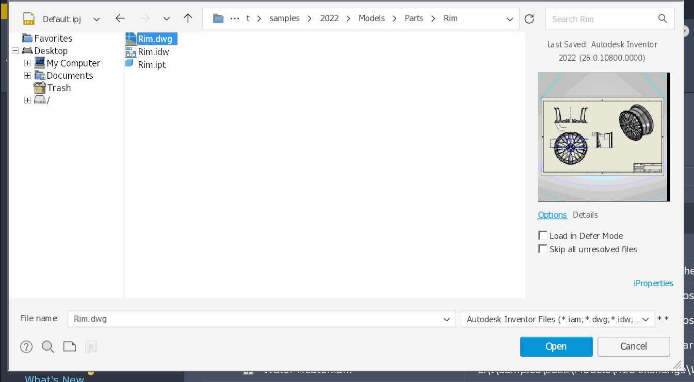
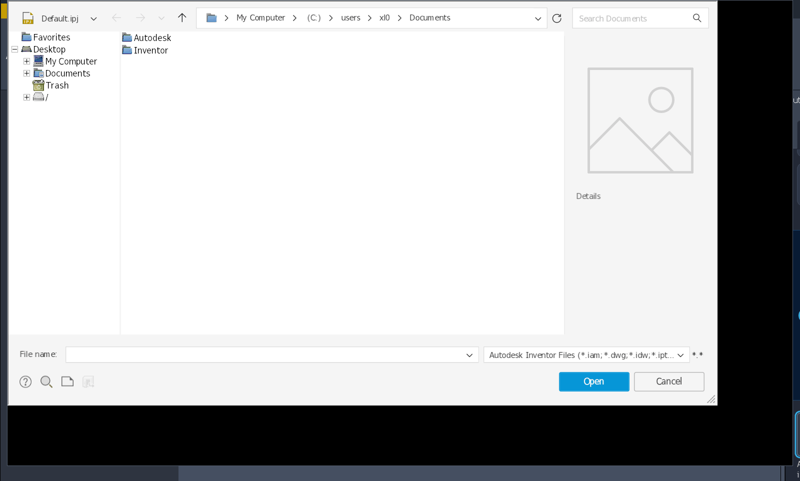
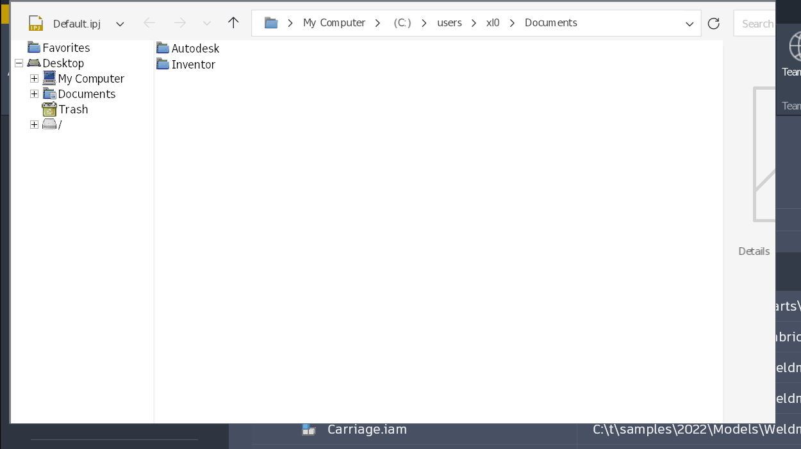

# 124 Open dialog fails to repaint after Awesome resize; CoreCLR crash captured
Status: open (crash part fixed on fix/124; dialog part: no WM-resize bug found, symptoms = frozen/crashing process, laptop to confirm) · Owner: - · Branch: fix/124 (crash) · Found in: user's laptop, integ d7799da4d5

## Report and scope

During interactive Inventor use, the user was in the **Open dialog**:
- Resizing with **Awesome Mod+mouse**, not the dialog border, failed to repaint.
  Growing exposed black padding; shrinking cropped the old content and replaced
  areas with black padding.
- Clicking the path breadcrumbs did nothing.
- Inventor subsequently terminated with an unhandled access violation.

The user initially suspected DWG preview but is unsure. No particular DWG or
preview action is confirmed. The exact ordering relative to the fault is not
established: the dialog may already have stopped responding before either action.
**The repaint/navigation symptoms and the crash are not yet proven to share a
cause.** Split this report if investigation finds independent problems.

## Environment

Laptop, Ubuntu 24.04 x86_64; Wine-only, no local reference VM.
- `wine-11.18-494-gd7799da4d5`, new WoW64; native Inventor 2027.1 installation
  in `prefixes/inv`, Windows 11 setting, 144 DPI.
- Native .NET Framework 4.8 plus Autodesk's .NET 10.0.9 runtime.
- Awesome/X11, unified NVIDIA-primary desktop (RTX 3080 Laptop GPU),
  two monitors, one X screen.
- Picom: `--config /dev/null --backend glx --vsync --no-use-damage`.
- WineD3D Vulkan, no DXVK.
- `WEBVIEW2_ADDITIONAL_BROWSER_ARGUMENTS=--disable-gpu` retained from previous
  experiments; this has **not** been shown to disable all WebView2 GPU use.
- `WINEDEBUG=-all,err+all,+timestamp,+pid`.

32/64-bit console, caption GUI and COM proxy smoke checks passed on this build,
as did D3D11 Vulkan clear/present/readback and DComp interface queries.
That does not validate the application's Open dialog.

## Crash evidence

Two runs exited 5 on 2026-10-02:

1. Launch at 13:53:32, fatal log at approximately 14:20:55 (-0300).
   CoreCLR reports .NET 10.0.9 / CoreCLR 10.0.926.27113, unhandled `0xc0000005`,
   address `0x6fffc6156fef`, Wine thread `0020:03f8`. No managed stack was
   printed and no new dump was found in the user's Temp/CrashDumps directories.
2. Relaunch around 14:31 with GDB attached; fatal exception captured around
   14:35. Wine thread `04c4`, **".NET TP Worker"**. Fatal record:
   `0xc0000005`, flags 0, zero parameters, address `0x6fffc8106fef`
   = **`coreclr.dll+0x356fef`**. Capture succeeded; debugger detached and
   Inventor exited 5.

[Sanitized faulting-thread stack](attachments/124-open-dialog-crash-stack.txt).
The PE stack shows nested exception handling:

```text
NtRaiseException
RaiseFailFastException
coreclr.dll frames
call_seh_handler / call_seh_handlers / dispatch_exception
KiUserExceptionDispatcher
RtlLocateExtendedFeature2+0xb0
coreclr.dll frames
call_vectored_handler / dispatch_exception / KiUserExceptionDispatcher
unidentified address
```

`RtlLocateExtendedFeature2+0xb0` resolves in the matching Wine binary to
`dlls/ntdll/exception.c:855`, the read of `xs->CompactionMask`.
The final fatal record is from CoreCLR's reporting path; do not assume it
contains the original fault address or access parameters. Inspect the nested
exception context and extended-context inputs before attributing blame.
No Microsoft binary disassembly was performed; PE unwinding used `.pdata`.

An earlier `stub_manager_delete: Got page fault when releasing stub!` in the
first run belongs to **another process**, `0250:0278`, roughly three minutes
before the fatal Inventor record. It is not established as this crash's cause.
The older WPF key-tip FailFast is likewise a separate signature.

## Private evidence and capture method

These paths exist **on the laptop only**, not on the server or in git:
- First run: `inst/local/debug-20261002-135332-d7799da4d5/inventor.log`.
- Captured run: `inst/local/debug-20261002-142809-crashcapture/`.
  Contains `inventor.log`, `gdb.log`, `maps.txt`, `process.core`, `capture.gdb`,
  build version/settings and the `captured` completion marker.

GDB attached using `-iex "set sysroot /"` and a conditional breakpoint in the
native `ntdll.so` `NtRaiseException`, `first_chance == 0`. Wine's handled
signals were passed through. On the fatal exception it saved the record,
context, core, mappings, native stacks and PE stacks, then detached.
The mechanism was first verified using a controlled fail-fast probe.

The **ELF core** is sparse: 55 GiB logical, about 1.7 GiB allocated. It includes
anonymous heaps/stacks; unchanged file-backed mappings depend on the matching
local binaries. Preserve those binaries before rebuilding. The core, raw
registers and logs can contain model/account data: directory mode 0700, outputs
0600, git-ignored. Request targeted sanitized extracts from the laptop rather
than publishing the core.

## Task / next checks

1. Inspect the captured nested exception and `RtlLocateExtendedFeature2` inputs:
   valid `CONTEXT_EX`, XState offset/length and compaction configuration?
   Determine whether this is a Wine context bug, malformed caller input, or
   an earlier failure being mishandled.
2. Reproduce the Open-dialog symptoms using Awesome Mod+mouse resize; compare
   border-driven resize. [077](077-wm-move-no-sizemove.md)'s WM size/move change
   is included in this build and is relevant, but is **not** a proven regression.
   Check whether ENTER/EXITSIZEMOVE completes and the dialog resumes painting
   and breadcrumb navigation.
3. Establish whether the UI failure precedes the crash and whether DWG preview
   matters at all. Obtain Windows ground truth on the server's VM, respecting
   the shared licence-seat constraints.

No further interactive reproduction, Wine patch, registry workaround or
automatic relaunch has been applied after the captured crash.

## Crash: root cause and fix (worker 124-crash, branch fix/124 @ 34a7e2755b8)

Status of the crash part: **fixed on fix/124**, reproduced and verified with a standalone .NET 10 test
(no Inventor run). Independent of the Open-dialog repaint symptoms.

**Cause.** The stack is CoreCLR handling an ordinary `NullReferenceException`: an AV in the JIT
write barrier (reference store into a field of a null object; frame #22 is the write-barrier code
copy). Frames #11-#18 by public symbols:
`CLRVectoredExceptionHandlerShim` → `CLRVectoredExceptionHandler` → `AdjustContextForJITHelpers` →
`Thread::VirtualUnwindToFirstManagedCallFrame` → `Thread::VirtualUnwindLeafCallFrame` → `GetSSP` →
`LocateXStateFeature(ctx, XSTATE_CET_U)`; #2-#5 are `ProcessCLRException` → `EEPolicy::HandleFatalError`.
`AdjustContextForJITHelpers` (dotnet/runtime src/coreclr/vm/excep.cpp) does `tempContext = *pContext`
into a plain local `CONTEXT`: ContextFlags keeps CONTEXT_XSTATE, but no CONTEXT_EX follows the copy,
so the "CONTEXT_EX" is whatever is on the stack behind it.
- Windows 11: `RtlLocateExtendedFeature(2)` returns NULL for a feature that is not enabled (CET_U
  without shadow stacks) without touching the context, length untouched.
- Wine (XSAVEC CPUs = compaction enabled): read `xs->CompactionMask` through the garbage
  `XState.Offset` first → AV inside the vectored handler → CoreCLR fail-fast, exit code 5.
  Whether it faults depends on the stack residue, hence intermittent. Not AVX-512 specific.
The context Wine hands to the handler is valid (probe below); no Wine dispatch path is at fault.

**Fix.** `ntdll: Don't access the context for disabled features in RtlLocateExtendedFeature2().`
(the enabled-features check now comes first for the compacted format too; length is left alone),
with a conformance test in ntdll:exception (CONTEXT_EX of 0xcc, every disabled feature).

**Repro / verification.** `tests/r124/nre_barrier.cs` (built on the VM with the .NET 4.8 csc, run
with `dotnet nre_barrier.exe` on the 10.0.9 runtime copied from prefixes/inv into a scratch
prefix): poisons the stack, then takes an NRE in the write barrier, 2000 times.
Windows: `caught 2000 of 2000`. Wine before: `Fatal error. 0xC0000005`, rc 5 (3/3 runs).
Wine after: `caught 2000 of 2000` (3/3).
ntdll:exception: Wine x86_64 5598 tests 0 failures, i386 5111 / 0; VM: the new checks pass on both
(the VM's 7 / 6 failures are older tests at lines 4764, 11754, 11921, 11925).

**Probe** `tests/r124/xstate_ctx.c` (`cfg init loc mat apc exc`), VM vs Wine:
- Hardware exceptions (AV, div0, int3, ud2, nested): both give flags 0x10005f and a valid CONTEXT_EX
  (Legacy -1232/0x4d0, XState 240, compaction 0x80…e4, features 2/5/6/7 at 64/320/384/896).
  Differences: XState.Length 0x788 (Win) vs 0x780; xstate Mask after `vzeroall` 0 (Win) vs 0xa0.
- `RaiseException`: Windows 0x10004f with a valid CONTEXT_EX (context not 64-aligned, XState 64/0x780);
  Wine 0x10000f and no CONTEXT_EX. `NtRaiseException(CONTEXT_FULL)`: Windows adds xstate (0x10005f),
  Wine doesn't (valid empty CONTEXT_EX, but XState 0/0x19 where RtlInitializeExtendedContext uses 25/0).
  Harmless for LocateXStateFeature (no CONTEXT_XSTATE flag → NULL).
- `RtlLocateExtendedFeature` on Windows, one change at a time on a valid context: NULL (length
  untouched) unless `XState.Offset >= All.Offset` and `XState.Offset + XState.Length <= All.Offset +
  All.Length` (signed 32-bit); XState.Length itself does not bound the lookup (Length 0 still finds
  features); bit 63 of CompactionMask is not required. Wine has none of that validation and bounds by
  XState.Length. Not changed: nothing known depends on it.
- XSTATE_CONFIGURATION: Windows `Features[].Offset` are compacted offsets (5: 0x340, 6: 0x380,
  7: 0x580) and ControlFlags 3; Wine reports the standard-format offsets (0x440, 0x480, 0x680), flags 7.
- VM CPU: AVX-512 (features 0xe7, PKRU listed but not enabled), no AMX, no CET. Server: + AMX in
  XCR0, which Wine masks out.

**Open / not done.**
- Windows' CONTEXT_EX range validation and the software-exception CONTEXT_XSTATE (above) are left as is.
- From the laptop core (optional, to confirm): in frame #10 `context_ex` (rcx at entry, or
  frame #11's context + 0x4d0) and its 24 bytes; expected: an address inside frame #15's stack frame,
  not the handler's `ContextRecord`, with a garbage XState.Offset.

## Dialog repaint / breadcrumbs (worker 124b; no Wine change, branch fix/124b = integ)

**Result: not reproducible as a WM-resize bug; the symptoms are those of a process that no longer runs
its message loop, and the crash is triggered by the breadcrumb click.** 077 is not involved.

Setup: inv4 on :101 (NVIDIA Xorg, 1920x1080), build/ = d7799da4d5c, awesome 4.3 with x/awesome-rc.lua,
picom with the user's flags (and without), 96 and 144 DPI, wined3d Vulkan; drags by xdotool.
- Mod4+right-drag resize of Inventor's Open dialog (grow/shrink, each corner, 20 Hz and ~500 Hz motion,
  30+ resizes, with a DWG/IDW/IPT preview shown or not), Mod4+left-drag move, border-corner resize
  (win32u loop): content relaid out and repainted every time, breadcrumbs / list navigation work
  afterwards. winex11's WM size-move tracking (cursor channel flipped on with gdb) is balanced: 9 begin /
  9 end on the dialog hwnd. 
- Inventor paused (SIGSTOP) before, during or across a drag, resumed later: the dialog catches up to the
  final size, nothing stays stale.
- A stopped process gives exactly the reported picture: the WM resizes the X window, nobody repaints;
  growing shows black padding, shrinking crops the old content (bit gravity keeps the old pixels).
   
- The CoreCLR crash reproduces on the server from this dialog (144 DPI, awesome + picom): select
  Rim.dwg / Rim.idw / Rim.ipt in C:\t\samples\2022\Models\Parts\Rim a few times (previews), then click
  the "Parts" breadcrumb: `Fatal error. 0xC0000005`, process gone within ~1 s of the click, in 3 of 3
  sessions on build/, at the 1st, 3rd and 2nd such click (inst/124b/crashloop.sh, crashrun.sh: "DEAD round 4|8
  after crumb"; coordinates are for the 144 DPI layout).
  +seh trace (inst/124b/inventor4.log:77303): write AV at address 8 in jitted code (the NRE), then inside
  CoreCLR's vectored handler `RtlLocateExtendedFeature2(context_ex, 11, ...)` faults reading
  context_ex + garbage XState.Offset: the cause found by the crash worker above.
  With fix/124's ntdll change (34a7e2755b8 applied to wt/124b-build, inv4 switched to it): 40 rounds =
  10 breadcrumb round trips, no crash, Mod4 resize and breadcrumbs fine afterwards.
So on the laptop: the breadcrumb click raised the fatal exception; in the GDB run the breakpoint then
held the process while the 55 GiB core was written, the dialog stayed on screen without a message loop
("click does nothing", Mod4 resize shows black / cropped content), then Inventor exited. On the server,
without a debugger, the window is gone ~1 s after the click.

Generic dialogs (tests/filedlg_sizemove.c: modal GetOpenFileName dialog with a disabled owner, logs
ENTER/EXITSIZEMOVE, WM_SIZE, client size; tests/sizemove_scen.sh with PROBE/TITLE), d7799da4d5c,
Xvfb, WM moves/resizes, ENTER/EXIT pairs (logs inst/124b/scen/):
| scenario | awesome | awesome + picom | openbox | openbox + picom |
|---|---|---|---|---|
| sizemove_log Mod+drag move / resize | 1/1 / 1/1 | 1/1 / 1/1 | 1/1 / 1/1 | 1/1 / 1/1 |
| sizemove_log keyboard move / resize | - | - | 1/1 / 1/1 | 1/1 / 1/1 |
| sizemove_log caption drag / 5 quick drags | 1/1 / 5/5 | 1/1 / 5/5 | 1/1 / 5/5 | 1/1 / - |
| sizemove_log plain clicks / Mod released first | - | 0/0 / 1/1 | - | - |
| file dialog Mod+drag move | 1/1 | 1/1 | 1/1 | 1/1 |
| file dialog Mod+drag resize | 1/1, 11 WM_SIZE, client = X size 606x409 | same | 1/1, 10 WM_SIZE, 637x440 | same |
| file dialog keyboard resize / 5 quick drags | - / 5/5 | - / 5/5 | 1/1 (589x360) / 5/5 | 1/1 / - |
picom on Xvfb runs without --vsync (no swap control); on :101 with the user's exact flags.

**To confirm on the laptop** (after fix/124 is merged): the Open dialog with a DWG selected, breadcrumb
clicks, Mod4 resize. If a dialog still stops repainting: `wine tests/wintext.exe Open` while it is in that
state; "NOT RESPONDING" = its thread is not pumping (hang/crash in progress), otherwise compare the
printed Win32 rect with `xwininfo` (a mismatch would be a winex11 state-tracking bug).
Was the stale dialog seen in the GDB run only, or also in the first run?

Notes: awesome's Mod4+B3 resize sometimes doesn't start right after awesome was restarted with clients
already mapped (also for xlogo; WM side). The dialog opens 1760x1001 at 144 DPI, wider than a 1080p
screen less the panel: the reason to resize it with the WM.
