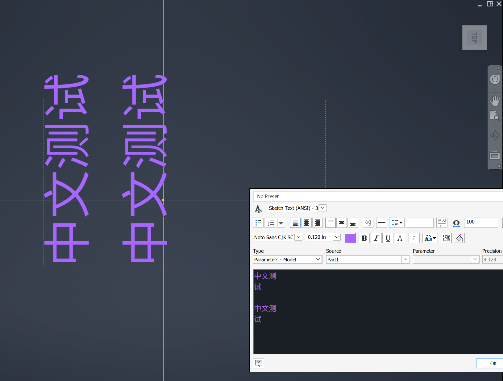

# 125 Sketch "Format Text" dialog: CJK boxes in the edit/preview area, early wrap, one-pixel text after re-edit
Status: open (draft) · Owner: - · Branch: - · Found in: user's laptop (integ d7799da4d5c, 144 DPI, awesome + picom); details in issues/123 "Laptop interactive comparison"

## Symptom
In a sketch, Text command → Format Text dialog (paste `中文测试`):
- With the default font (name not recorded) the edit/preview area shows boxes, while the text
  placed in the sketch renders (with other fonts too). Selecting "Noto Sans CJK SC" explicitly
  makes the preview render.
- With Noto Sans CJK SC at 0.120 in the preview wraps after three characters (`中文测` / `试`)
  although the edit area is wide.
- After finishing the text and re-selecting it (edit again), the preview collapses to ~1 px dots;
  selecting them shows the font as "Noto Sans Mono CJK".

## Hypothesis (unverified)
The edit/preview area is a rich-edit control (riched20/msftedit) or another control with its own
glyph lookup: Wine's rich edit doesn't use GDI font linking/fallback (119 fixed GDI
GetGlyphOutline and Uniscribe ScriptString paths), so missing glyphs show as boxes. The wrap and
the 1 px collapse suggest character-format/size handling (yHeight twips vs DPI 144, EM_SETCHARFORMAT
/ EM_GETCHARFORMAT round trip, font name matching "Noto Sans CJK SC" vs "Noto Sans Mono CJK")
or metrics of linked/fallback glyphs.

## Task
Identify the control (class, messages Inventor sends), reproduce on the server at 96 and 144
DPI, get Windows ground truth (rich edit font fallback for CJK with a Latin font selected;
char format round trip), fix Wine, add riched20 tests.
