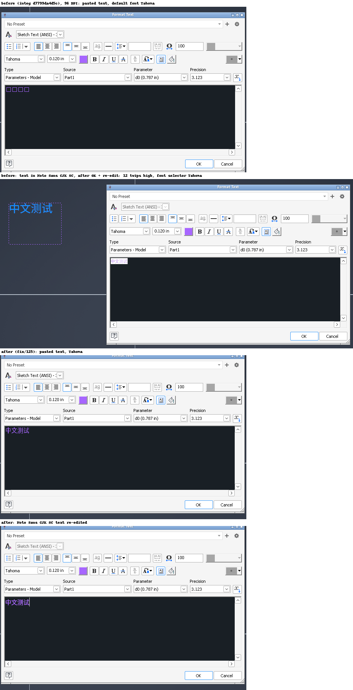
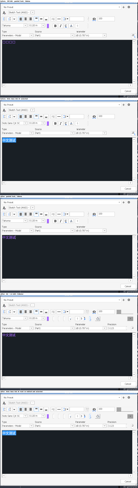
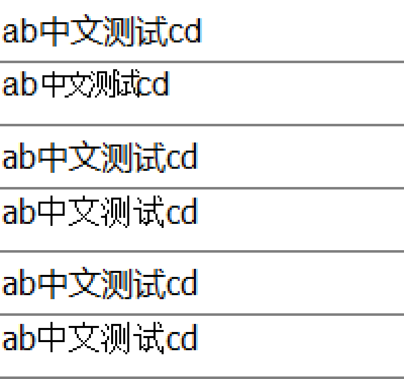
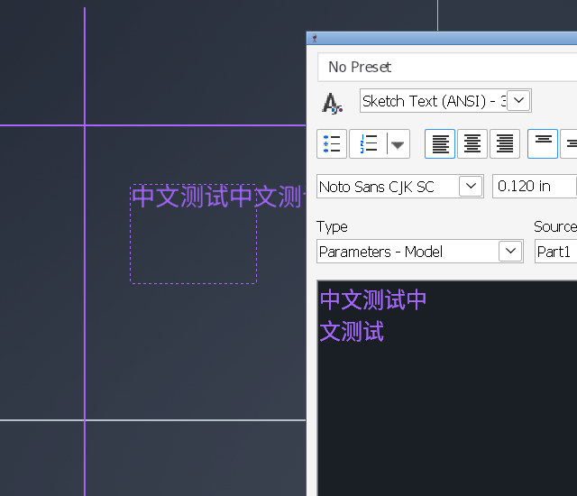
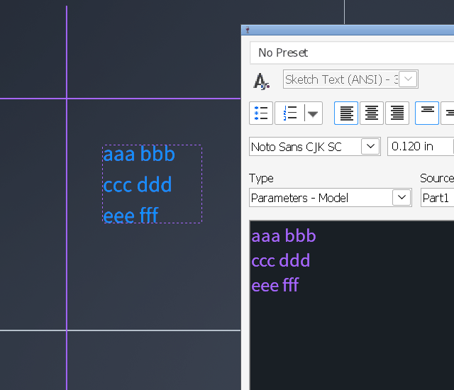

# 125 Sketch "Format Text" dialog: CJK boxes in the edit/preview area, early wrap, one-pixel text after re-edit
Status: fixed on fix/125 (wt/125, 6 commits on integ 1e44ad82022, review follow-ups done), not merged · Owner: issue-125 worker · Found in: user's laptop (integ d7799da4d5c, 144 DPI, awesome + picom); details in issues/123 "Laptop interactive comparison"

## Symptom
In a sketch, Text command → Format Text dialog (paste `中文测试`):
- With the default font (Tahoma) the edit/preview area shows boxes, while the text
  placed in the sketch renders. Selecting "Noto Sans CJK SC" explicitly makes the preview render.
- With Noto Sans CJK SC at 0.120 in the preview wraps after three characters (`中文测` / `试`)
  although the edit area is wide.
- After finishing the text and re-selecting it (edit again), the preview collapses to ~1 px dots;
  selecting them shows the font as "Noto Sans Mono CJK".

## Result
Reproduced on inv3 at 96 and 144 DPI (`build/` = integ d7799da4d5c). Four Wine bugs in riched20, all fixed;
the wrap is not a Wine bug. A fifth bug found on the way (Inventor crash when typing over selected
text) is fixed too.

| symptom | cause | fix |
|---|---|---|
| boxes | rich edit shapes with glyph indices (Uniscribe), which never use GDI font linking | `shape_run`: runs with missing glyphs go through the character path |
| ~1 px text + wrong font after re-edit | `ITextFont::Reset(tomApplyNow)` wrote the font object's whole stale cache to the range, the size in points as twips (12 pt -> 12 twips = "0.006 in") | units, apply only what was set, tomApplyTmp |
| wrap after 3 characters | none in Wine: the edit wraps at the sketch text box's width like Windows' rich edit does; the sketch itself only breaks at spaces | - |
| crash typing over a selection | WM_CLEAR left the final paragraph mark selected | collapse the selection |

Before/after, 96 DPI: 
144 DPI: 

## The control and what Inventor does with it
- Class `RichEdit50W` (msftedit.dll, in Wine a forwarder to riched20), child of the MFC dialog
  `#32770 'Format Text'`, style 5031b1c4 (multiline, scroll bars). Three more hidden RichEdit50W
  controls are scratch buffers (paste conversion, RTF round trips).
- Setup: `EM_SETEVENTMASK`, `EM_SETOLECALLBACK`, `EM_GETLANGOPTIONS` then
  `EM_SETLANGOPTIONS(opts & ~IMF_AUTOFONT)` (Windows default 0x182 -> 0x180: **font binding off**),
  `EM_SETCHARFORMAT` default (Tahoma, yHeight 240, DEFAULT_CHARSET), `EM_SETBKGNDCOLOR`,
  `EM_SETTARGETDEVICE(screen DC, width of the sketch text box in twips)`, `EM_SETTEXTEX` / `EM_STREAMIN`.
- Scale: the sketch text height is shown x100: 0.120 in = 12 pt = yHeight 240; the size box is
  yHeight / 2000 in. The target width is the text box width on the same scale (a 140 px box at this
  zoom: 1168 twips at 96 DPI, 1252 at 144).
- Paste: Inventor handles Ctrl+V itself: the clipboard text goes into a hidden control
  (`EM_STREAMIN SF_TEXT|SF_UNICODE`), comes back as RTF (`EM_STREAMOUT` / `EM_STREAMIN SF_RTF`).
  Its stream-out callback reports 104 of 209 bytes written; Wine doesn't resend (harmless here).
- Re-edit (double-click the sketch text): `EM_SETCHARFORMAT` + `EM_SETTEXTEX(ST_SELECTION)` per run,
  then TOM: `ITextDocument::Range(0, len)` -> `GetFont` -> `Reset(tomApplyTmp)`, `SetUnderline(tomNone)`,
  `Reset(tomApplyNow)` (clears temporary underlines), then `EM_GETCHARFORMAT` of the insertion point
  and `EM_SETCHARFORMAT` with the text style's face (so the font box shows the style font, Tahoma,
  until text is selected: Inventor logic, not a font lookup).
- Typing over a selection: a hidden control is emptied with `EM_EXSETSEL(0,-1)` + `WM_CLEAR`, then a
  recursive routine runs while `EM_SELECTIONTYPE` is non-zero.

## Windows ground truth (VM, tests/r125/re_probe.exe; outputs in inst/125/)
RICHEDIT50W and RichEdit20W agree unless noted.
- `EM_GETLANGOPTIONS` default: 0x182 (msftedit), 0x82 (riched20): IMF_AUTOFONT | IMF_DUALFONT.
- With IMF_AUTOFONT, CJK text inserted in Tahoma or Arial (EM_REPLACESEL, stream-in text or RTF,
  EM_SETTEXTEX, WM_PASTE) is rebound to `Microsoft YaHei` charset 134 (riched20: `SimSun`).
- With it cleared (Inventor's case) the run **stays Tahoma** and still shows the characters: GDI font
  linking at display time, 16 px advance at 12 pt/96 DPI, widths equal to `GetTextExtentPoint32W`.
  Arial (no SystemLink entry) also shows glyphs, squeezed to 12 px.
   (pairs: default options / options 0; Arial, Tahoma ANSI, Tahoma DEFAULT)
- `EM_SETTARGETDEVICE(screen DC, twips)`: 8 CJK characters of 240 twips wrap by character at
  floor(width / 240): 300 -> 1 per line, 600 -> 2, 840 -> 3, 1168 -> 4. Wine gives the same line starts.
- ITextFont on a range: `SetSize(20)` -> yHeight 400, `SetPosition(3)` -> yOffset 60, `SetKerning(2)`
  -> wKerning 40. `Reset(tomApplyNow)` without tomApplyLater changes nothing (mixed-format range
  keeps its formats). `Reset(tomApplyTmp)`: S_OK on msftedit (E_INVALIDARG on riched20.dll); the
  following `SetUnderline` doesn't touch the character format and `GetUnderline` still returns the
  real value; after `Reset(tomApplyNow)` setters are permanent again.
- Selection through the final paragraph mark (`EM_EXSETSEL(0,-1)` -> (0, len+1)): after WM_CLEAR,
  WM_CUT, EM_REPLACESEL "", VK_DELETE it is (start, start), `EM_SELECTIONTYPE` 0. Wine kept
  (start, start+1) for WM_CLEAR and WM_CUT.

## The wrap (not a Wine bug)
The edit wraps at the text box width as on Windows. The sketch does its own layout and only breaks
at spaces: Latin words wrap identically in both, a CJK string without spaces stays on one line in
the sketch and overflows the box, while the edit breaks it by character.
 
In the laptop screenshot the box holds ~3.5 characters, so the edit breaks after 3. Not verified against
Inventor on Windows (the VM's Inventor must not be started); the rich-edit half is verified by the probe.

## Fix (fix/125, wt/125; rebased on integ 1e44ad82022 after review)
- 078e761a90d `gdi32/uniscribe: Don't apply OpenType positioning without glyph indices.` With
  `fNoGlyphIndex` ScriptPlace looked the characters up as glyph ids in GPOS (bogus pair kerning; the
  next commit makes rich edit reach that path).
- dee56086dfd `riched20: Use GDI font linking for characters that the font lacks.` After ScriptShape,
  a non-complex LTR run with a default glyph is reshaped with `fNoGlyphIndex`, so ScriptPlace/
  ScriptTextOut work on characters and GDI links (119: Tahoma -> Noto CJK; in Wine every font falls
  back to Tahoma's links).
- 37116402e0f `riched20: Convert the points of ITextFont properties set on a range to twips.` (size,
  position, kerning, spacing, both directions; float setters ignore tomUndefined).
- 459b31906cc `riched20: Only apply the properties set since tomApplyLater in ITextFont::Reset(tomApplyNow).`
- 3916f4ee582 `riched20: Don't change the text format in ITextFont's tomApplyTmp mode.` (setters are
  ignored: temporary display formatting itself isn't implemented; tomApplyLater leaves the mode).
- 8d88a6d7ae4 `riched20: Collapse the selection after WM_CLEAR and WM_CUT.` Cut copies, deletes,
  collapses and notifies once; WM_CLEAR does nothing on read-only controls.
- Tests: riched20 editor `test_font_linking` (halfwidth katakana in Tahoma measure like GDI; CJK
  ideographs don't discriminate, Wine's Tahoma .notdef is 1 em wide), `test_delete_final_eop_selection`
  (selection, text, one EN_SELCHANGE + one EN_CHANGE, read-only); riched20 richole
  `test_ITextFont_range` (todo_wine: riched20.dll rejects tomApplyTmp); msftedit richole
  `test_ITextFont_tomApplyTmp`; usp10 `test_ScriptPlace_no_glyph_index` (Tahoma, Arial, DejaVu Sans
  if installed: without the fix 10 and 32 pairs off on Wine).
  VM (x86_64 and i386): riched20 editor 10789, richole 183150, msftedit richole 58, usp10 32076
  tests, 0 failures. Wine: 0 failures in riched20 editor/richole/txtsrv, riched32 editor, msftedit
  richole, usp10.
  `tools/regress.sh` on riched20, riched32, msftedit, gdi32, usp10, user32, comctl32 (146 units,
  wt/125-regress2) vs the d7799da4d5c baseline: 0 REAL, 1 FLAKY (i386 user32:win, fails on the base
  build too).
  Reviewer probes (/dev/shm/r125rev/rv.c): notify: no duplicate notifications left for WM_CUT /
  WM_CLEAR; lines differing from the VM 1531 (integ) -> 1485; tom: 143 -> 106.

## Leftovers / notes
- IMF_AUTOFONT font binding and EM_GET/SETLANGOPTIONS are still unimplemented (GET returns 0 =
  "no auto font", which matches what Wine does). An app that leaves auto font on gets YaHei/SimSun
  runs on Windows, Tahoma + linking on Wine: same picture, different EM_GETCHARFORMAT.
- Undo doesn't restore the selection (Windows: undo of WM_CLEAR/WM_CUT on an empty document selects
  (0,1) again; Wine's undo records no selections). ITextFont setters don't validate ranges
  (Windows: SetPosition(-3), SetKerning(-1), SetSize(2000) -> E_INVALIDARG), SetSize on an
  insertion-point font doesn't set the typing format.
- Not analysed: select all, Ctrl+X, Ctrl+V in Format Text pasted the text bold once (the cut text
  ends with the paragraph mark, the hidden paste buffer's mark is System bold); plain paste and
  typing over a selection are fine. Windows: a format set at an insertion point never reaches the
  final paragraph mark (probe `eop`, inst/125/vm-eop.txt), same as Wine.
- `ITextFont::SetUnderline` only takes tomTrue/tomFalse/tomToggle (tomSingle etc.: E_INVALIDARG);
  riched20.dll's E_INVALIDARG for tomApplyTmp isn't reproduced (Wine can't tell the classes apart).
- The dialog keeps its size per user: after a DPI change it opens with the old pixel size and a
  cramped layout until resized (seen when switching inv3 to 144 DPI; restored to 648x406).
  Resizing it from the X side (xdotool windowsize) leaves some owner-drawn buttons unpainted.
- Regression-relevant: every rich edit run with a character its font lacks now takes the
  ExtTextOut character path (no kerning/ligatures for that run; widths via GetCharABCWidthsW with
  linking; first miss per font instance loads the linked CJK face). Complex scripts and RTL runs are
  untouched. tomApplyLater users now get only the properties they set applied.

## Repro recipe
`INV=inv3 tools/invscen/run.sh uilat` (part + sketch in edit), click Text in the ribbon, click or drag
in the sketch; `tests/r125/clip.exe` puts `中文测试` on the clipboard (Ctrl+V); `tests/r125/ctl.exe
"Format Text" 4052 "Noto Sans CJK SC"` picks the font (combo ids: 4052 font, 4053 size; typing into
the combo moves focus back to the edit). OK, Esc, double-click the text to re-edit.
144 DPI: `reg add "HKCU\Control Panel\Desktop" /v LogPixels /t REG_DWORD /d 144`, restart the prefix
(the splash is then a 574x350 untitled dialog the harness watcher reports; use INVSCEN_DIALOGS=log).
After an Inventor crash restart the whole prefix: the service keeps respawning a licensing agent whose
invisible popup blocks the harness' connect.
