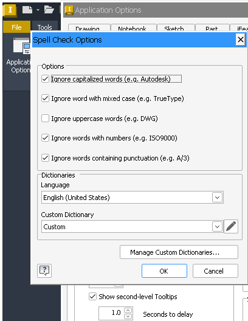

# 134 winewayland: an owned/modal dialog goes behind its owner when the owner is clicked, the app looks frozen
Status: fixed · Branch: fix/134 (wt/134, not merged) · Found in: wayland test pass (notes/wine/wayland.md) · Blocks real Inventor use under Wayland

## Symptom
Inventor: File > Open (or Application Options): the dialog appears; one click on the (disabled) main window and the dialog
disappears behind it. Wine still has the dialog visible and the main window disabled, so every input is swallowed:
Inventor looks hung. No way back with the mouse (no taskbar); SetForegroundWindow from another process is refused.
On Windows (and under X with a WM that honours WM_TRANSIENT_FOR) an owned window always stays above its owner.

## Repro
Standalone: `tests/wl_xowner.c` mode `self`
(`x86_64-w64-mingw32-gcc -o tests/wl_xowner.exe tests/wl_xowner.c -luser32`):
`wine tests/wl_xowner.exe self` creates A and a WS_POPUP|WS_CAPTION window B owned by A, A disabled. Click A's client
area outside B: B vanishes behind A (inst/wayland/evidence/134-probe-modal-popup-above.png / ...-behind.png).
Inventor: `x/wshot.sh move 80 48; x/wshot.sh click` (Open), wait, click on the main window (e.g. 1300,700).
inst/wayland/evidence/134-open-dialog-gone-behind-owner.png. Wine side: `tests/wl_winlist.exe` still lists the 'Open' window
visible with owner = main window.

## Evidence
`grep -n "set_parent" dlls/winewayland.drv/*.c` is empty: managed windows become plain xdg_toplevels (window.c
`is_window_managed` -> ROLE_TOPLEVEL), only unmanaged (SWP_NOACTIVATE) owned windows become subsurfaces. The owner
relation never reaches the compositor.

## Open
Component (guess): winewayland.drv, `wayland_surface_make_toplevel`: call `xdg_toplevel_set_parent()` with the owner's
toplevel for owned managed windows (same process). Cross-process owners: see 135. Possibly also keep input blocked on
the compositor side (xdg_dialog needs a newer protocol; mutter 42 has none).

## Fix (fix/134, rebased on integ 0b77b17a942 after the review; design notes in notes/wine/wayland.md "Owned windows")
- `acae84b59ed winewayland: Set the parent of owned toplevel windows.`: `xdg_toplevel.set_parent` for owned managed windows
  of the same process. The parent is set only once the owner is mapped (at the owned window's WindowPosChanged, or when the
  owner commits its first buffer), unset explicitly when the owner's toplevel goes away, and tracked per surface so a stale
  link is dropped before it could close a loop (protocol error `invalid_parent`).
- `5d59ae5fddf winewayland: Don't make a disabled window the foreground window.`: mutter gives the keyboard focus to the
  clicked (disabled) owner; Wine made it the foreground window, so after a click on the main window typing no longer reached
  the dialog. Now the owner's last active popup (if visible and enabled), else the thread's active window, becomes foreground;
  with neither, the disabled window itself as before. (winex11's FocusIn does focus > active > last_focus for a window it
  cannot activate; the first version here stopped at "active" and dropped keys when another process had held the foreground:
  review finding, `rv dis` / `rv fg` + `rv other`.)
- Upstream (origin/master 455e3509b98) has nothing for owners: no set_parent, xdg-foreign or xdg-dialog in winewayland.drv.
- Not done: xdg-dialog-v1 `set_modal` (no such global in mutter 42, appears in mutter 47).

## Verification
- Host (mutter 42.9, headless), `WINE_BUILD=wt/134-build tests/wl_xowner.sh`: 28 PASS / 0 FAIL, twice, on the final build;
  0 protocol errors (WAYLAND_DEBUG). Cases: modal popup (B stays above the disabled A after two clicks on A, foreground
  stays B), chain A>B>C, owned window shown before its owner, owner hidden / shown again / destroyed, owner changed with
  SetWindowLongPtr(GWLP_HWNDPARENT) + a stale parent that would loop, cross-process (135). On integ `self` loses B behind A
  (105592 -> 19883 px).
- VM (coordinator's run of the pre-review branch, vmwl/results-134.md): no FAIL on GNOME 50 and KDE (unfixed build 17 / 16
  FAILs), sway only the chain-3 FAIL it also has unfixed; 0 protocol errors on all three.
- Review probes (inst/134-review/rv.exe, final build): `dis` + `other` (A disabled while another process is foreground,
  clicked, re-enabled): "abc" reaches A. `fg` + `other`: click on the disabled A makes D foreground, "abc" reaches D.
  `fgthread` + `other`: D (other thread) becomes foreground, keys dropped (see Remains). `texit`: `set_parent(nil)` right
  after the dead owner's toplevel is destroyed.
- Inventor (inv2, renderer=gl): Open dialog, Create New File > Projects (dialog from a dialog), Application Options > Spell
  Check Options stay above their owners after clicks on the main window and on the intermediate dialog; after such a click
  "abc" still lands in Open's File name box (re-checked on the final build). 
  Marking Menu / context menu / tooltips unchanged; invscen hello, part, drawing, view PASS.
- user32:win / user32:msg under Wayland: 16 / 54 failures on integ, 16 / 52 with the fix, same failing lines (pre-review build).

## Remains
- Dialogs are not centred on their owner on mutter 42 (136); GNOME 50 and KDE do centre children on the parent (vmwl/results-134.md).
- An owner changed with SetWindowLongPtr is followed at the owned window's next WindowPosChanged only (no driver entry
  for owner changes; winex11 behaves the same).
- A window owned through a hidden intermediate owner (A visible > H hidden > D) gets no parent.
- A dialog living in another thread or process than its disabled owner (`rv fgthread`, Inventor's trial popup) keeps the
  foreground when the owner is clicked, but typed keys are still dropped: the compositor's keyboard focus is on the disabled
  window and the driver sends the keys for that window. Needs the keyboard path to target the foreground window when the
  focused one is disabled.
- Behaviour change: an owned window shown while its owner is minimized is invisible (`rv min`: green 0 px on fix/134,
  105592 px on integ). mutter hides the children of a minimized toplevel, and the driver's minimize state is out of sync with
  the compositor (156): Win32 believes the owner is restored, so it is a parent in the driver's eyes while mutter keeps it
  minimized. Fixing 156 fixes this.
