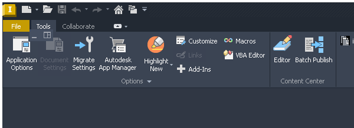

# 136 winewayland: activated owned popups/dialogs are free xdg_toplevels, positioned by the compositor, not at their Win32 coordinates
Status: draft · Found in: wayland test pass (notes/wine/wayland.md) · design limitation, partly working

## Symptom
Windows shown without SWP_NOACTIVATE are "managed" (window.c `is_window_managed`) and become xdg_toplevels; Wayland clients cannot
position toplevels, mutter puts them wherever it likes (near the top-left, cascaded), while Wine keeps believing the Win32 rect.
Seen in Inventor (Wine rect -> where it really appeared):
- FWxWindowButtons (the 40x20 minimize/restore overlay of the document pane): (1529,146) -> near (50,85), outside the pane it belongs to
  (inst/wayland/evidence/136-buttons-misplaced.png; in the very first start it happened to sit at the right place, later starts not).
- Open dialog (370,190) -> (50,82); Appearance Browser (242,146) -> (102,133); File (application) menu (1,50) -> (50,74).
- Application Options (695,3, 548x1074): Inventor sizes it for a 1080 px work area, mutter keeps the 32 px top panel and the 1048 px
  work area, so the OK/Cancel row is below the screen edge (Enter/Escape still work). Wine's SPI_GETWORKAREA reports the full
  1920x1080 monitor (no work area from the compositor).
Working fine: menus, context menus, tooltips, the Marking Menu (all SWP_NOACTIVATE -> subsurfaces, positioned at the pointer),
autocomplete dropdowns, mini-toolbars, the maximized main window (Wine adopts the configure size 1920x1048).
User can move/resize toplevels with the compositor (verified: title drag, edge resize; Wine sees the new size, not the new position).

## Repro
`x/wshot.sh` into Inventor, open any dialog and compare `tests/wl_winlist.exe` rects with the screenshot (window area starts at y=32).

## Open
Component (guess): winewayland.drv; inherent to xdg_toplevel. Improving it needs subsurface/xdg_popup for owned popups that are
visually attached to their owner (FWxWindowButtons), and work-area reporting (zxdg_output / gnome panel) for SPI_GETWORKAREA. Not a
regression of Wine, but it breaks tool windows that must sit at a fixed spot. Priority below 132-135.

## After 134/135 (fix/134, mutter 42.9, 2026-10-03)
Giving the toplevels a parent does not change placement here: mutter 42 centres only DIALOG/MODAL_DIALOG windows on their
parent (src/core/place.c), and a Wayland toplevel only gets that type through gtk_shell1.set_modal. Seen (Wine rect -> screen):
- Open dialog (370,190) -> (50,82); Create New File (560,240) -> (50,82); Projects (from Create New File) -> (100,135).
- Application Options (691,0, 548x1074) -> (104,32), OK/Cancel row cut by the bottom edge as before.
- File menu (1,50) -> (50,82), i.e. 45 px right of where it belongs.
- FWxWindowButtons (1880,146): at the right place after one fresh start; after a hide/show (`wl_winctl hide`, `show`)
  it came back at (50,82) over the ribbon. 
- Trial popup (530,290, 860x500) -> (958,205).
All of them now stay above their owner, which they did not before. What remains is positioning: borderless owned popups
(FWxWindowButtons, the File menu) need to be attached to their owner (subsurface or xdg_popup), and dialogs could become
modal dialogs where the compositor has xdg_wm_dialog_v1 (mutter 47+, KWin), which GNOME centres and attaches to the parent
(not testable on mutter 42).
