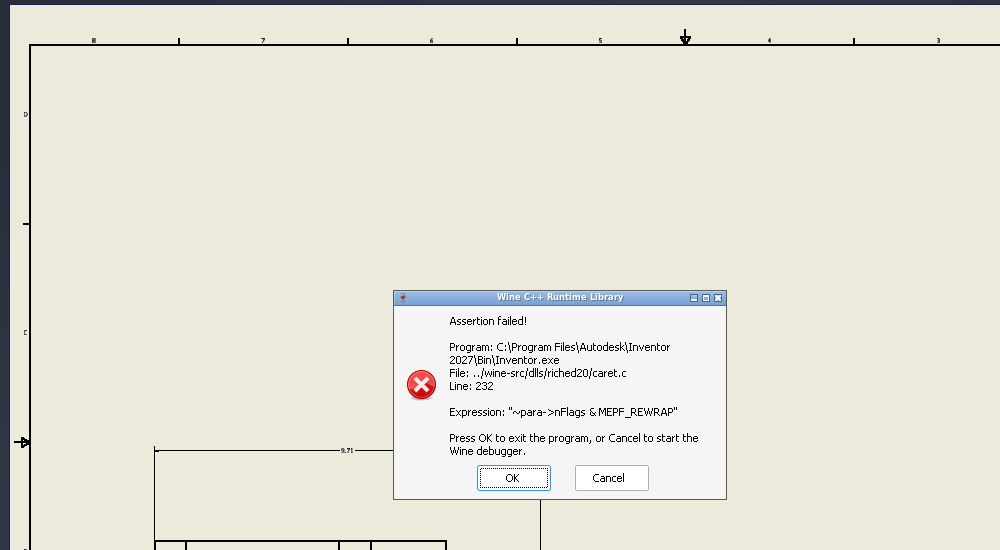
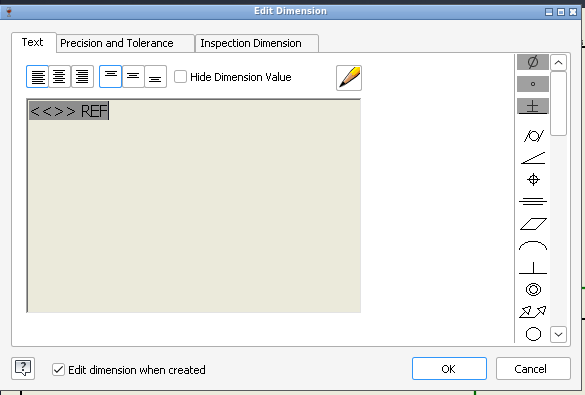

# 141 Placing a dimension in a drawing: riched20 assertion in an endless OK-loop dialog
Status: fixed on fix/141 (wt/141, 4 commits on integ d18a5dcd1ef, reworked after review), not merged; paused for a reboot, see State at pause · Owner: issue-141 worker · Found in: UI pass 2 (inst/ui2, inv :98, build/ 04293594c50)

## Symptom
In a drawing (.idw), General Dimension: pick two edges, click to place the dimension. Instead of Inventor's "Edit
Dimension" box a Wine message box appears: "Assertion failed! File: ../wine-src/dlls/riched20/caret.c Line: 232
Expression: ~para->nFlags & MEPF_REWRAP". Clicking OK ("exit the program") does not exit: the box disappears and a new
one (new HWND each time) appears at once. Inventor never gets back to the user; the only way out is killing the process.

## Result
- **Not a regression**: an old upstream bug (code unchanged since 2019, 03a93eb80e2 and before). Same assertion with
  riched20.dll from the upstream master build (wt/regress-master-build, 4e819f054dd) swapped into the test build
  (`inst/141/trace-master.log`: `_wassert ... ../regress-master/dlls/riched20/caret.c,232`). None of our 5 riched20
  commits is involved; no bisect needed.
- Cause: `EM_SETCHARFORMAT(SCF_WORD | SCF_SELECTION)` with an empty selection. Fixed, plus two differences in the
  same handler that the probe showed. After the fix: 

## Root cause
The Edit Dimension dialog (MFC `#32770`, RichEdit50W) fills its rich edit in WM_INITDIALOG while the control already
has the focus. Last steps (`inst/141/trace-integ.log`): `EM_GETCHARFORMAT(SCF_DEFAULT)`, `EM_EXSETSEL(4,4)` (end of
the text `<<>>`), `EM_SETCHARFORMAT(SCF_WORD | SCF_SELECTION, Tahoma 240 ...)`, `EM_EXSETSEL(4,4)`.
`handle_EM_SETCHARFORMAT` formatted "the word at the caret" with `ME_SetCharFormat` (marks the paragraph
MEPF_REWRAP) but only wrapped `if (changed)`, and `changed = ME_IsSelection()` is FALSE for an empty selection. The
handler's other paths wrap before returning; this one returned with a marked paragraph. (It is not the only such
path in riched20: drafts 159, 160.) The next caret computation asserts: `EM_EXSETSEL -> set_selection -> update_caret ->
cursor_coords` (first box, `inst/141/bt-first.txt`), then `WM_SETFOCUS -> create_caret -> cursor_coords` (every later box).
The reporter's four standalone variants never sent SCF_WORD with an empty selection.

## The OK loop (not a Wine-side difference, nothing filed)
It is recursion, not a failing abort: msvcrt's assert box is owned by the active window (the Edit Dimension dialog).
On OK, `EndDialog` of the box re-activates the owner, `DefDlgProc` restores the focus to the rich edit, its WM_SETFOCUS
asserts again, inside the first box's `EndDialog`, before `_wassert` gets to `raise(SIGABRT)` (frames 47-68 of
`inst/ui2/assert1/bt.txt`). Any assert in a focus handler does that, on Windows too.

## Windows ground truth (VM, `tests/r141/scf_word.exe`, output `inst/141/vm-scf_word.txt`)
RICHEDIT50W (msftedit) and RichEdit20W (riched20.dll), `EM_SETCHARFORMAT(SCF_WORD | SCF_SELECTION)`:
- The layout follows at once (EM_POSFROMCHAR of the text end moves) and so does the caret of a focused control
  (also for SCF_ALL and SCF_DEFAULT). No paint needed, hidden or visible.
- Non-empty selection: only the selection is formatted (SCF_WORD has no effect).
- Empty selection, text `one two  three`: caret inside a word's letters: the word without the spaces after it; caret
  among the spaces after a word: the word and the spaces; caret at a word start: nothing (modify flag stays 0);
  caret between the letters and the spaces: nothing on msftedit, word + spaces on riched20.dll.
- Caret in front of a paragraph mark (end of text, end of a line): the mark gets the format, the text before it is
  untouched (msftedit: modify flag and undo; riched20.dll: neither). This is Inventor's call: it gives the final
  paragraph mark the dimension style's font.
- Wine before: formatted the word (with its spaces) at every caret position including the word before a paragraph
  mark, and with a selection the word after the selection's end too; no wrap, no caret update.

## Fix (fix/141, wt/141; reworked after the adversarial review, old tip kept as branch fix/141-v1)
- fb34cb8cd17 `riched20: Wrap the paragraphs after formatting a word with EM_SETCHARFORMAT.` The assertion: SCF_WORD
  counts as a change, so the handler wraps like its other paths. Review: merge as is.
- 3466158191d `riched20: Update the caret after EM_SETCHARFORMAT.` One line. Review: merge as is.
- 81934a85ef4 `riched20: Restore the format of the final paragraph mark on undo.` undo.c: the end cursor of an undone
  character format couldn't pass the final mark (`ME_MoveCursorChars(.., FALSE)` -> TRUE). Test `test_undo_char_format`.
- 467f5b54e5d `riched20: Apply SCF_WORD to the paragraph mark when the caret is in front of one.` Replaces the first
  version's word-selection rewrite (71568c127a8, which could loop forever with an EDIT-style word-break proc and
  followed msftedit.dll where riched20.dll differs). Only change to the old code: empty selection in a paragraph-mark
  run -> format that run; every other SCF_WORD case is as on integ. Modify flag and undo item fall out of
  `ME_SetCharFormat` = msftedit.dll's behaviour (riched20.dll has neither: todo_wine).
- Test `test_EM_SETCHARFORMAT_word`: every caret position of `one two  three`, empty text, `<<>>`, `x\ryz\r\r q`,
  `ab, cd.` and 10 selections with riched20.dll's results (the test class is RichEdit20W); where Wine differs the
  character / modify / undo check is todo_wine. Plus layout and caret after a size change, and WM_SETTEXT resetting
  the final mark's format (todo_wine).

## Verification in Inventor (first version 71568c127a8, inv :98; the reworked branch: State at pause, item 7)
- Issue steps by mouse (Annotate > Dimension, two edges, place): Edit Dimension opened 3 of 3 (first dimension of the
  session included), 0 assertions. Typing, a symbol from the palette (Ø), select all + Delete + retype, tolerance
  method Symmetric (drawing shows `9.71 ± .00`), appended text (`6.06 MAX` in the drawing): work.
- Format Text (125): typed + pasted `中文测试` in Tahoma shows glyphs; re-edit by double-click keeps size and font;
  typing over a selection and Bold work (see 147 for the bold display).
- Repro without the mouse: `INVSCEN_DIALOGS=off INVSCEN_UI=1 INVSCEN_CMD=DrawingDimensionToleranceCtxCmd
  tools/invscen/run.sh dim141` (API-made dimension, then the context command that opens Edit Dimension on it);
  without INVSCEN_CMD it leaves the drawing open for the manual steps. WINEDEBUG=+richedit shows the sequence.

## Leftovers
- Deleting the `<<>>` token is possible on Wine (the dimension then shows its plain value). Whether Inventor on
  Windows prevents that is unknown: the dialog asks for ENM_PROTECTED and Wine has no EN_PROTECTED; the run was not
  CFE_PROTECTED when checked. The grey box behind the text is there with and without the fix. Not verified on Windows.
- Other rich edit differences the probes showed, outside this issue: draft 146. Format Text doesn't show bold: draft 147.
  Sibling assertions found by the review's fuzzer: drafts 159, 160, 161.

## State at pause (2026-10-03, reboot)
Rework after the review is complete in code and verified; nothing is half-applied (wt/141 clean, fix/141 =
467f5b54e5d; fix/141-v1 = the first version, delete when no longer wanted).
Done and how it was verified (all on wt/141-build = fix/141 tip):
1. Commit 3 replaced, undo.c fix added (commits above).
2. Reviewer's hang repro returns: `rescript.exe 'text:\sab\scd' wbproc:2 sel:2 cf:3,italic` -> nothing formatted,
   modify set, exit 0 (Windows: formats the whole text with such a proc, also sets modify; in 146).
3. Reviewer's undo repro restores: `class:0 'text:one\stwo' emptyundo sel:7 cf:3,italic mod undo map:italic` ->
   `[--------]`; SCF_SELECTION over the mark (6,8 and 7,8) too.
4. riched20 editor test on the VM, x86_64 and i386: 11496 tests, 0 failures. Wine: 0 failures both arches (153 todo).
5. `tools/regress.sh unit X -b wt/141-build` for riched20:editor, riched20:richole, riched20:txtsrv, msftedit:richole,
   riched32:editor, both arches: all pass, 0 failures (inst/141/regress-v2.txt; todo counts as the baseline except
   editor 70 -> 153 = the new todo_wine rows).
6. Reviewer's fuzzer, 300 steps: 80 runs with `-x tomtext` (class 0 style 10000004 seeds 1-40, seeds 41-60 also
   without setpf; class 1 style 10200044 seeds 1-20): 75 pass, 5 assert after EM_STREAMIN (4) / EM_REPLACESEL (1) on numbered paragraphs (160);
   EM_SETCHARFORMAT is never the last action. Without `-x tomtext` 39 of 40 seeds die in ITextRange::SetText (159).
7. Inventor on inv3 (:100) with wt/141-build: issue steps by mouse opened Edit Dimension 3 of 3 (control class
   RichEdit50W), 0 assertions; select all + Delete + retype gives Tahoma 12 pt; ` REF` appended shows on the sheet;
   Format Text: typed + pasted CJK, re-edit by double-click, typing over a selection fine. inv3 is back on build/,
   lease released.
8. Regression re-check (the DLL-swap trap): my "master's riched20.dll also asserts" test did use master's DLL. I
   overwrote wt/141-build/dlls/riched20/x86_64-windows/riched20.dll (the file the build tree loads; sha1 equal to
   wt/regress-master-build's) instead of using an override; the assert message named `../regress-master/dlls/
   riched20/caret.c` and the trace has master-only output (`fixme:richedit:TextFont_Reset reset mode 4 not
   supported`). So: old upstream bug, not a regression.
9. Drafts 159, 160, 161 filed with repros that run from a checkout (tests/r141/rescript.c, fuzz.c, fuzz-keep-*.txt;
   all three reproduce on the fix/141 build and, per the review, on the pre-fix DLL); 146 extended.
Not done / remaining, in order:
1. msftedit.dll expectations as a test in dlls/msftedit/tests (optional per the coordinator; skipped).
2. `changed` is still TRUE for SCF_WORD when nothing was formatted (empty word range with an EDIT-style word-break
   proc): modify flag set without a format change. Matches Windows' flag in the one case measured; left as is.
3. Second adversarial review / merge of the 4 commits onto integ (coordinator).
4. wt/141-prefix (1.6 GB scratch prefix, also used by the review) can be deleted with tools/del.
