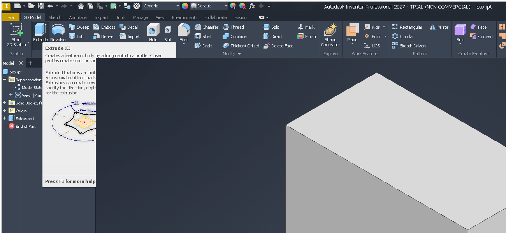

# 145 winewayland: a tooltip (subsurface) overlapping the 3D viewport is drawn under the viewport's client surface
Status: draft · Found in: 134/135 Inventor check on Wayland (inv2, mutter 42) · not caused by fix/134 (same on integ d18a5dcd1ef)

## Symptom
Inventor with a part open: hover a ribbon button whose tooltip is big enough to reach into the graphics window (e.g.
3D Model > Extrude, wait for the extended tooltip). The part of the tooltip over the viewport is missing: the GL viewport
is drawn above it. 
Context menu and Marking Menu opened inside the viewport are fine (shown above it).

## Repro
`x/wayland.sh start`, Inventor on Wayland (notes/wine/wayland.md), `tools/invscen/run.sh view`, then
`x/wshot.sh move 104 115; x/wshot.sh move 106 117`, wait 4 s, `x/wshot.sh out.png`.

## Open
Component (guess): winewayland.drv subsurface stacking. An unmanaged popup is a wl_subsurface of the main window's surface,
placed above the *owner's own* client surface (`wayland_surface_reconfigure_subsurface`: `place_above(owner client surface)`),
but the viewport is the client surface of a child window, also a subsurface of the same toplevel surface, and
`wayland_surface_reconfigure_client` calls `wl_subsurface_place_above(client, toplevel surface)` on every attach/update,
so whichever was restacked last wins. Not investigated further; a standalone probe (GL child window + tooltip-style
WS_POPUP shown with SWP_NOACTIVATE over it) should show it.
