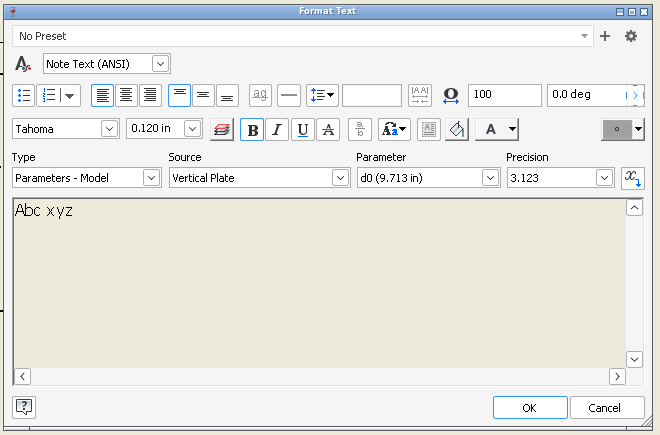

# 147 Format Text: bold text is not drawn bold in the dialog's edit area
Status: draft · Owner: - · Branch: - · Found in: 141 verification (inv :98; same on build/ integ d18a5dcd1ef and on fix/141) · Windows reference: not checked

## Symptom
Drawing, Annotate > Text, type `Abc xyz`, double-click `xyz`, click **B**. The button shows as pressed and the text
placed on the sheet is bold, but in the dialog's edit area (RichEdit50W, Tahoma) the word looks the same as before.
 Sheet after OK (`Qrs`, `xyz`, `end` bold):

## Evidence
`WINEDEBUG=+richedit`: the click sends `EM_SETCHARFORMAT(SCF_SELECTION)` to the edit with the selection (9,12) and
an undo item for a character format is pushed, so the format reaches the run. Not analysed further: which
mask/effects/wWeight Inventor sends, and whether the font actually selected for the run is bold (Wine ships
tahomabd.ttf). Not a regression of 125 or 141 (same picture with integ's riched20.dll).

## Guess at the component (guess)
riched20 style -> LOGFONT weight (`ME_LogFontFromStyle`: CFM_WEIGHT's wWeight overrides CFE_BOLD) or the font
linking path of 125 (`fNoGlyphIndex` runs); a standalone probe with the message's CHARFORMAT2 would tell.
