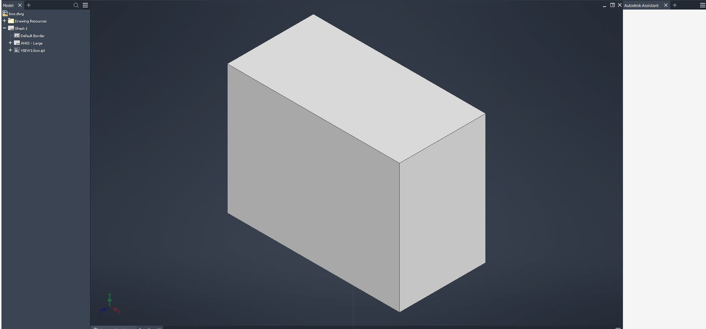

# 167 winewayland: in-process client surfaces ignore the window z-order (an inactive document's 3D view covers the active document)
Status: draft · Found in: 132 M2 (Inventor on Wayland; present on integ e00a74f6590 without 132) · Component: winewayland.drv wayland_surface.c (client subsurfaces)

## Symptom
Inventor with two documents open (part `box.ipt`, then drawing `box.dwg`): the drawing is the active MDI child (browser pane,
ribbon, tab), but the view area keeps showing the part's 3D view; the drawing sheet is never seen. After the main window is
restored/resized, the stale view of the inactive document keeps its old size and sticks out of the window.
 (build/ = integ, `renderer=gl`, NVIDIA EGL; the white
Assistant pane is 132.)
Related: 145 (tooltip under the GL viewport), and the tooltip under a 132 sink.

## Cause (from the code, not verified by a fix)
A GL/Vulkan client surface is a wl_subsurface of the toplevel, unclipped: nothing hides it when a sibling window covers its
window (MDI children are stacked, not hidden), and `wayland_surface_reconfigure_client` does
`wl_subsurface_place_above(client, toplevel surface)` at every attach/present, which puts the surface that is presenting
just above the parent = BELOW every other subsurface of that toplevel. So the active view sinks under the stale one.
Popups in the subsurface role do the same (`wayland_surface_reconfigure_subsurface`): 145.
Three `Mtk-CRITICAL mtk_region_ref: assertion 'region != NULL' failed` lines of the compositor per opened document belong to
this in-process path too (seen on integ, 1 per document; not from 132's sinks).

## Fix idea
132 M2 gives sinks the Win32 view: `get_visible_region` server request for the client window, hide when the visible region is
empty, crop to its bounding box. The same for in-process client surfaces in `wayland_client_surface_update` (win32u calls it for
every window change in the toplevel and at every present): hide = detach when the region is empty. Two traps:
- a detached surface that keeps swapping with interval > 0 blocks forever on Mesa (163): fix or guard that first;
- cropping needs `wp_viewport.set_source` inside the buffer EGL attaches at its next swap (protocol error otherwise): set it at
  swap time from the EGL surface size, or hide-only first.
And stop re-placing subsurfaces at the bottom on every present / popup update (keep creation order, or track the stack).
