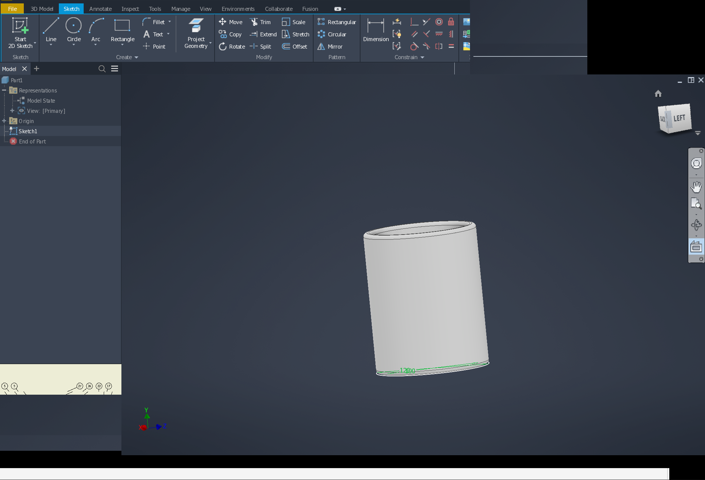

# 174: Main-window regions stay black or stale after Awesome Mod+mouse resize

Status: open, partly fixed · Owner: worker-174 · Branch: fix/174 (wt/174, d09a8c4d1ce on integ cffd27540ee)
The persistent stale picture of the report was **not reproduced** on the server, neither on build/ (b5d75449ffe, the
user's build) nor on build-next (cffd27540ee), Inventor at 144 DPI under awesome + picom. What was found and fixed in
Inventor: under load the window jumps back to an earlier size of a WM drag (stale configure request). 181's fixes
(merged) cover GPU-presented children. To be confirmed by the user on a build with 181 + fix/174; data to ask for is
at the end. See "Inventor round (2026-10-05)".

## Environment

- Inventor Professional 2027.1, existing `prefixes/inv`, 144 DPI.
- Wine `b5d75449ff`, `wine-11.18-537-gb5d75449ff` (2026-10-04 build).
  Includes the fixes for 124 and 125.
- Ubuntu 24.04, Awesome on X11, NVIDIA-primary single X screen (RTX 3080).
- `WINE_D3D_CONFIG=renderer=vulkan`.
- Picom: `--config /dev/null --backend glx --vsync --no-use-damage`.
  These settings were checked during the report; the earlier viewport tearing
  had been resolved with this compositor configuration.

## Observed behavior and recovery

1. Resize Inventor's main window using **Awesome Mod+mouse**, not its border.
   Exact size, drag direction and timing were not recorded.
2. Most visual glitches are transient, but some black/stale regions remain
   after the resize. The screenshot shows affected ribbon/panel areas and
   black bands; the model viewport is still visible.
3. Move the mouse over a black area: **icons redraw as the pointer passes**.
4. Resize again: after another round of transient glitches, **the entire
   window redraws correctly**.

Expected: the window repaints fully when resizing ends, without requiring
hover or another resize to reveal its contents.

The user's exact recovery description:

> Mod+mouse. When I drag the mouse over the black area, the icons are redrawn,
> and on the next resize, adter another round of quick glitches, I get the
> whole window redrawn correctly.

Screenshot published with the user's permission, cropped to Inventor and
stripped of metadata. The original is retained privately.

## Distinction from earlier reports

- [124](124-open-dialog-resize-coreclr-crash.md): the old Open-dialog failure
  involved a fatal exception, with GDB holding the process during capture.
  **This report is not that paused-process case.** At inspection Inventor was
  sleeping normally, not ptrace-stopped; GDB was armed with no capture marker.
  Hover and the next resize also demonstrate continued UI processing.
- [077](077-wm-move-no-sizemove.md): WM-driven size/move handling is relevant
  context, but this is not yet established as a regression of that fix.
- [062](062-wpf-layered-splitter-black.md): another black-region report;
  no shared cause has been demonstrated.

## Investigation / handoff

The recovery pattern suggests missed repaint/invalidation after WM-driven
resizing. This is a hypothesis, not proof of which layer is responsible.
Compare final Win32/X11 geometry, update/clip regions and repaint delivery
before hover versus after recovery; include border resizing as a control.
No such trace or border-resize comparison has been collected locally.
Maximize/restore recovery and behavior without picom have not been tested.

Private evidence is in `inst/local/debug-20261004-203715-b5d75449ff/`,
including `persistent-resize-artifacts.png`, the launch log and GDB log.
No raw logs, core data or model files are attached.

## Server investigation (worker-174, 2026-10-04; Inventor not run: licence seat in use)
Setup: :98 (headless NVIDIA Xorg) with awesome 4.3 (`x/awesome-rc.lua`) + picom 12.5
`--config /dev/null --backend glx --vsync --no-use-damage` (vsync works there; one "duplicate vblank" warning), LogPixels
144 and 96, wined3d Vulkan, build/ = integ b5d75449ffe. Probes in `tests/r174/` (see CODE.md): a frame laid out like
Inventor's (ribbon / browser / status bar / view) in plain Win32 (`frame.exe`) and in WPF 4.8 (`wpf.exe`, one window or
a WinForms frame hosting four child HwndSources), driven by `drive.sh` (Mod4 + right-button drags of any corner, 20 per
run, screenshot + pixel check against the layout for the X window's size + the probe's own state).

### What is not the cause
- **The size-move pair (077 / 130).** WM_EXITSIZEMOVE before the WM's last size: 2 of 60 resizes, only with 2 ms steps
  and the release right after the last motion; 0 of 140 otherwise (a 30-150 ms layout doesn't change it) (the EXIT handler applies
  the pending config first, and a slow application reaches the posted message after the last ConfigureNotify). What does
  happen in 35-60 % of awesome resizes is the first WM_SIZE *before* WM_ENTERSIZEMOVE: awesome's frame ConfigureNotify
  becomes a GravityNotify whose WM_WINE_WINDOW_STATE_CHANGED is posted ahead of `wm_size_move_begin()`'s message, and it
  applies the size the following ConfigureNotify brought (openbox: never). Harmless here: Inventor's frame
  (`MFCxDocFrameWnd`, FwUI.dll) only forwards both messages to CMDIFrameWndEx / DefWindowProc, and no probe variant
  (layout on WM_SIZE, layout deferred to WM_EXITSIZEMOVE, layout that pumps messages) ends with a stale layout.
  Builds: integ, integ without 130, integ without 130 and 077 (`wt/174-r130`, `wt/174-r077`) behave the same in every
  probe; without 077 there is no pair at all. The user's previous build d7799da4d5 has 077 and not 130; the other
  winex11 / win32u changes between the two builds are the 062 set (99ae4d1588d, ef0df759591, 32e116bc7e5, 1e44ad82022)
  and 133 / 143.
- **GDI content in the window surface.** 0 stale of ~600 WM resizes: children painted on WM_PAINT with and without
  CS_HREDRAW, painted by another thread (as WPF's software render thread does), with a D3D11 child next to them, layout
  0-150 ms, all four corners, 96 and 144 DPI, awesome and openbox (Alt + right drag), with and without picom; software
  WPF (`RenderOptions.ProcessRenderMode = SoftwareOnly`) as one window and as child HwndSources, up to 120 steps of 3 ms.
  Final X geometry, Win32 rects and the last WM_SIZE always agree.

### What does go stale: child windows the GPU presents into (offscreen client surfaces)
Details, timelines and repro lines in draft [181](181-offscreen-client-surface-stale-after-move-resize.md); none of it
depends on 077 / 130 (same on the build without them) or on the compositor:
1. A D3D11 child that presents once per WM_SIZE (ResizeBuffers + Present): after every *growth* step the new strip of
   the view shows garbage (black, shifted copies of other screen content) until the next present: 10 of 10 growths.
2. Hardware-rendered WPF child panes (D3D9 through wined3d, one Vulkan swapchain and one offscreen X window per
   HwndSource): a pane that is *moved* by the layout without changing size (status bar when only the height changes)
   is not shown at its new place, the frame's background stays there.
3. WPF's dirty-rectangle presents (hover effects, late content) go through wined3d's GDI present from its command
   stream thread, straight onto the toplevel X window; nothing flushes them until an X event reaches the process, and
   the offscreen X window that fix/061 presents again on Expose never gets them (an older frame comes back).
   `wpf.exe hosted partial`: after a Mod4 resize the square stays black for >= 5 s in 7 of 10 runs and turns right as
   soon as the pointer moves over any pane of the window.
Together: after a WM resize, panes at an old size or place, black / foreign strips, repaired piecewise by hovering and
completely by the next resize, while a view that presents continuously looks right. That is this report's picture, but
only for panes that are GPU-presented, and the evidence below says Inventor's WPF panes are not.

### Open: what Inventor's ribbon / browser / tab strip are drawn with
- An Inventor that another worker's harness run started on :98 by mistake (killed after a passive `xwininfo -tree`,
  nothing clicked) had exactly one own client X window: 1327x884 at 241,127 = the document area. Ribbon and browser
  had none, so they were software WPF or GDI there (96 DPI, no document, 2.5 min after start).
- `WpfAppPage.dll`: the static constructor of `InvAIRLookPageFactory` sets `RenderOptions.ProcessRenderMode =
  SoftwareOnly`; `WpfHost.dll` (the ribbon host: RibbonHwndSource, HwndSourceParameters) uses that factory; AdWindows.dll
  sets SoftwareOnly for InfoToolbar and WpfMediaPlayer only (IL scan, `inst/174/il/mref.py`). So Autodesk forces software
  WPF for the process, most likely from the creation of the ribbon on, on the laptop too.
- So for Inventor the reproduced defects explain at most the viewport (defect 1, repaired by its next frame), and the
  cause of the stale ribbon / browser / status bar is **not found**: software WPF and GDI panes never went stale in the
  probes. It needs Inventor itself (seat) or data from the laptop.
- The screenshot's boundaries: ribbon content ends at x = 1382 = 2/3 of the 2073 px width, the plain ribbon background
  at 1727 = 5/6 (= the middle between the two), status bar at ~1965; browser content ends at y = 1070, foreign content
  to 1161, background to 1326, black to 1377 of 1412. 2/3 and 5/6 are also 96/144 and 120/144; no DPI path was found
  that would produce them (Inventor.exe is system DPI aware by manifest, no per-thread awareness in Autodesk's
  binaries), so they are taken for the old and an intermediate width.
Next step (10 minutes with the seat at 144 DPI, part document in sketch edit, awesome + picom; or on the laptop while the
window is stale):
`xwininfo -root -tree | grep -B1 -A12 "child"` (X windows below a 1x1 unnamed window = client surfaces: are there some
at the ribbon / browser rectangles?), `tests/r174/wstate.exe "Autodesk Inventor" tree` (window / client rect, region,
children with pending update rects; `redraw` invalidates everything: a screenshot that changes then shows content that
was painted but not on screen), whether the stale state survives moving the pointer over the viewport only (defect 3
does not), `xrdb -query | grep -i dpi` and the prefix's LogPixels.

### Other facts
- Inventor's main frame: class AfxMDIFrame140u, no WS_CLIPCHILDREN; `MFCxDocFrameWnd::OnEnterSizeMove` -> Default(),
  `OnExitSizeMove` -> `CMDIFrameWndEx::OnExitSizeMove` (FwUI.dll 0x180442110 / 0x180442160).
- Under a compositing manager Expose events only come from growth and mapping (no Expose when a covering window goes
  away); what shows in a never-painted new area is whatever the X server copied into the new window pixmap (screen
  content of that place), not black.
- Harness: `drive.sh` under openbox lets the window grow off the screen after ~10 drags (those samples are reported as
  "not fully on screen" and don't count).

## Inventor round (2026-10-05, inv3 on :100, seat on the server)
Setup: awesome 4.3 + picom 12.5 (`--config /dev/null --backend glx --vsync --no-use-damage`), Xft.dpi 144 and LogPixels
144, NVIDIA, Vulkan renderer, part with a sketch in edit (invscen `uilat`), window restored to 1300x800. Driver
`inst/174/i/inv-drive.sh` (Mod4 + right drags of a corner or left drags of Inventor's own border; pointer moved away;
screenshot, then `wstate.exe redraw` and a second screenshot: pixels that differ = content that was not on screen;
final X size against the last pointer position). Shots and result files: inst/174/i/.

| build | what | stale after settling | window not at the dragged size |
|---|---|---|---|
| build/ b5d75449ffe | Mod drags br / tl, 20-150 steps, part tab | 0 of 24 | 0 |
| build/ | Inventor's own border (win32u loop) | 0 of 6 | 0 |
| build/ | Home tab active (WebView2) | 0 of 8 | not evaluated (minimum size) |
| build/ | Inventor pinned to one CPU, with 0 / 1 / 2 busy loops on it | 0 of 34 | 1 of 6 / 5 of 20 / 3 of 8 (+ 1 of 6 in the traced run) |
| build-next cffd27540ee | Mod drags, part and Home, unthrottled and throttled | 0 of 50 | 1 of 42 throttled |
| fix/174 (cffd27540ee + d09a8c4d1ce) | Mod drags, border drags, throttled (2 loops) | 0 of 26 | 0 of 26 |
A throttled Inventor needs up to ~10 s to finish repainting after a drag (white viewport, tab strip at two places, old
ribbon width at 3 s: inst/174/i/b-many-15-a.png); it always got there without input, so that is slowness, not the
report's state.

Facts about Inventor (measured): with a part open its process has one client X window, the graphics view (1678x787 at
241,200 when maximized); ribbon, browser, tab strip and status bar are in the window surface (software WPF / GDI), so
181's defects 2 and 3 don't apply to them. The frame has a rectangular window region of its own size (`wstate`:
region type 2). WebView2's GPU processes have their own client windows in Inventor's toplevel (Home, Assistant).

### Defect found: the window jumps back to an earlier size of the drag (fixed on fix/174)
Timeline (build/, `WINEDEBUG=+x11drv,+event,+cursor`, Inventor pinned to one busy CPU; inst/174/i/b-tr-cfg.txt, lines
from inst/invscen/inv3/inventor.log of that run):
- 43613.38-.41: the thread gets to its X queue late and handles 407 events in one go; every ConfigureNotify is an
  "unexpected config", the last one (60,40)-(1360,840) = the size the pointer was released at. The driver's current /
  pending / desired rect are that; the Win32 rect is still (60,40)-(1496,903), one WM_WINE_WINDOW_STATE_CHANGED per
  event is posted.
- .437: `X11DRV_WindowPosChanging hwnd 0x204e0, swp_flags 0x181f`: win32u's `update_window_state()` for the frame (a
  child window was created / destroyed, got a pixel format, or another process posted WM_WINE_UPDATEWINDOWSTATE for
  its client surface): a SetWindowPos that moves nothing, with the old Win32 rect.
- .441: `window_set_config ... requesting config (60,40)-(1496,903)`: `sync_window_position()` passes the Win32 rect
  to `window_set_config()`, which sees it differs from the pending (= the WM's) rect and asks for it. awesome honours
  configure requests of floating clients: the window is 1436x863 again.
- .443 on: the posted state changes find `configure_serial` set and do nothing; the reply matches; X and Win32 agree on
  the stale size. The content is consistent, the window is just not where the user left it; while the drag is still
  going on the next motion resizes it again (visible as jumping).
110 such no-move SetWindowPos on the frame in that session, 4 during the 6 drags. Same mechanism upstream (the code is
upstream's); also with any application SetWindowPos that doesn't move the window (SetWindowRgn from a posted message:
probe `frame.exe rgnpost` on Xvfb + awesome: build/ 27 of 30, build-next 20 of 20 resizes end at a stale size and the
window creeps by a pixel per resize, up to 300 px off screen; fix/174 0 of 20, no creep).

Fix d09a8c4d1ce `winex11: Don't request the old window rect again when the Win32 rect didn't change.`:
`sync_window_position()` returns before `window_set_config()` when the window is managed, the visible rect is the one
from before the call, no state update is being applied (`state_locks`) and nothing of ours is waiting
(desired == pending). Inside a state update the old behaviour stays, so an application that refuses the WM's rect in
WM_WINDOWPOSCHANGING still gets its rect requested.
Checks: 077's table (`inst/130/sm.sh`, awesome and openbox, with and without picom; inst/174/sm/fix.txt) identical to
the reference in all four setups; 130's root-window XI2 selection is not touched (no change in mouse.c / event.c);
Inventor on the fix build: table above, application-side SetWindowPos of the frame still moves the X window;
regress user32 / win32u / winex11.drv (52 units, both arches) vs the integ cffd27540ee baseline: 0 real differences
(user32:win fails 4 on both in the re-runs; inst/174/regress-compare.txt).
Not closed: the same request can still go out when the no-move SetWindowPos happens *inside* a state update that
applies an older WM rect while a newer one has already been recorded (X events handled inside the application's
WM_SIZE; 4 of 2854 state updates in the traced session handled ConfigureNotify inside). Closing it needs the driver to
remember which rect the running update delivers.

### Other observations (not pursued)
- With a region set, awesome and a cross-process `ShowWindow(SW_RESTORE)` + `SetWindowPos` of the maximized frame
  (`wstate.exe pos=`): Win32 restores, the X window stays maximized (_NET_WM_STATE_MAXIMIZED_*), build-next and fix
  alike; un-maximizing through the WM first (Mod4+m) works.
- fix/077 sends an ENTER / EXIT pair to a window whose placement ConfigureNotify arrives while a button is held for
  another window's WM drag (seen with two probe windows).
- `tools/prefix.sh stop` kills everything that has the prefix in its environment, also a WM started from a shell that
  had run `prefix.sh env`.

### If the user still sees stale regions on a build with 181 + fix/174: data to ask for (laptop, while it is stale)
1. A screenshot, then `xwininfo -root -tree > tree.txt` and `xprop -id <Inventor window>`.
2. `wine tests/r174/wstate.exe "Autodesk Inventor" tree` (Win32 rect, region, children, pending update rects), then the
   same with `redraw` and a second screenshot (does everything come back?).
3. Does moving the pointer over the *viewport only* repair anything; does the window keep the size it was dragged to.
4. `xrdb -query | grep -i dpi`, `wine reg query "HKCU\Control Panel\Desktop" /v LogPixels`, awesome's layout for
   that tag (floating or tiled), which corner / edge was dragged, CPU load at the time (the debugger was attached).
5. If it can be made to happen again: Inventor started with `WINEDEBUG=+timestamp,+x11drv,+event,+cursor` (the log
   compresses well) and the time of the stale resize.
