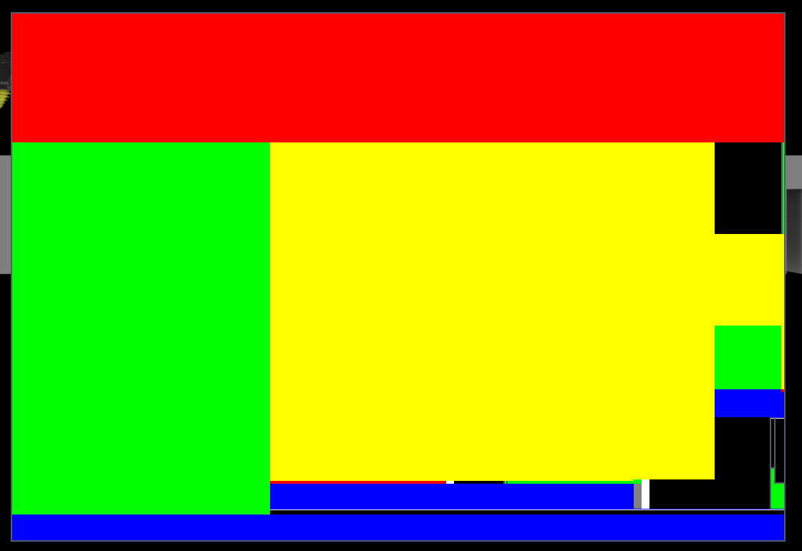
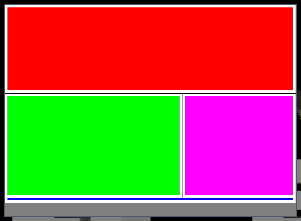

# 181 GPU-presented child windows go stale on screen when they are resized, moved or presented partially (offscreen client surfaces)
Status: fixed on fix/181 (wt/181, integ 6c65743db3a + 9 commits; reworked after the review, first version kept as fix/181-v1 on b5d75449ffe) · Owner: worker-181 · Found in: 174 (probes `tests/r174/`) · X11, wined3d Vulkan and GL
All three defects are upstream's (same on master 4e819f054dd, also on Xvfb + lavapipe); our 061 only changed what an
Expose over a partial present shows (old frame instead of black). Inventor not run (seat in use).

## Symptom
A child window that a GPU API presents into is an offscreen client surface on winex11 (window-surfaces.md): the driver
presents into an X window under the dummy parent and copies it onto the toplevel X window. After the toplevel is resized
(by the WM or not) such children showed old or foreign pixels until the application presented the whole window again.
Applications that present once per change (WPF, anything that renders on WM_SIZE / WM_PAINT only) stayed wrong;
hovering repaired the rectangles WPF redraws.
 
Left: D3D11 view (yellow) after a growth, 50 ms layout. Right: WPF panes, the status bar (blue) only moved.

## Probes
- `tests/r181/gpuchild.exe MODE [N] [options]` (C, runs on the VM; every check reads the screen from another process,
  the thread under test idles without polling): `grow` (one ResizeBuffers + Present per resize), `move` (moved, no
  present), `movesib` (a sibling grows over it and presents, then it moves), `partial` (D3D9 COPY-effect presents of a
  40x40 rectangle, then a cover window beside / over it). `tests/r181/run.sh TAG vulkan|gl MODE..`.
- 174's `tests/r174/drive.sh` with `frame.exe` (D3D11 view) and `wpf.exe hosted partial` (hardware WPF panes), 30 WM
  resizes per run: `tests/r181/accept.sh TAG RENDERER LABEL`, `accept-wpf.sh` (needs the .NET prefix copy
  inst/181/pfx-net48), `all.sh LABEL` (everything on :98 as it is; ~1 h). Also there: `xmove.sh` (cross-process moved
  child), `quick.sh` / `rep.sh` (061 / 078 / cross-process probes, repeated), `fps.sh`, `sw.sh` (Xvfb :1470 + lavapipe).
  Results of the runs below: inst/181/r/.

## Windows ground truth (Win11 VM, 96 DPI)
| probe | Win11 |
|---|---|
| grow, grow flip, grow d3d9 | 0 bad of 6 each: one Present after ResizeBuffers / Reset shows the new size |
| move, move flip, move d3d9 | 0 of 4: the frame is shown at the new place, nothing presented |
| partial, partial top | 0 of 7: the square shows each partial present, also after a cover beside and over it |
| movesib (either z-order) | the moved child B gets WM_PAINT for its whole client area and its bits are *not* shown at the new place (draft [186](186-overlapped-sibling-not-invalidated.md)) |
| grow top (top-level, blt model) | 1 of 6 bad on Windows itself (the present in WM_SIZE misses the new strip): no reference |

## Defects, causes, fixes (branch fix/181)
1. **First present after a growth leaves the new strip undefined** (upstream; base 5 of 5 growths with gpuchild, 10 of
   15 with frame.exe; master the same).
   - Vulkan: win32u answers vkAcquireNextImageKHR with VK_SUBOPTIMAL_KHR once the window no longer matches the
     swapchain, wined3d (`wined3d_swapchain_vk_blit`, written before win32u did that) presented to the old-size
     swapchain anyway and recreated it afterwards, for the next frame. The host driver shows the old-size image
     unscaled; the rest of the (already resized) offscreen X window is what the server copied from the screen.
     Fix 76c338b653a `wined3d: Recreate the Vulkan swapchain before presenting when it doesn't match the window.`:
     an acquire that says SUBOPTIMAL is treated as out of date (recreate, acquire again, one present, no frame of the
     wrong size at all); a second SUBOPTIMAL in a row is presented as before.
   - GL (NVIDIA GLX; llvmpipe is fine): the GLX drawable follows the X window, and the resize request of the client
     window (`client_surface_update_geometry`, gdi_display) was still in Xlib's buffer when the frame was rendered
     (17 of 30 with frame.exe under awesome + picom, 3 of 3 with gpuchild).
     Fix 92082e9be26 `winex11: Wait for the server to resize a client window.` (XSync after a size change; one round
     trip per resize of a client surface, none per present).
2. **A moved child is not shown at its new place** (upstream; base and master 4 of 4).
   `move_window_bits()` copies inside the window surface, which has no pixels of client surfaces (they are clipped
   out of it; the driver draws them on the toplevel X window).
   - a9ae27a63a1 `win32u: Move the bits of client surfaces with their window.`: a second copy on the host window,
     through a DC without window surface whose visible region is what the surface doesn't paint (internal
     `DCX_CLIENTSURFACES`; skipped for DPI-scaled surfaces and drivers without direct drawing). This is what moves a
     GPU child of *another* process when its container moves (`tests/r181/xmove.sh`: xp.exe child in a host panel that
     the host moves: new strip host grey on base, the child's frame on fix).
   - 4a0563e157a `win32u: Present offscreen client surfaces again when they are moved.`: screen bits are only right
     if nothing drew over them, and WPF renders a pane inside its WM_SIZE: the pane resized first had already
     presented over the old place of the pane moved next (hardware WPF probe with the first commit alone: 10 of 15
     growths showed the browser pane's bottom strip in the status bar). So a surface of this process that moved
     without resizing is presented again from its offscreen window and invalidated. Windows sends WM_PAINT in that
     situation too (movesib) and WPF repaints on it.
3. **Partial presents stay invisible** (upstream; base 5 of 5). wined3d presents a partial destination rectangle of a
   COPY-effect swapchain (WPF's dirty rectangles) with GDI on the window DC it got when the swapchain was created.
   Three separate things:
   - The DC kept drawing into the window surface, under the client surface, where it is never shown: nothing
     invalidated it when the window got its pixel format flag afterwards (until the next resize / z-order change).
     gpuchild `partial` without `nudge`: never visible. Fix f4fda93bfdb `win32u: Invalidate the DCs of a window when
     it gets a pixel format.` (in `apply_window_pos()`, the one time the flag reaches the server; `clip_clients` 1 -> 2).
   - Once the DC draws on the toplevel X window directly: the request stays in Xlib's buffer. gdi_display is flushed by
     `X11DRV_ProcessEvents`, which upstream only calls when the thread has X events since d3cb94b543e (Oct 2025), by a
     window surface flush or a full present. `partial nudge`: every square showed one present late, the last never
     (174: black 7 of 10 until the pointer moves). Fix 44ff08bf2b7 `winex11: Flush the display after drawing an
     image on a window.` (XFlush after `X11DRV_PutImage`, `X11DRV_StretchBlt`, the XRender StretchBlt / PutImage /
     BlendImage / AlphaBlend: where a GDI present and the bits move of defect 2 land; no round trip). Other direct
     GDI (fills, lines, text) is still not flushed: draft [189](189-direct-gdi-on-window-not-flushed.md).
   - The offscreen X window never gets partial presents, so presenting it again on Expose (our 061) brought back the
     last *full* frame over the whole window: confirmed (cover beside the square: square lost on base; master shows
     black instead). Fix e0409a6a1d7 `win32u: Only present the exposed part of offscreen client surfaces again.`
     (changes our own 061 function `present_offscreen_client_surfaces()`: to be folded into 061 for upstreaming, like
     c1f6c77e9ea below).
     **Left open**: a cover *over* the square (no compositing manager) still shows the old frame there until the
     application repaints (fix/005's RedrawWindow asks it to; WPF does). Closing it needs partial presents to reach
     the offscreen window: wined3d keeping the presented front buffer, or DCs of such windows drawing into it.

## Review round (2026-10-05) and what changed
Review files: inst/181-review/ (`rv181.c` probes; `tests/r181/rv.sh TAG RENDERER ARGS` runs them on our builds).
1. *A moved surface was presented again although nothing had ever been presented into it* (VRAM garbage on NVIDIA;
   061's Expose path had the same hole). c1f6c77e9ea `win32u: Don't present offscreen client surfaces again that have
   no image.`: `presented` in struct client_surface (WINE_GDI_DRIVER_VERSION 113), set by `client_surface_present()`,
   required by both re-present paths, and cleared when the surface grows in either direction (the host window keeps
   the old image at the top left, the strip is undefined) or switches between onscreen and offscreen (another
   pixmap). Not cleared on a shrink (the image is cropped) nor when the Vulkan surface / swapchain is recreated (the X
   window and its content stay). After a growth without a present the move is done by the bits copy on the host
   window alone, which is what Win11 shows (`growmove`: old area kept, strip = parent, 2 WM_PAINT on both).
   `nopresent`: parent colour and 1 WM_PAINT, as Win11 and build/.
2. *XFlush per primitive* (incomplete for pens, 8x slower PatBlt): now after image operations only, see defect 3;
   the general problem is draft 189 (188 was taken). `gdiflush`: none of the four primitives is shown, as on build/
   (Win11: all four). `gdibench` on a swapchain window, build/ vs fix: PatBlt 2.6-4.0 M vs 4.0 M calls/s, SetPixel
   2.2-2.9 M vs 2.0-2.9 M, InvertRect 4.7 M vs 4.8 M; Xorg CPU for the whole benchmark 17 vs 16 ticks.
3. *Stale clip in `X11DRV_client_surface_present()`* (`if (region)`): 0391bd19f08 `winex11: Always select the clip
   region when presenting an offscreen client surface.` It is upstream's bug without any Expose: reproduced with
   `gpuchild fsclip` (DPI-unaware top-level swapchain in a 144 DPI prefix = offscreen; partly covered and uncovered;
   SetFullscreenState; present): build/ shows the fullscreen frame only inside the former window rectangle (3 of 5
   screen points black), fix all green.
4. *DCX_CLIENTSURFACES reachable through NtUserGetDCEx*: the body is a static `get_dc_ex()`, the syscall masks the
   bit, only `move_window_bits()` passes it. `dcx`: a working DC as on build/ (Win11 returns NULL for the unknown bit).
5. *DC invalidation on every update_window_state()*: only when the pixel format flag is first sent, see defect 3.
6. **Deliberate difference, to re-measure in Inventor** (splitter drag that moves the viewport, uilat, when the seat
   is free): a GPU child that moved without resizing and has an image gets one WM_PAINT (and one copy of its last
   frame) that Windows doesn't send for a plain move. Kept because hardware WPF needs it to get its dirty rectangles
   back. The `presented` flag does not tell whether partial presents are outstanding: they are GDI drawing on the
   toplevel X window through a DC, which neither win32u's client surface code nor the driver's surface sees; telling
   them apart would need the DC to know its client surface (the same plumbing as making the offscreen window the
   single source). What the flag does restrict: no present and no WM_PAINT for a surface without an image.
7. Prototype rewrapped. `sibover` x 4 (plain, clip, part, clip part): pixels and WM_PAINT counts identical to Win11.
   `xhost`, `xhost dirty`: 0 bad of 2.
Not fixed, found by the reviewer: D3D9 with the Vulkan renderer on lavapipe: `gpuchild grow 6 d3d9` is 6 of 6 bad on
build/ and fix alike (GL and NVIDIA are fine).

Verification of the final branch (wt/181-build = integ 6c65743db3a + 9 commits; `tip` = integ tip alone, wt/181-tip-build):
- `tests/r181/all.sh` on :98 (NVIDIA, 144 DPI), awesome + picom and awesome alone, Vulkan and GL: frame.exe view,
  hardware WPF moved pane and dirty rectangle 0 of 30 each; gpuchild grow, move, move d3d9, movesib, partial nudge,
  partial N = 30: **0 bad in all 36 runs**. openbox (Expose works): partial 1 of 8 = the cover over the square (tip
  8 of 8); fsclip 0 of 5 (tip 3 of 5); nopresent / growmove as Win11 (inst/181/r/pass3.txt).
- Xvfb + lavapipe / llvmpipe: grow, move, movesib 0 of 10, partial 1 of 8 (the same cover), both renderers; grow d3d9
  with the Vulkan renderer 5 of 6 bad (tip 6 of 6), GL 0 of 6.
- 061 / 078 / cross-process probes at 96 DPI (`quick.sh fix`): all 16 pass; `xmove.sh`: the foreign child's frame at
  the new place (build/: host grey).
- `tools/regress.sh run` for d3d11 dxgi d3d9 d3d8 ddraw opengl32 vulkan-1 user32 gdi32 win32u wined3d d3d10core, both
  arches, 119 units: fix vs tip differs in one unit, i386 user32:win (tip pass, fix 4 failures), which fails with the
  same 4 in 5 of 5 `regress.sh unit` runs on both builds; vs the b5d75449ffe baseline nothing differs. 0 worse.
- fps, `tests/d3d11_present.exe`, Vulkan, :98 openbox, 8 interleaved runs each, tip vs fix: 96 DPI (onscreen
  top-level) mean 4329 vs 4442; 144 DPI (DPI-scaled = offscreen path) 2640 vs 2625. `xp.exe child` 3000 presents:
  0.17-0.19 ms average on build/ and fix.

## Verification of the first version (fix/181-v1 on b5d75449ffe)
- gpuchild on :98 (NVIDIA, 144 DPI, awesome), fix build, N = 30 per mode, Vulkan and GL, with picom and without:
  grow, move, move d3d9, movesib, partial nudge, partial: **0 bad** in every run (24 runs of 30-32 checks).
  build/ without picom, N = 10: grow 5 (every growth), move 10, movesib 10, partial nudge 10 of 12 (GL 9), partial 12
  of 12, both renderers.
- 174's probes, 30 WM resizes each (awesome Mod4 drags / xdotool windowsize), with picom: frame.exe view base
  Vulkan 10 bad, GL 17 bad -> fix **0 / 0**; hardware WPF moved pane (base 2 of 3 in 174) -> **0 of 30**; WPF dirty
  rectangle (base 7 of 10) -> **0 of 30**; both renderers.
- The same without picom: frame.exe view build/ 9 of 20 (Vulkan and GL: 9 of 10 growths) -> fix **0 of 30 / 0 of
  30**; WPF moved pane and dirty rectangle **0 of 30** each, both renderers.
- The cover steps of `partial` only mean something where the cover really covers and makes an Expose (openbox without
  compositor; awesome moves the cover window away, picom keeps the pixels): build/ 8 of 8 bad, fix 1 of 8 = the cover
  over the square (left open, above), both renderers.
- Xvfb + lavapipe / llvmpipe (openbox): master Vulkan grow 3 of 6, move 6 of 6, movesib 6 of 6, partial 6 of 6; GL
  grow 0, the rest the same. Fix: 0 bad of 10 in grow, move, movesib, and the cover over the square in partial (1 of 8),
  both renderers.
- 061 / 078 / cross-process probes at 96 DPI, Vulkan and GL, awesome without picom: expose_present (plain, nopump,
  show), present_lag 60 1 and 30 0, xproc_hidden_present, xproc_swapchain_expose, layered_child_gpu: all pass, as on
  build/. `expose_present.exe show` with the GL renderer is flaky on both builds (30 runs: build/ 23 ok, fix 22 ok;
  Vulkan 30 of 30 on both): draft [187](187-gl-first-present-after-show-lost.md).
  (These probes are not DPI aware: in a 144 DPI prefix they fail on build/ too, colours read back as d4.)
- `tools/regress.sh run wt/181-build -m '^(d3d11|dxgi|d3d9|d3d8|ddraw|opengl32|user32|d3d10core|win32u|vulkan-1|gdi32|wined3d|d3d10_1|d2d1|dcomp)$'`:
  127 units, 0 worse than the integ baseline `deps/regress/b5d75449ffe…-h26` (x86_64 d3d11:d3d11 crashes in both;
  i386 user32:win 4 failures -> 0, flaky).
- Cost: `tests/d3d11_present.exe` (top-level, Vulkan, :98) 9 interleaved runs each: build/ 2416-2883 fps (mean 2683),
  fix 2543-2901 (mean 2710); a child swapchain in another process' window (`xp.exe child`, 3000 presents): 0.37-0.38
  ms per frame on both. Inventor's rubber band (uilat) not measured: seat in use.
- No conformance test added: Wine's D3D tests never read the screen, and what is fixed here is what reaches it. The
  check is `tests/r181/gpuchild.exe` (exit code; runs on Xvfb + lavapipe too).

## Where this meets other branches
dlls/win32u/dce.c `move_window_bits()` / `update_visible_region()` / `NtUserGetDCEx` flags and window.c
`update_client_surfaces()`, `present_offscreen_client_surfaces()` (ours, 061), `update_window_state()`: fix/171 works on
`register_window_surface` in the same files (other functions). dlls/winex11.drv/init.c `add_device_bounds()`,
`client_surface_update_geometry()`: not touched by fix/173 / fix/175 (event.c, window.c). dlls/wined3d/swapchain.c
`wined3d_swapchain_vk_blit()` / `swapchain_vk_present()`: next to 165's hunks, no overlap.

## Weak spots
- The bits `move_window_bits()` moves on the host window can be another window's if that one drew there first (the
  re-present covers this process' surfaces only; for a foreign GPU child it is still better than the stale parent
  pixels, but not always right).
- A moved GPU child with an image gets a WM_PAINT that Windows doesn't send for a plain move (review item 6).
- XSync under win32u's client `surfaces_lock`; an acquired swapchain image is dropped when the swapchain is recreated
  (valid Vulkan, tested on NVIDIA and lavapipe only).
- Not done: DPI-scaled (Wine-virtualized) windows, top-level (onscreen) client surfaces after an Expose, partial
  presents under an Expose (above), and Inventor itself.
- `presented` says "something was presented since the surface last grew", not that the present covered the window
  (a Vulkan application that presents an old-size image and gets VK_SUBOPTIMAL_KHR sets it too).

## Relevance
Inventor's viewport (D3D11 child): defect 1 after every growth until its next frame, defect 2 when a pane moves it.
Its WPF panes are most likely software-rendered (174), so defect 3 concerns other WPF / D3D9 applications. WebView2
children are other processes' client surfaces: defect 2's first commit. The stale ribbon / browser of 174's report is
not explained by any of this; 186 is the lead found here.
